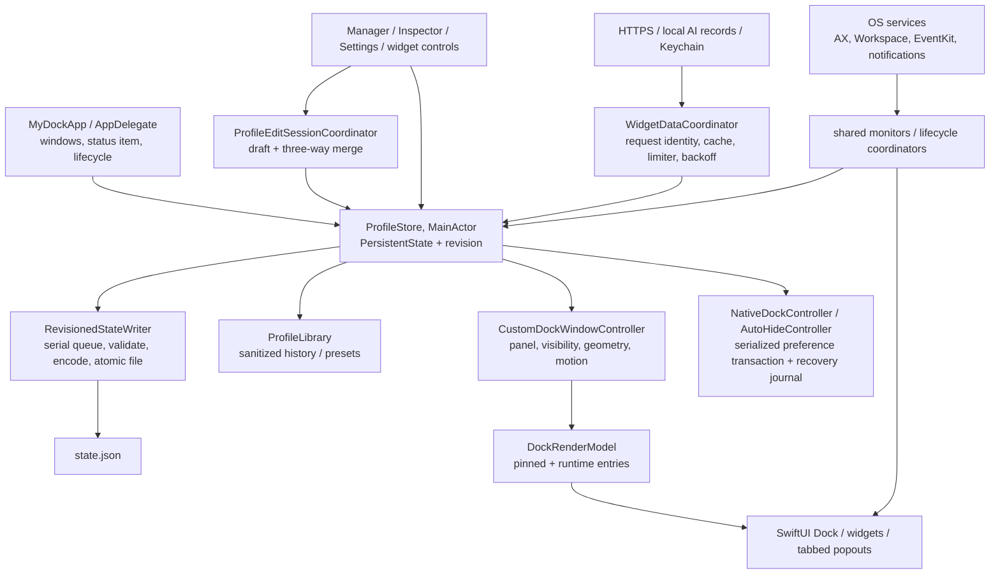

# MyDock — complete application audit, 2026-10-03

Audit of the current working tree at `/Users/jakubjalowiecki/Documents/ChatGPT/dockX`, not an implementation report. HEAD: `24f9c76133d5fc3a27b2b7ace7dadf0e240217c0`; the substantial existing working-tree changes are part of the audited baseline. Read with the [complete feature and widget coverage matrix](COMPLETE_APPLICATION_COVERAGE_2026-10-03.md). Recommendations below have **not** been implemented.

Evidence notation: **S** current source; **T** current automated test; **R** current runtime observation; **V** current screenshot/bitmap render; **H** historical evidence; **I** inference; **U** unverified. “Confirmed” can describe a demonstrable conditional source defect without implying that a live account or native desktop scenario was exercised. File line numbers refer to the unchanged audited tree. Source links point into this repository; disposable evidence lives in [the audit artifact directory](../../.build/visual-qa/full-audit-2026-10-03/).

## A. Executive assessment

MyDock is a substantial, coherent local development application with 35 registered widget families, a working profile workspace, explicit appearance inheritance, a native panel Dock, recovery infrastructure, and extensive behavioral tests. It is **not yet qualified for distribution or fully accepted as a native Dock replacement**. There are confirmed correctness defects in state protection, success reporting, credential replacement, data aggregation, and editing. Native window operations, live resizing, wallpaper compositing, permission recovery, and signed release execution still lack current acceptance evidence.

The most important corrective work is:

- Protect unknown future schemas before decoding version-specific models. Today an unknown future enum can enter ordinary corruption recovery, move the file, and enable replacement state writes (MD-A01).
- Make Restore and similar mutations publish success only after a successful candidate save. Combined import limits and write failures currently produce optimistic state and a false “Restored” message (MD-A02).
- Bound imported and external numeric data before arithmetic or integer conversion. Isolated executions of unchanged parser/model source trapped on a huge market volume and an extreme cached AI percentage (MD-A03/A04).
- Repair Shopify replacement identity. A new random local connection ID is compared with the old one, so same-store replacement is rejected (MD-P03).
- Make Windows and Close Window discoverable independently of unrelated optional window-monitoring settings (MD-D01), then accept actual unsaved-document behavior.
- Establish a service-level isolation boundary for QA. A temporary ProfileStore does not isolate every singleton or native cleanup path (MD-Q01).

Further confirmed issues include duplicated AI activity totals, a false network spike after counter reset, unsaved snippet draft loss, unreachable retained history entries, inaccurate Paddle setup instructions, and clipped compact clock content. These merit targeted changes; the evidence does not justify a wholesale rewrite.

Strengths worth preserving include revision-aware atomic writes and private file modes, tested three-way draft merging, explicit normal Quit versus AX Close Window operations, credential exclusion from profile exports, bounded automation capture, provider refresh coalescing/backoff, layout/icon independence, and semantic metric-first widget faces. The current native UI uses recognisable macOS controls and the revised Settings navigation is visible and wraps rather than hiding categories in horizontal scrolling.

Current validation: **253 individual default tests passed, five opt-ins skipped**; the runner reports 258 tests in 20 suites. Two safe opt-ins then passed: installed-app inventory and explicitly synthetic performance. A disposable universal Release build passed, as did strict ad-hoc signature checks. An isolated DEBUG preview supported native workspace, Settings, library, Clock appearance, saved snippet, rename, keyboard reorder/undo, and command-search observations. These are not equivalent to canonical application relaunch or desktop Dock acceptance. Five render matrices exported 175 PNGs; static imagery cannot qualify wallpaper blur or animation pacing.

The canonical `build/MyDock.app` was inspected but not launched or replaced in this audit. Its executable hash matches `docs/BUILD_BASELINE.json`; the initial source fingerprint also matches that baseline. Launch could execute existing system-preference ownership/recovery, so actual native mutation was deferred. Its universal ad-hoc signature is valid, but it contains no App Intents metadata. Full Xcode is unavailable on this host.

Documentation is mixed: `RELEASE_AUDIT.md` and `BUILD_BASELINE.json` responsibly record many native and distribution gaps; historical counts and broad “fully implemented,” future-schema protection, or identity-safety claims exceed the acceptance now supported. Older CUA startup failures are historical: safe preview UI inspection worked during this audit. That recovery does not close desktop Dock gaps. See MD-Q05 and the verification ledger.

Completion status against the requested prompt: source, architecture, all feature families, tests, provider contracts, safe UI/renders, build tooling, findings, plan, and manual checklist are completed within the permitted scope. Actual desktop mutation, account-dependent integration, native permissions, VoiceOver, production motion/performance, older OS/Intel, and signed distribution acceptance remain unperformed for the reasons in G/H. No application fixes were made.

## B. Architecture and feature inventory

### Ownership and data flow

The actual entry is [MyDockApp.swift](../../Sources/MyDock/MyDockApp.swift:1): the SwiftUI app delegates window/status-item management to AppDelegate; its Settings scene is empty because Settings are hosted explicitly. The menu-bar UI is an NSStatusItem lifecycle path; `UI/MenuBarView.swift` is not the active app scene. Onboarding selects setup mode and defaults, then normal lifecycle restores profile selection and creates the corresponding controllers. Preview/export flags are DEBUG paths, not alternative shipping baselines.

Profiles originate from creation, import, presets, native Dock capture, or user edits. Manager edits generally use a session draft, then a tested merge against the latest persisted profile; widget configurations and Settings often mutate ProfileStore directly. ProfileStore publishes MainActor state and assigns revisions. RevisionedStateWriter serializes validation/JSON/atomic replacement, suppressing superseded asynchronous snapshots. Immediate calls synchronously wait on that queue. Recovery, history, personal presets, setup drafts, and system-preference journals are separate stores; “draft,” “history,” and “backup” therefore have different retention/privacy semantics.

CustomDockWindowController observes effective profile/settings and OS state, constructs DockRenderModel, and hosts CustomDockView in a transparent native panel. The same host is retained across ordinary root assignments. During an active resize, a transient interaction state drives geometry and the ordinary root-update path returns early; completion commits size. Runtime app/window/media/trash entries augment pinned profile entries. Popouts use a single tabbed anchored host, an intentional product choice. Widget faces dispatch all 35 families through WidgetViews; configuration dispatch is centralized and specific providers own richer popouts.

WidgetDataCoordinator owns provider refresh identity, in-flight sharing, backoff and a four-request limiter; returned snapshots are stored in widget configuration. RefreshScheduler and CPU/network/media/window monitors are additional shared owners. Timers and notification services have their own lifecycle/generation guards. Credentials live in Keychain; connection metadata lives outside portable profile data. NativeDockController owns native pinned-layout transactions; NativeDockAutoHideController owns replacement-mode autohide/reveal/no-bouncing preferences and restoration. Permissions are requested by the responsible native action rather than all at first launch.

### Current inventory and boundaries

The audited source contains **120 Swift files, 28,860 lines**; Tests contains **20 Swift files, 5,325 lines**, including one Xcode UI file with nine UI methods. Resources contains the application icon; Tools contains its Swift generator. Package.swift has an executable and test target and no third-party package dependency. Shipping minimum is macOS 13; Swift Testing builds target 14. BuildMyDock.sh compiles both architectures, packages/signs a local bundle, checks for a running target and fingerprints source. TestMyDock.sh uses an intermediate test cache. GenerateXcodeProject.sh produces the Xcode project. ReleaseMyDock.sh has Developer ID, App Intents metadata, notarization, stapling, Gatekeeper and DMG gates. `.github/workflows/validate.yml` validates SwiftPM plus Xcode build/metadata; it does not run the native UI suite.

Current registered families, from [DockModels.swift](../../Sources/MyDock/Models/DockModels.swift:1229), are: Stock, Watchlist, Calendar, Reminders, Now Playing, Weather, Focus Timer, Sticky Note, Battery, Shortcuts, Stripe, Paddle, Shopify, Clock, World Clock, Stopwatch, Countdown, Alarm, Time Progress, Hydration, System Activity, Network Activity, AI Limits, AI Activity, AirDrop, Trash, Disk Space, Calculator, Quick Checklist, File Shelf, Text Snippets, Quick Links, Unit Converter, Color Picker, App Folder. Memory/swap/thermal/core metrics belong to System Activity; there is no separate Memory family. The [coverage matrix](COMPLETE_APPLICATION_COVERAGE_2026-10-03.md) records every family and the non-widget feature paths, including empty/error/offline states, permissions, persistence and remaining acceptance.

External paths inspected individually: Alpha Vantage market data, Open-Meteo weather/geocoding, Stripe, Paddle Billing, Shopify Admin GraphQL/OAuth, GitHub personal Copilot billing, Codex app-server/local sessions, Claude status-line/local records, Grok local records, and explicitly unsupported activity/limit combinations for Cursor/Gemini CLI/Antigravity. Installed apps, window AX/capture, EventKit, location, media automation, notifications, login item, Finder sharing/AirDrop/Trash, and native Dock preferences are OS-service integrations. Release lookup uses the configured GitHub repository; it is disabled when no valid repository is configured.

### Architectural pressure points

- The 1,821-line Dock controller mixes window hosting, presentation, motion, screen/pointer monitors, resize/reorder, app menus and item actions. WidgetViews (1,523), DockModels (1,266), Settings (1,228) and Manager (1,140) are similarly broad. This raises regression cost and makes service injection difficult; line count alone is not a defect.
- Whole AppSettings values participate in Dock presentation signatures, including settings-navigation state. Unrelated changes can assign a new SwiftUI root (MD-E02).
- ProfileStore publishes models containing provider snapshots; background refresh therefore feeds back into the same state/write pipeline as user editing. Merge tests mitigate this, but ownership must remain explicit.
- Shared monitors, ProfileStore.shared, setup drafts, caches, notification services and Focus/global shortcut consumers are not uniformly injected. Some view lifetime subscriptions and the single global Dock-visible flag decide refresh even when another surface needs the data (MD-S05/Q01).
- Production catalog, semantic layout definitions and DEBUG gallery/export dimensions repeat information; the adaptive renderer omits the last five families. Central registry-derived coverage would reduce drift (MD-Q02).
- No unavoidable circular module dependency was established. There are practical feedback cycles—service → store → UI task → service—and singleton back-references. They warrant narrow ownership boundaries, not a new application architecture.

## C. Detailed findings

Each finding separates observation from cause. Priority meanings: P0 immediate serious failure/exposure; P1 important corrective or release-blocking work; P2 narrower defect/meaningful quality work; P3 optional refinement. **No Critical/P0 finding is established by this audit.**

### State, persistence and recovery

#### MD-A01 — Unknown future models bypass downgrade protection

**Category:** persistence/migration. **Severity:** High. **Priority:** P1. **Confidence:** Confirmed (conditional source path).

- **Impact/trigger:** An older app opens a future-version state containing an enum case it cannot decode. Expected: leave the future file untouched and disable saves. Actual: full model decoding happens before the schema guard; decode failure moves the original to a recovery file, initializes empty state and leaves saves enabled. The original is preserved, so this is not a claim of irretrievable deletion.
- **Evidence:** S [ProfileStore.swift:40](../../Sources/MyDock/Persistence/ProfileStore.swift:40), version guard 41, catch 51, move 55. T existing compatible future-version protection does not cover unknown future enum decoding. No real user file was corrupted or downgraded.
- **Likely cause:** Version compatibility is checked only after version-specific decoding succeeds.
- **Direction:** Read a small schema envelope first; refuse future versions before decoding models. Keep ordinary corruption recovery separate. **Verify:** isolated future JSON with unknown item/widget/settings cases remains byte-identical, saves disabled, existing same-version corruption recovery still works. **Dependencies/risks/effort:** shared archive schema handling; preserve recovery migration; Small/Medium.

#### MD-A02 — Restore reports success after failed persistence

**Category:** persistence/user feedback. **Severity:** High. **Priority:** P1. **Confidence:** Confirmed.

- **Impact/trigger:** Restore an individually valid archive into a store whose combined count exceeds 500 profiles/20,000 items, or make the target unwritable. Expected: reject the combined candidate or report the write failure without a successful restore. Actual: import appends to memory, calls nonthrowing commit, then Settings reports “Restored” and records success regardless of the disk result. Oversized combined state can make subsequent saves fail; relaunch returns to the older disk state.
- **Evidence:** S [ProfileStore.swift:471](../../Sources/MyDock/Persistence/ProfileStore.swift:471); [RevisionedStateWriter.swift:33](../../Sources/MyDock/Persistence/RevisionedStateWriter.swift:33); [SettingsView.swift:924](../../Sources/MyDock/UI/SettingsView.swift:924). `createProfile(kind:)` at 79 also publishes before its nonthrowing commit; the resolved-profile creation path already demonstrates candidate-first persistence. No production restore/write failure was exercised.
- **Likely cause:** A void mutation API cannot distinguish accepted/persisted state from a failed commit.
- **Direction:** Validate and persist the merged candidate before publication; return an explicit result to all success UI. **Verify:** combined limits, unwritable fixture, injected atomic-write failure, retry, relaunch and correct diagnostics. **Dependencies/risks/effort:** import/create call sites and revision ordering; preserve user drafts; Medium.

#### MD-A03 — Cached AI percentage can trap after a valid JSON import

**Category:** data validation/security availability. **Severity:** High. **Priority:** P1. **Confidence:** Confirmed source-slice execution.

- **Impact/trigger:** An imported/cached available AI window contains `usedPercent = Int.min`. Expected: reject invalid percentages or display unavailable. Actual: `100 - usedPercent` overflows before clamping. The semantic validator does not validate this cached snapshot. Preconditions are malformed local/imported data; this does not establish credential exposure or remote code execution.
- **Evidence:** S [AIUsageService.swift:75](../../Sources/MyDock/SystemServices/AIUsageService.swift:75), [ProfileSemanticValidator.swift:33](../../Sources/MyDock/Models/ProfileSemanticValidator.swift:33). R isolated unchanged-source fixture exited -5; [results](../../.build/visual-qa/full-audit-2026-10-03/source-slice-results.json). This was not a whole-app/live-account crash.
- **Likely cause:** Clamping after overflowing arithmetic, plus incomplete snapshot validation.
- **Direction:** Validate all cached snapshot collections, bounds, dates and identities at decoding/import and guard arithmetic at presentation. **Verify:** extreme signed integers, missing values, out-of-range values, old valid caches, reimport/relaunch. **Dependencies/risks/effort:** model compatibility and honest unavailable states; Medium.

#### MD-A04 — External numeric parsers are not consistently bounded

**Category:** provider correctness/security availability. **Severity:** High. **Priority:** P1. **Confidence:** Confirmed for market parser; conditional source evidence for other conversions.

- **Impact/trigger:** A valid JSON market volume string is `1e30`. Expected: reject the response safely. Actual: direct Double-to-Int64 conversion traps. Other unchecked paths include business interval counts and finite-but-enormous weather temperatures converted to Int in faces.
- **Evidence:** S [MarketDataService.swift:138](../../Sources/MyDock/SystemServices/MarketDataService.swift:138), StripeDataService 326/362, PaddleDataService 276, WeatherService 83, WidgetPrimitives 242/248/254. R market source slice exited -5 with “Double value cannot be converted to Int64 … greater than Int64.max.” See source-slice manifest/results. No claim that the current providers normally emit such values.
- **Likely cause:** “Finite” and “parseable” are treated as sufficient bounds for subsequent integer conversion/multiplication.
- **Direction:** Use domain bounds and overflow-safe arithmetic, rejecting malformed snapshots without replacing the last good data. **Verify:** huge finite values, negative counts, NaN/infinity where decoding permits, interval multiplication, normal currency/weather fixtures. **Dependencies/risks/effort:** common parsing conventions across providers; preserve partial-data messages; Medium.

#### MD-A05 — Sticky Note draft is cleared even when validation rejects it

**Category:** editing/persistence. **Severity:** Medium. **Priority:** P2. **Confidence:** Confirmed conditional source path.

- **Impact/trigger:** Paste more than 1 MiB of text into the unbounded note editor. Expected: retain the draft and explain the limit. Actual: updateWidgetConfiguration rejects it, but saveNote unconditionally calls noteWasSaved; closing invokes the same path. The rejected text can lose its recovery draft.
- **Evidence:** S [WidgetViews.swift:1400](../../Sources/MyDock/CustomDock/WidgetViews.swift:1400), save 1441–1443; [ProfileStore.swift:448](../../Sources/MyDock/Persistence/ProfileStore.swift:448); validator 58. Large paste was not attempted against user content.
- **Likely cause:** Save acknowledgement is independent of the mutation result.
- **Direction:** Return acceptance/persistence outcome, retain failed draft, show a limit before destructive dismissal. **Verify:** boundary-size Unicode text, validation/write failure, close/reopen and retry. **Dependencies/risks/effort:** draft acknowledgement semantics; avoid converting debounced editing into per-keystroke synchronous writes; Small/Medium.

#### MD-A06 — Closing Snippets configuration silently drops unfinished input

**Category:** editing/usability. **Severity:** Medium. **Priority:** P2. **Confidence:** Confirmed for Text Snippets; source-confirmed equivalent Quick Links state ownership.

- **Impact/trigger:** Type a new snippet title/body, then press Escape before Save. Expected: retain recoverable input or make discard explicit. Actual: in the isolated native preview, the form closes without warning; reopen shows blank new-entry fields while the previously saved snippet remains. Quick Links uses the same transient @State pattern.
- **Evidence:** R current CUA scenario; S [DockUtilityWidgetViews.swift:160](../../Sources/MyDock/CustomDock/DockUtilityWidgetViews.swift:160), explicit save 205; Quick Links 222. Saved snippet persistence has T store-recreation coverage; pending input does not.
- **Likely cause:** Collection form drafts live only in the dismissed view.
- **Direction:** Keep item-scoped drafts or confirm discard on dismissal, without saving incomplete entries into collections. **Verify:** new/edit forms, Escape, click outside, profile switch, item deletion and clean relaunch in temporary state. **Dependencies/risks/effort:** sheet/popout dismissal and draft cleanup; Medium.

#### MD-A07 — Utility removal has no local undo

**Category:** recovery/usability. **Severity:** Medium. **Priority:** P2. **Confidence:** Confirmed source path.

- **Impact/trigger:** Remove a snippet/link or clear File Shelf/checklist content. Expected: a readily available recovery route for accidental removal. Actual: collection mutations persist directly without collection undo; ordinary sanitized history excludes much of this content. File Shelf removal does not delete original files, but its organization/reference can be lost.
- **Evidence:** S DockUtilityWidgetViews remove at 192/264, Shelf clear 98; UtilityWidgetViews checklist mutation around 187; [ProfileSanitizer.swift:8](../../Sources/MyDock/Models/ProfileSanitizer.swift:8). Destructive controls were inspected, not exercised against user state.
- **Likely cause:** Utility mutations bypass the profile editor undo session.
- **Direction:** Add small bounded in-memory undo at the collection operation, keeping private-history defaults intact. **Verify:** remove/clear/undo with intervening edits and duplicate identities. **Dependencies/risks/effort:** distinguish reference removal from file deletion; privacy retention; Medium.

#### MD-A08 — History privacy control understates its scope and resets

**Category:** privacy/settings clarity. **Severity:** Medium. **Priority:** P2. **Confidence:** Confirmed.

- **Impact/trigger:** Enable “Include Sticky Note text in future history.” Expected: an accurate scope description and intentional retention of the preference. Actual: the same flag also preserves checklist and snippet content; it is a transient published property defaulting false, so relaunch resets it. Links/file references remain excluded independently. Default sanitization is a strength.
- **Evidence:** S [RecoveryCenterView.swift:15](../../Sources/MyDock/UI/RecoveryCenterView.swift:15), [ProfileLibrary.swift:15](../../Sources/MyDock/Persistence/ProfileLibrary.swift:15), ProfileSanitizer 8–10.
- **Likely cause:** A formerly note-only option outgrew its label and persistence model.
- **Direction:** Describe the precise private-content classes and make lifetime explicit; if persisted, require an explicit choice with no retroactive content restoration. **Verify:** default, enable/relaunch, disable, exports and retained snapshots. **Dependencies/risks/effort:** privacy migration and history sanitization; Small/Medium.

#### MD-A09 — Retained history and presets beyond ten entries are unreachable

**Category:** recovery/navigation. **Severity:** Medium. **Priority:** P2. **Confidence:** Confirmed.

- **Impact/trigger:** More than ten retained entries exist; default history keeps up to 25. Expected: all retained entries can be browsed/restored. Actual: Recovery Center and Personal Preset picker use prefix(10) without pagination or Show More.
- **Evidence:** S [RecoveryCenterView.swift:18](../../Sources/MyDock/UI/RecoveryCenterView.swift:18); [PersonalPresetPicker.swift:21](../../Sources/MyDock/UI/PersonalPresetPicker.swift:21). R safe preview showed an empty initial history, not this populated scenario.
- **Likely cause:** Display limiting is used as navigation limiting.
- **Direction:** A compact list with pagination/search or Show More; preserve existing retention policy. **Verify:** 0/1/10/25 entries, long names, keyboard selection and exact restore target. **Dependencies/risks/effort:** identity-safe selection; Small.

### Native Dock and file interactions

#### MD-D01 — Windows and Close Window disappear under default behavior settings

**Category:** native Dock functionality. **Severity:** High. **Priority:** P1. **Confidence:** Confirmed source condition; native acceptance outstanding.

- **Impact/trigger:** Keep both Show Minimized Windows and Click Focused App to Minimize off, their defaults, even with AX access. Expected: application context menus can discover current windows and offer Close Window independently. Actual: the window monitor is disabled and the menu is omitted when its window array is empty. Quit remains a separate normal terminate operation.
- **Evidence:** S [CustomDockWindowController.swift:579](../../Sources/MyDock/DockManagement/CustomDockWindowController.swift:579) and window-dependent menu at 1491. No permission was granted and no real document/window was closed.
- **Likely cause:** Optional tile/minimize behavior owns the only source of window descriptors used by an unrelated menu action.
- **Direction:** Fetch current windows on demand for the menu, or give menu discovery independent ownership, with clear denied-permission recovery. **Verify:** default/off combinations, two unsaved TextEdit documents, Close cancel/save, Quit cancel/save, Finder, no AX and revoked AX. **Dependencies/risks/effort:** async menu freshness, process identity and permissions; Medium.

#### MD-D02 — Untitled AX windows cannot resolve using their display fallback

**Category:** native window identity. **Severity:** Medium. **Priority:** P2. **Confidence:** Confirmed conditional source mismatch.

- **Impact/trigger:** An AX window has an empty title and no stable AX identifier. Expected: its descriptor can either resolve safely or explicitly report unsupported identity. Actual: enumeration replaces the empty title with the app name, while resolution compares against the raw empty title; fallback title matching cannot find it.
- **Evidence:** S [WindowAccessibilityService.swift:64](../../Sources/MyDock/SystemServices/WindowAccessibilityService.swift:64), raw candidate title 149 and match 151. T duplicate-title identity tests exist, but this display-fallback mismatch is not covered. No live untitled AX application was used.
- **Likely cause:** Display text and identity text share one field.
- **Direction:** Keep raw title/identifier separate from a localized display fallback; never fall back to stale array position alone. **Verify:** empty titles, duplicates, renamed/closed windows, reordered AX arrays and reused processes. **Dependencies/risks/effort:** Codable descriptor/cache identity; Small/Medium.

#### MD-D03 — Multiple installed app copies use inconsistent identity

**Category:** native app/window identity. **Severity:** Medium. **Priority:** P2. **Confidence:** Confirmed source inconsistency; wrong-target native outcome needs verification.

- **Impact/trigger:** Two installed/running copies share a bundle identifier. Expected: the selected path/PID remains authoritative. Actual: AppLauncher resolves the selected bundle URL and Quit uses PID, while runtime deduplication, window menus and some minimize/pinned filtering group by bundle identifier. Another copy's windows can therefore enter the selected item's menu.
- **Evidence:** S [AppLauncher.swift:38](../../Sources/MyDock/SystemServices/AppLauncher.swift:38), RunningApplications 15–17; Dock controller 1492, minimize 1305, pinned filtering 1735. The installed-app inventory validated bundles, not simultaneous launching of two copies.
- **Likely cause:** App identity changes between path, bundle ID and PID at different boundaries.
- **Direction:** Retain a runtime identity including executable/bundle URL and PID; use bundle ID only for intentional grouping with explicit UI. **Verify:** two disposable app copies, each with named windows, restart/PID reuse, pin/quit/activate selection. **Dependencies/risks/effort:** running-entry IDs, preview cache and migration of stored targets; Medium.

#### MD-D04 — Finder insertion is confined to an append target

**Category:** native Dock product enhancement. **Severity:** Low. **Priority:** P3. **Confidence:** Confirmed intentional limitation.

- **Impact/trigger:** Drag an external file/app between existing Dock items. Expected: an optional parity enhancement would offer spatial insertion, as the normal macOS Dock does. Actual: MyDock's explicit external target accepts URLs and appends; per-item destinations handle internal payloads. This is a product difference, not an observed wrong insertion bug.
- **Evidence:** S Dock controller internal drop 1261/1551, external target 1279, append handler 1652. T pasteboard/order tests do not qualify a Finder pointer drop. No external desktop drop was performed.
- **Likely cause:** Separate contracts for internal reorder and external URL intake.
- **Direction:** Reuse validated URL intake with spatial insertion feedback when that improves Dock organization; keep an accessible Add path. **Verify:** apps/files/folders/links, multi-URL order, separators/groups, empty/end areas and invalid payloads. **Dependencies/risks/effort:** drag session identity and exact insertion index; Medium.

#### MD-D05 — File Shelf cannot repair missing references

**Category:** utility completeness/native files. **Severity:** Medium. **Priority:** P2. **Confidence:** Confirmed source/render.

- **Impact/trigger:** A shelved file moves, its bookmark stops resolving, or a volume is disconnected. Expected: explain unavailability and offer Locate/retry while retaining the shelf entry. Actual: warning text and disabled Open/Copy are present, but its row/menu has no repair action. Minimal bookmarks are resolved without refreshing a stale bookmark.
- **Evidence:** S [DockUtilityWidgetViews.swift:113](../../Sources/MyDock/CustomDock/DockUtilityWidgetViews.swift:113), menu 120; [DockUtilityModels.swift:10](../../Sources/MyDock/Widgets/DockUtilityModels.swift:10). V tools fixtures include missing-file states. No user file was moved. The app is unsandboxed; this is not a claim that all references require security-scoped access today.
- **Likely cause:** App/file target Locate recovery was not extended to utility collections.
- **Direction:** Add Locate/retry and bookmark refresh; expose permission recovery only when relevant. **Verify:** fixture rename/move, stale bookmark, eject/reconnect, duplicate repair, share/drag without deleting originals. **Dependencies/risks/effort:** reference identity and future sandbox policy; Medium.

#### MD-D06 — Trash summary and Empty Trash have different scope

**Category:** destructive-action clarity/native integration. **Severity:** Medium. **Priority:** P2. **Confidence:** Strong inference from source and local Finder scripting contract.

- **Impact/trigger:** External-volume Trash contains items while the home Trash widget is used. Expected: the count and confirmation describe the scope actually emptied. Actual: TrashService lists/opens `~/.Trash`, but Empty runs Finder's `empty trash` command, whose Trash is broader than that directory. The confirmation is generic.
- **Evidence:** S [TrashService.swift:9](../../Sources/MyDock/SystemServices/TrashService.swift:9), open 94/empty 99; TrashWidgetViews confirmation 66. Local Finder.sdef `empty trash` contract inspected read-only. No Trash operation executed.
- **Likely cause:** Home-folder filesystem summary is paired with Finder's global command.
- **Direction:** Explain Finder-wide scope, or consistently use a safely supported scoped operation; do not invent a global count. **Verify:** disposable account/volume with sacrificial fixtures, confirmation/cancel, Automation denial and partial failure. **Dependencies/risks/effort:** destructive operation must remain opt-in; Medium.

### Services, lifecycle and concurrency

#### MD-S01 — Running Shortcuts has no cancellation or execution deadline

**Category:** background/native operations. **Severity:** Medium. **Priority:** P2. **Confidence:** Confirmed source.

- **Impact/trigger:** A selected shortcut stalls, waits for input indefinitely, or never terminates. Expected: visible running state with a supported cancellation/lifecycle policy. Actual: the run path retains a Process until termination, discards stderr, and has no execution timeout/cancel path. Catalog enumeration is separately bounded.
- **Evidence:** S [ShortcutsService.swift:74](../../Sources/MyDock/SystemServices/ShortcutsService.swift:74), process setup through 99; bounded catalog path is not proof of bounded execution. No shortcut was executed.
- **Likely cause:** A fire-and-wait operation was designed around successful completion.
- **Direction:** Expose running/cancel state and safe app-quit cleanup, with useful bounded diagnostics. User-interactive shortcuts may legitimately run longer than catalog lookup; do not apply an arbitrary short forced timeout. **Verify:** successful, failing, interactive, hung and cancelled safe fixture shortcuts. **Dependencies/risks/effort:** child-process ownership and side effects; Medium.

#### MD-S02 — Folder popout enumeration has no useful loading/cancellation boundary

**Category:** native I/O/responsiveness. **Severity:** Medium. **Priority:** P2. **Confidence:** Confirmed source; real slow-volume severity unmeasured.

- **Impact/trigger:** Open a large or slow/network folder, then change target or close the popout. Expected: a distinct loading state and obsolete work cancellation. Actual: the reader enumerates/sorts the full contents without a cancellation/deadline contract; the initial empty state can precede results, and previous rows can remain while a new target loads.
- **Evidence:** S [FolderContentsReader.swift:11](../../Sources/MyDock/SystemServices/FolderContentsReader.swift:11); [FolderContentsPopout.swift:99](../../Sources/MyDock/CustomDock/FolderContentsPopout.swift:99). No mounted slow-volume performance test was run.
- **Likely cause:** One-shot asynchronous enumeration lacks phase and request identity as first-class state.
- **Direction:** Show loading/error explicitly, publish only the current request, bound displayed work and cancel where the API permits. **Verify:** empty/large/error folders, target changes, dismissal and reconnect. **Dependencies/risks/effort:** filesystem cancellation cannot guarantee an OS call returns instantly; Medium.

#### MD-S03 — Some permission-dependent native waits remain unbounded

**Category:** native services/concurrency. **Severity:** Medium. **Priority:** P2. **Confidence:** Confirmed missing bounds; user-visible hang is conditional.

- **Impact/trigger:** Location never supplies a suitable result, or EventKit Reminders completion does not arrive promptly. Expected: a bounded waiting/error state and cancellation without stale publication. Actual: Location has task cancellation but no overall deadline and accepts fixes without age/accuracy validation; Reminders waits on a continuation without cancelling its fetch token. The later cancellation check cannot end the preceding wait.
- **Evidence:** S [CurrentLocationService.swift:20](../../Sources/MyDock/SystemServices/CurrentLocationService.swift:20), fix 67–79; [CalendarRemindersService.swift:163](../../Sources/MyDock/SystemServices/CalendarRemindersService.swift:163). Permissions were not requested.
- **Likely cause:** Callback completion is assumed, independent of app task lifetime.
- **Direction:** Race against a sensible deadline, cancel the native request/token, validate location age/accuracy, and distinguish denied/unavailable/time-out. **Verify:** denied/revoked, no fix, stale fix, cancelled reminder fetch, sleep/wake and repeated requests. **Dependencies/risks/effort:** continuation single-resume and actor isolation; Medium.

#### MD-S04 — Hydration enabled state is not reconciled at app startup

**Category:** notification reliability. **Severity:** Medium. **Priority:** P2. **Confidence:** Strong inference.

- **Impact/trigger:** Saved Hydration reminders say enabled but OS pending requests/permission changed while MyDock was closed. Expected: reconcile configuration with authorization and pending requests or show an actionable mismatch. Actual: scheduling/cancellation generation guards exist, but startup explicitly reconciles Alarm; an equivalent Hydration revalidation path was not found. Stored enabled state alone cannot establish delivery.
- **Evidence:** S [HydrationReminderService.swift:26](../../Sources/MyDock/SystemServices/HydrationReminderService.swift:26), cancel 59; [MyDockApp.swift:180](../../Sources/MyDock/MyDockApp.swift:180). T generation tests do not verify OS pending requests across relaunch. No real notifications scheduled.
- **Likely cause:** Enable-time scheduling is treated as permanent OS state.
- **Direction:** Reconcile enabled configurations on relaunch/wake/permission change, avoiding repeated permission prompts and duplicate requests. **Verify:** revoke/regrant, deleted pending request, relaunch, item deletion and interval change. **Dependencies/risks/effort:** notification limits and operation identity; Medium.

#### MD-S05 — A global Dock-visible gate also pauses non-Dock consumers

**Category:** refresh ownership/usefulness. **Severity:** Medium. **Priority:** P2. **Confidence:** Confirmed source condition; complete native editor scenario unverified.

- **Impact/trigger:** A configuration/editor or popout needs current CPU/network/media data while the custom Dock is hidden or inactive. Expected: refresh according to all visible subscribers. Actual: RefreshScheduler requires the global Dock-visible flag even with subscribers; CPU/network/media policy also uses Dock visibility. A standalone/editor consumer can therefore hold stale readings. Clock's TimelineView and provider initial fetches have different ownership and should not be generalized into this finding.
- **Evidence:** S [RefreshScheduler.swift:49](../../Sources/MyDock/SystemServices/RefreshScheduler.swift:49); NowPlayingService 149; SystemActivity/NetworkActivity monitor visibility gates; WidgetDataCoordinator active-profile selection 122.
- **Likely cause:** Visibility of one surface stands in for visibility of every consumer.
- **Direction:** Aggregate typed visible-consumer demand and centralize polling ownership; retain zero-work behavior when all consumers are absent. **Verify:** Dock visible/hidden, editor only, popout only, multiple same-kind widgets, absent widgets and sleep/wake; measure refresh counts and resource use. **Dependencies/risks/effort:** subscriber lifecycle, not simply higher polling; Medium.

### Providers and data accuracy

#### MD-P01 — AI Activity double-counts duplicate logical records

**Category:** data accuracy. **Severity:** Medium. **Priority:** P2. **Confidence:** Confirmed source-slice execution.

- **Impact/trigger:** A Claude assistant message appears twice in local JSONL, or two Codex rollout files represent the same session and cumulative usage. Expected: count unique logical usage, or flag uncertain duplicates. Actual: fixture output was Claude 260 tokens/2 requests/2 tools for one 130-token message; copied Codex session 260 tokens and one session for 130 unique tokens. Both reported `partial=false`.
- **Evidence:** S [AIUsageService.swift:626](../../Sources/MyDock/SystemServices/AIUsageService.swift:626), per-file Codex counters 574; R unchanged-source fixture, source-slice-results.json. No provider billing/quota claim is inferred from these local counters, and no real account history was read for the scenario.
- **Likely cause:** Claude message identity is ignored; Codex cumulative deltas reset for every file while session counting is separately deduplicated.
- **Direction:** Deduplicate with supported provider/session/message identity and preserve provenance; unknown schemas should not silently become complete totals. **Verify:** repeated messages, copied/resumed sessions, legitimate repeated equal usage, range/DST boundaries and partial file budgets. **Dependencies/risks/effort:** local schemas are not an authoritative billing API; avoid undercounting distinct messages; Medium.

#### MD-P02 — Claude account/limits and activity resolve different directories

**Category:** integration consistency. **Severity:** Medium. **Priority:** P2. **Confidence:** Confirmed source.

- **Impact/trigger:** Claude uses `CLAUDE_CONFIG_DIR`. Expected: account setup, limits bridge and local activity use the same configured installation. Actual: AIAccountService honors that variable; AIActivity always scans home `.claude/projects`. Limits can work while Activity is empty or from another installation.
- **Evidence:** S [AIAccountService.swift:29](../../Sources/MyDock/SystemServices/AIAccountService.swift:29); [AIUsageService.swift:463](../../Sources/MyDock/SystemServices/AIUsageService.swift:463). No real configuration was modified.
- **Likely cause:** Duplicate provider path resolution.
- **Direction:** One injected directory resolver for all Claude paths. **Verify:** default/custom directory, missing path, symlink policy, isolated test home and relaunch. **Dependencies/risks/effort:** bridge paths and test injection; Small.

#### MD-P03 — Shopify Test and Replace rejects the same store

**Category:** credential replacement. **Severity:** High. **Priority:** P1. **Confidence:** Confirmed source.

- **Impact/trigger:** Replace credentials for an existing Shopify connection, including identical store credentials. Expected: validate the store and preserve the connection's local identity. Actual: connect creates a ShopifyConnectedStore with a new UUID; Connections Center compares it to the existing local ID and throws “different Shopify store.”
- **Evidence:** S [ShopifyDataService.swift:118](../../Sources/MyDock/SystemServices/ShopifyDataService.swift:118), new store 202; [ConnectionsCenterView.swift:121](../../Sources/MyDock/UI/ConnectionsCenterView.swift:121). No live request or credential replacement was performed.
- **Likely cause:** A generated local UUID is used as if it were a provider store identity.
- **Direction:** Validate normalized store/provider identity, retain the existing local ID, and keep current concurrent-authority checks. **Verify:** same-store new/identical credentials, different-store rejection, connection removed during validation, token refresh and widgets retaining assignment. **Dependencies/risks/effort:** connection directory/Keychain identity; avoid silently replacing another tenant; Small/Medium.

#### MD-P04 — Shopify pagination lacks progress and duplicate guards

**Category:** provider concurrency/accuracy. **Severity:** Medium. **Priority:** P2. **Confidence:** Confirmed conditional source.

- **Impact/trigger:** GraphQL returns `hasNextPage=true` with a repeated nonempty cursor and empty/duplicate pages. Expected: bounded failure without a partial or doubled total. Actual: loop bounds only accumulated order count, checks nonempty cursor, and does not limit pages or require cursor advancement. Empty repeated pages can run indefinitely in aggregate despite bounded individual requests; duplicate pages can be counted repeatedly.
- **Evidence:** S [ShopifyDataService.swift:226](../../Sources/MyDock/SystemServices/ShopifyDataService.swift:226). T maximum-order coverage is useful but does not prove cursor-progress behavior. No malformed live server scenario was run.
- **Likely cause:** Record budget substitutes for a complete pagination contract; records lack deduplication identity in this path.
- **Direction:** Page/deadline budget, visited cursor detection and order-ID deduplication, rejecting incomplete totals explicitly. **Verify:** empty/repeated cursor, overlapping pages, normal multipage result, cancellation and rate-limit failure. **Dependencies/risks/effort:** GraphQL query ID field, shared refresh permit; Small/Medium.

#### MD-P05 — Stripe nested subscription item pagination is ignored

**Category:** financial metric completeness. **Severity:** Medium. **Priority:** P2. **Confidence:** Confirmed conditional source/contract.

- **Impact/trigger:** A returned subscription's embedded item list is partial. Expected: complete supported item totals or label/refuse incompleteness. Actual: the parser sums only `items.data` and ignores nested `has_more`; the top-level ten-page protection cannot cover it. Supported per-unit gross normalization should not be described as full Stripe dashboard MRR.
- **Evidence:** S [StripeDataService.swift:300](../../Sources/MyDock/SystemServices/StripeDataService.swift:300). Stripe documents independently paginated item lists in [List subscription items](https://docs.stripe.com/api/subscription_items/list). No live subscription with a partial embedded list was accessed.
- **Likely cause:** Top-level pagination was accepted as completeness of every nested collection.
- **Direction:** Load all needed items with budgets or explicitly refuse/flag partial input; keep discounts, metered/tiered and tax exclusions honest. **Verify:** `has_more`, multiple items, transformed quantity/item taxes, zero-decimal currencies and unsupported models. **Dependencies/risks/effort:** request count/rate limits and metric definition; Medium.

#### MD-P06 — Paddle setup instructions request the wrong permission

**Category:** setup/data contract. **Severity:** Medium. **Priority:** P2. **Confidence:** Confirmed.

- **Impact/trigger:** Follow Connections Center's instruction to grant transaction/subscription reads. Expected: the key can read the metrics MyDock requests. Actual: three `/metrics/...` endpoints require Metrics Read; the backend error correctly says `metrics.read`, but setup copy does not.
- **Evidence:** S [ConnectionsCenterView.swift:84](../../Sources/MyDock/UI/ConnectionsCenterView.swift:84), [PaddleDataService.swift:147](../../Sources/MyDock/SystemServices/PaddleDataService.swift:147), correct error 124. Primary [Paddle MRR contract](https://developer.paddle.com/api-reference/metrics/get-metrics-monthly-recurring-revenue/) specifies the permission, UTC bounds, currency and freshness fields. No live key requested.
- **Likely cause:** Setup copy describes an earlier data strategy.
- **Direction:** Use one provider-owned permission explanation and distinguish Billing live/sandbox keys. **Verify:** mocked missing-permission response, consistent connection/widget instructions, authorized sandbox smoke test later. **Dependencies/risks/effort:** none requiring data migration; Small.

#### MD-P07 — Network counter reset is displayed as a huge download

**Category:** native metric accuracy. **Severity:** Medium. **Priority:** P2. **Confidence:** Confirmed source-slice execution.

- **Impact/trigger:** An interface counter falls from 1,000,000 to 100 over four seconds after reset/reconnection. Expected: rebaseline/unavailable rate for that interval. Actual: the fixture produced 1,073,491,849 bytes/s, because every decrease is treated as a 32-bit wrap.
- **Evidence:** S [NetworkActivityReader.swift:50](../../Sources/MyDock/SystemServices/NetworkActivityReader.swift:50); R source-slice results. No actual network reset was induced.
- **Likely cause:** Counter width and interface lifecycle are not part of sample identity.
- **Direction:** Distinguish plausible wrap from reset and rebaseline; use native width/identity and monotonic time. **Verify:** 32/64-bit wrap, interface disappearance/reuse, sleep/wake, reset and stable traffic. **Dependencies/risks/effort:** avoid masking legitimate high throughput; Small/Medium.

#### MD-P08 — Response size checks occur after complete allocation

**Category:** security/resource hardening. **Severity:** Medium. **Priority:** P2. **Confidence:** Confirmed implementation; exploitation likelihood unverified.

- **Impact/trigger:** An allowed provider sends an unexpectedly large response. Expected: transfer/allocation is bounded before it consumes excessive memory. Actual: Stripe/Paddle/Shopify check 5/5/8 MB after `URLSession.data(for:)` returns; market transport similarly checks 5 MB after allocation, and Weather has no equivalent response-size check. Individual request timeouts do not bound bytes already accumulated.
- **Evidence:** S StripeDataService 123–124, PaddleDataService 99–100, ShopifyDataService 147–148, MarketDataService 58–60; [WeatherService.swift:105](../../Sources/MyDock/SystemServices/WeatherService.swift:105). GitHub Copilot's streaming cap is an existing stronger pattern. No oversized network transfer was attempted.
- **Likely cause:** Parser input limits are mistaken for transport memory limits.
- **Direction:** Bound streaming/delegate accumulation and total request lifetime; preserve host restrictions and sanitized errors. **Verify:** oversized/chunked/slow fixture server responses, redirects, cancellation and normal payloads. **Dependencies/risks/effort:** transport abstraction and concurrency limits; Medium. This is availability hardening, not a demonstrated secret leak.

#### MD-P09 — Credential replacement does not bind Stripe/Paddle tenant identity

**Category:** connection provenance. **Severity:** Medium. **Priority:** P2. **Confidence:** Strong inference.

- **Impact/trigger:** Replace a connection's key with a valid key for another tenant, then the first fresh request fails. Expected: explicitly identify the new account and invalidate old account snapshots. Actual: validation verifies key capabilities, then retains the user-named local connection ID; the replacement guard checks whether the old credentials changed concurrently, not whether the new key represents the same provider tenant. Cached widget snapshots are not cleared by this form; coordinator cache clearing is a separate transient cache. Old figures can retain the connection label until a successful refresh.
- **Evidence:** S [ConnectionsCenterView.swift:109](../../Sources/MyDock/UI/ConnectionsCenterView.swift:109), saves 114/118, authority guard 196; [WidgetDataCoordinator.swift:106](../../Sources/MyDock/Services/WidgetDataCoordinator.swift:106). Assign at 172–174 does clear snapshots, illustrating the missing equivalent in replacement. No live cross-tenant replacement tested.
- **Likely cause:** Local connection identity and provider identity are conflated.
- **Direction:** Validate/display provider identity when available, make deliberate tenant change explicit, and clear/relabel persisted snapshots on authority change. **Verify:** same tenant/new key, different tenant, offline replacement, stale response arriving and deleted connection. **Dependencies/risks/effort:** provider identity APIs/metadata migration; preserve concurrency protection; Medium.

#### MD-P10 — “Sessions” totals actually count active session-days

**Category:** metric semantics/provenance. **Severity:** Medium. **Priority:** P2. **Confidence:** Confirmed source and current test.

- **Impact/trigger:** One local session has usage on two calendar days inside a selected multi-day range. Expected: “Sessions” means distinct sessions across that range, or the label explicitly describes active session-days. Actual: the service deduplicates `(session ID, day)` then sums daily counts; a single session can count more than once. The face and popout label it sessions without that qualification.
- **Evidence:** S [AIUsageService.swift:492](../../Sources/MyDock/SystemServices/AIUsageService.swift:492), total accumulation 503; [AIUsageWidgetViews.swift:370](../../Sources/MyDock/CustomDock/AIUsageWidgetViews.swift:370), metric 542. T [ProfileStoreTests.swift:2284](../../Tests/MyDockTests/ProfileStoreTests.swift:2284) uses one session across two days and expects two at 2311. This passing test confirms the current aggregation rather than resolving the user-facing meaning.
- **Likely cause:** A useful daily chart measure is reused as a range-wide distinct-session measure.
- **Direction:** Compute distinct session IDs for range totals, or rename/explain session-days consistently; keep daily activity counts if useful. **Verify:** one cross-midnight session, two sessions same day, multiple-day range/DST and face/popout/accessibility labels. **Dependencies/risks/effort:** snapshot/cache migration if semantics change, MD-P01 dedup; Small/Medium.

### Visual design, presentation and accessibility

#### MD-U01 — Appearance controls precede the widget's useful task

**Category:** information hierarchy/usability. **Severity:** Medium. **Priority:** P2. **Confidence:** Confirmed native UI/render/source.

- **Impact/trigger:** Configure Text Snippets or another setup-heavy widget. Expected: the content/setup action is immediately understandable. Actual: the generic preview, layout cards and icon swatches occupy roughly 430 logical points above the functional form; the native snippet Save action required scrolling. Many configuration screens repeat this stack irrespective of widget complexity.
- **Evidence:** R isolated native configuration; V tools renders; S [WidgetConfigurationSheet.swift:32](../../Sources/MyDock/UI/WidgetConfigurationSheet.swift:32), [WidgetAppearance.swift:42](../../Sources/MyDock/CustomDock/WidgetAppearance.swift:42).
- **Likely cause:** One common appearance wrapper determines every configuration's hierarchy.
- **Direction:** Put task/setup first or offer a compact Appearance disclosure/tab, preserving the existing preview, typography and rounded card vocabulary. **Verify:** first-use setup, Save reachability, small windows, keyboard focus and independent layout/icon retention. **Dependencies/risks/effort:** per-widget configuration state and previews; Medium.

#### MD-U02 — Library sample counts look like existing user content

**Category:** preview/provenance clarity. **Severity:** Medium. **Priority:** P2. **Confidence:** Confirmed native UI/render/source.

- **Impact/trigger:** Browse unconfigured File Shelf, Snippets or Links. Expected: illustrative values are clearly examples. Actual: cards show “2 files,” “2 snippets,” or sample links without a visible Sample label. The preview's illustrative accessibility text is hidden by its parent; the Appearance settings preview does correctly show sample-data copy.
- **Evidence:** R current Add Item library; V catalog/tools matrices; S [AddLibrary.swift:195](../../Sources/MyDock/UI/AddLibrary.swift:195), [AppleWidgetCard.swift:37](../../Sources/MyDock/CustomDock/AppleWidgetCard.swift:37). The separate DEBUG gallery has sample copy; the product AddLibrary lacks its equivalent. This does not mean production widgets invent stored content.
- **Likely cause:** Decorative sample previews were not given user-visible provenance.
- **Direction:** A small shared Example label or setup-oriented empty representation; keep semantic preview dimensions. **Verify:** first-run empty account, VoiceOver reading, sample versus live preview distinction. **Dependencies/risks/effort:** library card labels only; Small.

#### MD-U03 — Compact faces clip useful clock/checklist content

**Category:** adaptive widget readability. **Severity:** Medium. **Priority:** P2. **Confidence:** Confirmed bitmap/source; live Dock acceptance outstanding.

- **Impact/trigger:** Use Compact Clock with an ordinary 24-hour value or a compact checklist metric. Expected: the selected layout conveys its primary value. Actual: adaptive renders truncate the time to “14:…” and checklist content to “3…”. Compact Clock's 84-point allocation also includes emblem/padding; minimum text scaling does not establish readability.
- **Evidence:** V adaptive-layouts page 2 light/dark; S WidgetPrimitives local Clock face around 292/checklist 327 and semantic widths. Standard Clock in the native preview displayed a useful time/date correctly.
- **Likely cause:** Fixed semantic widths do not reserve the primary metric's real typographic width across formats.
- **Direction:** Allocate width from supported format/content bounds, reduce emblem priority or use a truly compact composition; preserve Dock height and units. **Verify:** 12/24-hour, seconds, locales, long metric values, min/max scale and side representations. **Dependencies/risks/effort:** width/overflow geometry and layout migration; Medium.

#### MD-U04 — Settings navigation consumes too much small-window height

**Category:** design/density. **Severity:** Low. **Priority:** P3. **Confidence:** Confirmed render/native observation; exact small native resize unperformed.

- **Impact/trigger:** A narrow Settings window wraps seven categories into three rows. Expected: clear category navigation with enough room for the form. Actual: the Settings heading, padded navigation, page heading/caption and preview dominate the initial viewport. Categories remain reachable; this finding does not reinstate the old hidden horizontal-scroll defect.
- **Evidence:** V [navigation-minimum.png](../../.build/visual-qa/full-audit-2026-10-03/interaction-renders/navigation-minimum.png), R two-row navigation at the inspected workspace width; S [SettingsView.swift:98](../../Sources/MyDock/UI/SettingsView.swift:98), grid 125.
- **Likely cause:** Fixed spacious header metrics scale poorly when the grid wraps.
- **Direction:** Condense header spacing and redundant hierarchy at small sizes, maintaining labeled native buttons and selected state. **Verify:** minimum native window, all seven pages, Tab/Shift-Tab, scrolling and focus restoration. **Dependencies/risks/effort:** embedded/standalone parity; Small/Medium.

#### MD-U05 — Resize grip becomes a very narrow pointer target

**Category:** accessibility/pointer usability. **Severity:** Medium. **Priority:** P2. **Confidence:** Confirmed geometry; actual ease of use unverified.

- **Impact/trigger:** Dock size is the minimum 0.65 scale. Expected: the unobtrusive visible grip has a usable hit area. Actual: its thin hit-area dimension scales from 14 to 9.1 logical points. Accessibility adjustment and double-click reset exist, but do not enlarge the pointer target.
- **Evidence:** S [CustomDockWindowController.swift:1171](../../Sources/MyDock/DockManagement/CustomDockWindowController.swift:1171), adjustment 1203/reset 1209. Pointer dragging on the desktop was not performed; no standards-conformance failure is asserted solely from this number.
- **Likely cause:** Interaction target scales with visual decoration.
- **Direction:** Keep a minimum transparent hit area independent of Dock scale and use a clear cursor/hover affordance. **Verify:** bottom/left/right at minimum scale, precise and imprecise pointing, keyboard/AX adjustment and neighboring item clicks. **Dependencies/risks/effort:** edge reveal hit testing; Small.

#### MD-U06 — Profile spacing controls expose inconsistent ranges

**Category:** appearance/settings consistency. **Severity:** Medium. **Priority:** P2. **Confidence:** Confirmed source ranges; native out-of-range slider presentation unverified.

- **Impact/trigger:** Set profile-specific spacing below 4 or above 18 points in the profile inspector, then open Appearance Settings for that profile. Expected: both controls represent the same valid saved value. Actual: inspector permits 0–30 and ProfileAppearance validates that range, while Settings' slider permits only 4–18. Valid saved overrides such as 0 or 30 cannot be represented by the Settings slider's range. Global settings decode also uses 4–18; broad appearance validator bounds are not the same as global decoding bounds.
- **Evidence:** S [DockInspector.swift:38](../../Sources/MyDock/UI/DockInspector.swift:38), [SettingsView.swift:855](../../Sources/MyDock/UI/SettingsView.swift:855), [ProfileAppearance.swift:44](../../Sources/MyDock/Models/ProfileAppearance.swift:44), DockModels 1163. No claim that an actual 30-point override was silently rewritten during this audit.
- **Likely cause:** UI and validation bounds are independently defined and drift between surfaces.
- **Direction:** One explicit supported range or a clearly described scope-specific range that both surfaces can display; migrate existing valid overrides deliberately rather than silently clamp. **Verify:** 0/4/18/30 inspector→Settings→relaunch and global/profile inheritance; imported older values. **Dependencies/risks/effort:** preserve existing profile geometry; Small/Medium.

### Performance and maintainability

#### MD-E01 — Immediate persistence blocks the MainActor for the whole save

**Category:** performance/architecture. **Severity:** Medium. **Priority:** P2. **Confidence:** Confirmed source and synthetic measurement; production latency unmeasured.

- **Impact/trigger:** Immediate Settings/profile commits with a large valid store. Expected: responsive controls with ordered durable persistence. Actual: MainActor commit synchronously waits for validation, encoding and atomic writing. In the explicit DEBUG synthetic workload of 50 profiles/2,000 items, one encode/write took 107.42 ms; 20 immediate appearance changes took 2,079.75 ms versus 107.03 ms for coalesced flush.
- **Evidence:** S [ProfileStore.swift:499](../../Sources/MyDock/Persistence/ProfileStore.swift:499), [RevisionedStateWriter.swift:29](../../Sources/MyDock/Persistence/RevisionedStateWriter.swift:29). T [synthetic-performance.json](../../.build/visual-qa/full-audit-2026-10-03/synthetic-performance.json). These are synthetic elapsed durations, not measured UI stalls/FPS or ordinary-profile results.
- **Likely cause:** Synchronous durability boundaries are also used for routine live control changes.
- **Direction:** Coalesce routine edits off the main thread with explicit lifecycle flush/results; retain candidate-first publication and revision ordering. **Verify:** large valid fixtures, rapid controls, pending async save then immediate save, injected failure, quit/relaunch and observed native main-thread latency. **Dependencies/risks/effort:** MD-A02, draft save contracts and history frequency; Medium.

#### MD-E02 — Unrelated settings can invalidate the Dock's whole root

**Category:** architecture/performance. **Severity:** Medium. **Priority:** P2. **Confidence:** Confirmed invalidation source; cost/gesture consequences are inference.

- **Impact/trigger:** Change a persisted setting such as the last Settings page while the Dock exists. Expected: only relevant Dock presentation changes update its root. Actual: the signature stores full AppSettings; any unequal field can reach `hosting.rootView = root`. The host itself is retained, and an active resize has an early return, so this is not a claim that every pointer event recreates the host or loses the resize gesture.
- **Evidence:** S [CustomDockWindowController.swift:64](../../Sources/MyDock/DockManagement/CustomDockWindowController.swift:64), signature 217/root 226, resize guard 212.
- **Likely cause:** Persistence model is reused as presentation dependency key; controller responsibilities are broad.
- **Direction:** A narrow effective presentation signature and clear service/panel/view ownership; extract one responsibility at a time. **Verify:** instrument root assignments and subscriptions during unrelated navigation, resizing, profile switch and actual appearance changes. **Dependencies/risks/effort:** render model identity and monitor ownership; Medium. No wholesale rewrite recommended.

### QA boundaries, test quality and release readiness

#### MD-Q01 — Preview/test isolation does not cover every global service

**Category:** validation safety/architecture. **Severity:** High. **Priority:** P1. **Confidence:** Confirmed conditional source paths; no user-data mutation asserted.

- **Impact/trigger:** Run DEBUG render mode without the separate visual-preview flag, or run the custom-Dock runtime opt-in with only a temporary ProfileStore. Expected: every write, cleanup, cache and native side effect uses isolated dependencies. Actual: render exports use previewStore, but termination selects the ordinary store unless visualPreview is true and can flush it/reach native preference restoration. WindowAccessibilityMonitor's shared preview cache defaults to the user's cache and retention-off configuration can remove it even when the test store disallows system changes.
- **Evidence:** S [MyDockApp.swift:52](../../Sources/MyDock/MyDockApp.swift:52), render 63–69, termination 201/203/229/231; [WindowPreviewCache.swift:55](../../Sources/MyDock/SystemServices/WindowPreviewCache.swift:55), [WindowAccessibilityService.swift:211](../../Sources/MyDock/SystemServices/WindowAccessibilityService.swift:211), retention removal 226, ProductRuntimeTests custom-Dock opt-in. This audit always used `MYDOCK_VISUAL_PREVIEW=1`; successful bundled scenarios also had preview bundle identities, and the custom-Dock opt-in was not run.
- **Likely cause:** Store-level permission flags are not a service dependency boundary; singleton cleanup can escape it.
- **Direction:** One explicit audit/test mode that injects isolated state, UserDefaults, caches, notifications, credential facades and native preference backends; refuse mutation opt-ins without proven isolation. **Verify:** a disposable user/VM traces writes and native calls for every harness, including failure and termination. **Dependencies/risks/effort:** service injection and lifecycle; Medium/Large. Existing audit artifacts do not prove that every global read is isolated, and real user data was deliberately not opened to manufacture that proof.

#### MD-Q02 — Test/render coverage leaves significant acceptance holes

**Category:** test quality. **Severity:** Medium. **Priority:** P2. **Confidence:** Confirmed.

- **Impact/trigger:** Treat the reported 258-test run or a full gallery export as acceptance. Expected: tests cover meaningful failure contracts and native paths are identified separately. Actual: five opt-ins are skipped, nine Xcode UI methods are unrun, and adaptive export uses three pages of ten for a 35-family registry. The last five families are absent from that semantic matrix; tools renders cover four of them but not App Folder. Numeric extremes, incompatible future models, same-store replacement and untitled raw identity lack relevant regressions.
- **Evidence:** T tests.log/safe-optins.log; S [PremiumVisualQA.swift:352](../../Sources/MyDock/UI/PremiumVisualQA.swift:352), Tests/MyDockUITests, CI validate.yml. Geometry, symbol availability and frame-policy assertions are useful unit contracts, not native interaction acceptance.
- **Likely cause:** Tests mirror selected value/policy examples and opt-in prerequisites exceed local validation capability.
- **Direction:** Registry-derived matrices, failure fixtures from these findings, safe dependency injection, and a separate reproducible native suite. **Verify:** each registered family/configuration, all finding triggers, explicit skipped ledger, native release bundle path. **Dependencies/risks/effort:** MD-Q01/full Xcode; avoid brittle sleep-only tests and pixel-golden claims about glass; Medium.

#### MD-Q03 — Canonical local bundle cannot evidence advertised Focus discovery

**Category:** packaging/native integration. **Severity:** Medium. **Priority:** P2. **Confidence:** Confirmed missing artifact; Strong inference for discovery.

- **Impact/trigger:** Follow Settings' instruction to add MyDock's Focus filter using the canonical CLI-built app. Expected: a qualified bundle exposes it. Actual: canonical and disposable CLI Release contain no `Metadata.appintents`. Xcode/release tooling explicitly requires that metadata; actual system discovery was not exercised.
- **Evidence:** R read-only bundle inventory; S [SettingsView.swift:273](../../Sources/MyDock/UI/SettingsView.swift:273), FocusDockFilterIntent.swift, [ReleaseMyDock.sh:32](../../ReleaseMyDock.sh:32), CI metadata gate. Unit tests of intent selection do not establish OS registration.
- **Likely cause:** Local SwiftPM packaging and distribution Xcode packaging have different metadata products.
- **Direction:** Give local users an accurate capability explanation and validate a metadata-bearing release bundle; choose CI artifacts accordingly. **Verify:** System Settings Focus discovery, assignment, disable/nil behavior and signed-bundle relaunch. **Dependencies/risks/effort:** full Xcode and identity; Small/Medium.

#### MD-Q04 — Local build evidence is not distribution qualification

**Category:** release readiness. **Severity:** High. **Priority:** P1 before distribution. **Confidence:** Confirmed current evidence gap.

- **Impact/trigger:** Ship the local validation artifact as a finished release. Expected: Developer ID/hardened runtime/notarization/Gatekeeper plus supported-host execution. Actual: canonical/disposable bundles are universal ad-hoc v0.1.0/build 1 with no signing team. Full Xcode is absent, UI tests and metadata-bearing build were not run, no signed/notarized release was produced, and older supported macOS/Intel execution remains unknown. CI uploads the CLI bundle rather than its metadata-checked Xcode product.
- **Evidence:** R codesign/lipo/plist read checks; S [ReleaseMyDock.sh:23](../../ReleaseMyDock.sh:23), full release gates 28–56; `.github/workflows/validate.yml` artifact path. A real release pipeline **exists**; it was not executed or verified end-to-end here.
- **Likely cause:** Development build success is stronger than source compilation, but weaker than distribution acceptance.
- **Direction:** Run the existing gated release process on an authorized release host and explicitly select the distributable artifact. **Verify:** clean install/quarantine/Gatekeeper, entitlements/permissions, login/update/Focus, Intel and macOS 13+ fallbacks, reproducible metadata and checksum. **Dependencies/risks/effort:** full Xcode, authorized signing/notary identities, release policy; Medium/Large. No precise time estimate is justified.

#### MD-Q05 — Completion language and historical inventories outpace evidence

**Category:** documentation/acceptance. **Severity:** Medium. **Priority:** P2. **Confidence:** Confirmed comparison.

- **Impact/trigger:** Plan a release or prioritize defects from existing reports alone. Expected: claims identify current source, tests and remaining native acceptance. Actual: historical widget/test counts are stale; architecture's future-schema protection description misses MD-A01; broad “fully implemented” utility/identity descriptions omit current defects. Older tool failures no longer describe all safe UI inspection. Current release documents do preserve many valid gaps and should not be dismissed wholesale.
- **Evidence:** H docs/history 2026-09-29 through 2026-10-03; S current docs/ARCHITECTURE.md, IMPLEMENTATION_STATUS.md, RELEASE_AUDIT.md and BUILD_BASELINE.json compared with this ledger.
- **Likely cause:** Implementation milestones and historical validation are used as durable product acceptance labels.
- **Direction:** Link current acceptance to explicit evidence and keep historical records dated. **Verify:** counts from registry, no native/FPS/glass claim without its ledger, unresolved finding IDs retained. **Dependencies/risks/effort:** after corrective work; Small. This audit adds reports and does not rewrite the existing development baseline documents.

## D. Design breakdown

Current visual evidence is separated into the native **isolated DEBUG** workspace/settings/configuration observations and static export matrices. The activated canonical Dock was not visually inspected on the desktop. Rendered sample metrics are fixtures, not measured CPU/AI/account data. Contact sheets were inspected by screen/family, with selected individual renders for detail; this is not a claim that every pixel of all 175 images received individual review.

| Surface | Current assessment and concrete examples | Recommended direction / visual language to preserve | Evidence and limits |
|---|---|---|---|
| Main workspace / profile sidebar | Clear sidebar, selected profile, composition and toolbar. Native rename updated sidebar and heading; Saving feedback appeared. Item selection and keyboard reorder/undo worked. Icon-only secondary actions remain less discoverable than labeled primary actions. Large/empty fixture states use generous whitespace, but there is no basis to call every empty card defective. | Keep native sidebar selection and a compact toolbar; make important item actions visible/contextual. Clarify remembered/active/applied status using existing tested status labels. | R safe preview; V editor-light, editor-dark-small/large, editor-empty, missing-item. Production activation/relaunch U. |
| Profile inspector/editor | Repeated tile cards are useful for ordering; long/missing targets have source recovery paths. Profile-level editing has stronger draft/undo ownership than utility subforms. Narrow inspector fixtures do not prove all native sheet controls remain reachable. | Preserve composition-first hierarchy; keep appearance subordinate to content. Apply consistent save/draft feedback to nested forms. | V inspector-normal/minimum, editor-selected-item; S Manager/DockInspector. |
| Add Item/library | Two-column product library with semantic 78-point previews, descriptions and small + actions. Useful category/search filtering. Unlabeled sample counts and plus-only intake leave a mismatch between card appearance and action (MD-U02). DEBUG gallery is a different, explicitly sampled surface. | Keep metric previews; label examples and make the add affordance obvious throughout the card or through a clear labeled action. Do not enlarge decorative icons or add glow. | R product library/add snippet; V add-library/native/search/empty and catalog contact; S AddLibrary. |
| Widget configuration | Native close control and scrolling work. Common appearance stack dominates the form; snippet Save was below the initial viewport (MD-U01). Pending entry dismissal loses input (MD-A06). | Task/setup first, compact Appearance disclosure, persistent/recoverable draft. Keep layout/icon choices independent and actual dimension labels. | R Clock/Snippets; V configure-sheet-Clock and tools configuration states. Other functional setup/native actions U. |
| Embedded Settings | Labeled seven-category navigation is visible and selected-state exposed; it wraps to two rows at the inspected width. Form sections are clear. At 780-point fixture width, three navigation rows plus duplicate heading/preview consume a large portion of the window (MD-U04). | Condense header and small-size spacing; retain readable native controls and category names. | R navigation/General/Appearance/Behavior/Permissions/Shortcuts; V navigation-minimum, settings-small/narrow matrices. Real minimum-window resizing U. |
| Standalone Settings | Shares SettingsView, reducing visual drift; additional header/preview density remains. Source/window-hosting and appearance settings renders were inspected. | Keep the shared form and selected category; verify compactness/focus in both hosts rather than fork designs. | S window host; V glass/settings appearance exports. Native standalone acceptance U. |
| Appearance/material settings | Scope, theme, finish, tint and continuous opacity are separate. The settings preview visibly identifies sample data. Opacity 0/100 bitmaps differ as intended, with opaque background at the 100 endpoint. | Retain explicit global/profile scope and restrained border; explain opacity as surface backing and verify the “Opaque” endpoint on real wallpaper. | V interaction opacity-0/50/100 light/dark and glass matrices; S DockMaterialSurface. Wallpaper refraction U. |
| Behavior/animation | On/Off, Fade/Slide/Gentle Grow and Preview controls exist; selected style shown in native Settings. Native transition playback was not exercised. | Keep restrained feedback and Reduce Motion. No additional decorative effect is recommended; interrupted transitions matter more than more options. | R control presence/selection only; S controller motion; V navigation-behavior. |
| Connections | List/assignment/test/replace/disconnect flows and explanatory errors exist. Paddle help is wrong (MD-P06); Shopify replacement is defective (MD-P03). Generic provider tiles hide important contract differences. | Provider-specific setup and provenance, accurate read scopes, clear credential replacement status. Preserve compact native secure fields; avoid dashboards of empty decorative cards. | S Connections/provider views; V settings-integrations. No live account UI acceptance. |
| Permissions | Current native preview displayed denied/not-requested states without automatic new requests. Per-app Automation uncertainty is honestly described. AX/Screen Recording explanations relate to windows/previews; unrelated utility content remained usable. | Keep user-initiated permission actions and exact recovery instructions; give in-context fallback rather than a global blocking wizard. | R permission overview; V settings-permissions/narrow. Grant/revoke/recovery U. |
| Backup/history/recovery | Distinct backup and layout-history concepts are present. History toggle is inaccurate and resets; only first ten entries accessible. Backup success can be false. Personal-content inclusion is an explicit backup option. | Show scope, retention and outcome near actions; all retained entries browsable; do not silently broaden exported private content. | S Backup/RecoveryCenter/ProfileLibrary; R General empty-history/configuration; populated restore dialogs U. |
| Onboarding | Four step renders have consistent typography and setup choice hierarchy. Empty/setup screens should lead to a task; there is insufficient live evidence to assess every first-launch transition. | Keep guided mode choice and permission explanations; avoid implying full Apple Dock parity. | V onboarding-1…4; S OnboardingView. Native first-run/relaunch U. |
| Command palette / menus | Native Cmd-K → Open Settings returned to Settings. AX named item actions support reorder/rename. App Windows/Close depends on monitor settings (MD-D01); explicit Quit label is good. | Keep search as an additional route, with primary actions discoverable without shortcuts/tooltips. On-demand fresh window menus. | R command search/AX actions; V command-palette; S app menus. Desktop right-click/long-press U. |
| Error/confirmation dialogs | NSAlert/native confirmation paths have plain language for save, native restore, close failure and destructive actions. Their method existence does not prove focus/escape/recovery behavior. | Return accurate success/error results; preserve native Cancel and avoid ambiguous “done” feedback. Explain destructive scope. | S alert paths; no current failed-write/unsaved-document dialog screenshot. |
| Activated Dock, bottom/left/right | Shared rendered faces are substantially more data-driven than uniform icon cards. Compact Clock/checklist clips; side mode collapses width into compact representations and needs live readability acceptance. A thin resize grip is undersized at minimum scale. | Preserve height coherence, metric hierarchy, quiet materials and modest hover. Increase invisible hit area and fix format-dependent width. | V dock-bottom/left/right/overflow plus adaptive/tools matrices; S production shared faces/controller. Actual desktop composite/focus U. |
| About / updates / login | Native About metadata/source references exist; update check is disabled with empty repository and login actions disabled in safe preview. This is honest configuration gating, not proof of distribution readiness. | Keep status explicit, avoid a functional-looking inactive release promise. | V about, R Settings gating; S AppLifecycleService. Signed update/login acceptance U. |

Typography/contrast/text scaling assessment is bounded: light/dark/high-contrast/Reduce Transparency bitmap variants retain useful labels and native sections, and selected controls were exposed to CUA. No contrast-ratio measurement, dynamic text-scale qualification or VoiceOver run occurred. Secondary text is plentiful in setup/library/configuration; reducing duplicate captions would improve hierarchy more than changing the typeface. Existing corner geometry, modest accent color, restrained shadows and SF Symbols are worth retaining. No confirmed need for new gradients, glow, decorative motion or a wholesale visual rebrand was found.

Representative inspected artifacts: [screen contact sheet](../../.build/visual-qa/full-audit-2026-10-03/screens-contact.png), [catalog contact sheet](../../.build/visual-qa/full-audit-2026-10-03/catalog-contact.png), [adaptive contact sheet](../../.build/visual-qa/full-audit-2026-10-03/adaptive-contact.png), [utility contact sheet](../../.build/visual-qa/full-audit-2026-10-03/tools-contact.png), [glass contact sheet](../../.build/visual-qa/full-audit-2026-10-03/glass-contact.png). Native CUA screenshots were inspected in the tool conversation; they are not claimed as disk artifacts.

## E. Backend and native-integration breakdown

### Persistence, drafts and recovery

Current state/archives use Codable defaults/migrations and explicit semantic limits: 500 profiles, 20,000 globally unique items, bounded collection/note sizes, 25 MiB archive reads/writes, bounded appearance and timer numbers. Existing tests cover older partial data, invalid identities, private file modes, malformed archives, ordered revision writes, failed writes, retry and store recreation. This protects many ordinary failure paths, but cached snapshots and future incompatible decoding remain holes (MD-A01/A03/A04).

RevisionedStateWriter's serial queue and revision announcement prevent a delayed older asynchronous write from replacing a newer snapshot. Atomic replacement protects against partial JSON publication. Errors are retained in ProfileStore and surfaced, and app quit offers Retry Save/Cancel Quit/Quit Without Saving; pending native restore failure cancels quit. These are source/test strengths, not acceptance of every real disk-full/interruption scenario. A system crash can still lose edits inside the in-memory/debounce window; durable crash-draft acceptance was not established. No production state was intentionally corrupted, deleted, restored or inspected for secrets.

Profile edit sessions perform three-way merges: unchanged fields retain concurrent/background changes, independently changed fields merge, conflicting fields produce explicit resolution, and deleted objects are not silently resurrected. Undo has tests ensuring provider changes are not overwritten. Array-level conflicts are a reasonable product choice rather than proof of broken merge. Utility input @State and direct store mutations have weaker draft/recovery semantics. History is sanitized layout recovery; it is not a full private-content backup. Portable backup inclusion is explicit, credential secrets stay out, and imports generate new profile/item identities. MD-A02/A05–A09 describe the remaining failure and clarity paths.

### Refresh, cancellation and resource ownership

Provider work is deduplicated by query, limited to four concurrent jobs, protected by request identity and authority revalidation, and backed off after failures. Weather's actor cache/in-flight sharing avoids duplicate location/unit requests and invalidates changed-unit data. No evidence of continuous network telemetry was found in source. Normal provider refresh cancellation and error retention have tests; local data monitors have subscriber/visibility gates and observers/tasks have cleanup paths. This is more considered than a timer per view, though MD-S05 shows the visibility boundary is too broad.

Countdown/Stopwatch use bounded persisted values and boot-scoped continuous timing with wall-clock migration/reboot fallback. Lifecycle reconciliation handles hidden timers and sleep/wake; notification generation identity prevents stale schedules/cancellations from replacing the current request in tests. Alarm startup reconciliation is present. Hydration needs equivalent current OS reconciliation acceptance. Calendar/reminders/location/native automation have different timeout/cancellation contracts; MD-S01–S03 identify the weak ones. Automation media/artwork capture is bounded and off the main path; Shortcuts catalog enumeration is bounded, while shortcut execution is intentionally interactive but lacks Cancel ownership.

The Dock presentation monitor checks visibility/system overview at 500 ms; event monitors drive pointer/reveal behavior. Window capture bounds each batch, checks Screen Recording permission before publication, avoids ambiguous duplicate-title captures, and has a disk cache with TTL/count/byte policies. Minimized-window capture cannot simply be assumed available through public capture APIs; icon fallback is an appropriate platform limitation. Timer/task/observer leaks and long-term cache growth were not proven either present or absent by the short preview sample.

### Resizing and animations: source conclusions versus missing native evidence

Pointer resize uses global NSEvent mouse position, converts coordinate direction, and maps bottom/left/right to the screen-edge normal, clamping to 0.65–1.5. Transient `dockResizePreview` does not publish a changed PersistentState or write/history record on every pointer event in the regression test. It changes effective geometry; finish commits according to an existing profile appearance override or global inheritance and flushes. The host is retained; ordinary root reassignment is suppressed while resizing. Icon cache keys use source path/day and copy the cached image to fractional requested size, avoiding a cache entry per fraction. Overflow depends on current viewport/semantic lengths. Double-click reset and accessibility increment/decrement/reset exist. `onDisappear` commits a pending preview: interrupted resize currently has commit-last-value semantics there, not a separately accepted cancellation contract.

This is good structural evidence but **no “smooth resizing” claim is warranted**. Actual pointer survival across native updates, anchoring during long content reflow, monitor restarts, overflow boundary flicker, interruption/Escape, main-thread time, event-to-presentation latency, writes per desktop drag, CPU/RSS under continuous drag and frame pacing on the actual 60 Hz display remain U. The synthetic geometry workload computes layout; it does not present frames. MD-E01/U05/E02 are actionable source/fixture concerns.

Fade, Slide and Gentle Grow, enable/disable and Preview exist. Source uses generation-protected completion, cancellation of preview requests, alpha plus frame movement for Slide, and a composited layer scale for Grow rather than changing its viewport size. Off/Reduce Motion selects zero-duration behavior and unit scale; magnification also consults accessibility motion preference. Profile morphing has semantic identity tests for repeated items. Source ownership does not prove AppKit interruption semantics or hit testing: rapid reversal, changing style/Off during an in-flight animation, repeated previews, profile switch plus resize and stale transforms require H4. No extra decorative effect is recommended.

### Material semantics

Clear/Frosted glass use native clear/regular `.glassEffect` on macOS 26+, with ultraThinMaterial fallback on older systems. Shared DockMaterialSurface independently layers glass-opacity backing and profile tint, clips to the continuous rounded shape, and uses system/profile appearance. Reduce Transparency uses an opaque native window-background fill, and increased contrast strengthens the edge. Host backing/layer mask is transparent; the broad whole-Dock shadow was removed in current source. Legacy appearance migration and 0…1 opacity round-trip have tests.

Current static 0/50/100 light/dark exports show continuous backing differences; opaque endpoint is solid in the bitmap. Glass export's corner alpha assertion passed, and interaction corner images exist. These are evidence for mask/backing/export behavior, **not wallpaper blur/refraction or absence of a compositing halo**. Native “Opaque” meaning, full-range readability, tint independence in actual glass, live profile/theme/resize changes, older fallback, Reduce Transparency and contrasting wallpaper remain U. H3 gives a desktop procedure.

### Provider contracts and provenance

| Provider | Current implementation and honest meaning | Evidence / remaining acceptance |
|---|---|---|
| Alpha Vantage Stock / Watchlist | API key in Keychain; daily market series and explicit provider-limit/error states; partial watchlist failures retain successful/saved symbols. This is not a live trading feed. | S parser/request; T quote/range/partial fixtures. [Daily-series/search contract](https://www.alphavantage.co/documentation/) confirms compact daily data and search currency metadata; current UI labels ranges as trading-session counts and explains the 100-close limit. Huge volume traps (MD-A04). Live key, plan limitations, symbols/currency/market-calendar acceptance U. |
| Open-Meteo Weather | HTTPS allowlisted forecast/geocoding; configured location/time zone/units and cached forecast. Location permission only for device location. | S actor/parser; T ranges/units/refresh. [Forecast contract](https://open-meteo.com/en/docs) defines unit selection and Unix-second timestamps/time-zone handling. Stale/huge temperature bounds and transport cap concerns. Live location/weather accuracy/revoke U. |
| Stripe | Restricted `rk_` key; Balance/transactions/subscriptions, currency-grouped decimal metrics; ten-page top-level budget rejects partial totals; unsupported subscription models are counted. | S/T transport/parser fixtures; primary item pagination contract linked in MD-P05. Nested pagination, interval extremes and tenant replacement remain open/defective. No live billing reconciliation. |
| Paddle Billing | Live/sandbox key; three provider metrics, UTC daily bounds, common balance currency, `updated_at` retained as minimum freshness. | S/T metrics fixtures; primary metrics contract linked in MD-P06. Backend permission is correct, setup copy wrong; count bounds and live metrics reconciliation U. |
| Shopify | Normalized myshopify domain, installed app/client credentials, short-lived token refresh, recent order query and store time zone/currency. API calls are read-only. | S/T pagination/currency/timezone/token fixtures. Same-store replacement defect; progress/dedup gap. [Client credentials contract](https://shopify.dev/docs/apps/build/authentication-authorization/client-credentials-grant?lang=node) describes same-organization use and token lifetime. No live setup/expiry/revocation. |
| Codex AI Limits | Structured app-server account/rate-limits RPC; bounded subprocess; quota windows are different from tokens in local activity. API-key-only accounts cannot be assumed to provide plan limits. | S/T recorded RPC fixtures. [Official app-server contract](https://learn.chatgpt.com/docs/app-server) separates account/rate-limit readings, window percentages/reset times and additional limit buckets. Live-account opt-in skipped. Multiple-bucket/credit offerings need current account acceptance. |
| Claude AI Limits | User-authorized status-line bridge records provider-supplied percentage/reset windows; missing bridge/data is setup/unavailable, not an invented allowance. | S/T bridge setup preserves settings and rejects symlinked/invalid settings. [Claude status-line contract](https://code.claude.com/docs/en/statusline) supplies window data through status input. No bridge installation or account action performed. Directory mismatch affects Activity. |
| GitHub Copilot | Personal billing AI-credit usage, documented headers/API version; optional user-entered allowance is separate from provider-known usage. No unconfigured remaining quota invented. Token stays Keychain. | S/T parser/request fixtures; [GitHub billing usage contract](https://docs.github.com/en/rest/billing/usage?apiVersion=2026-03-10) distinguishes personal credit usage from organization/enterprise billing. No token/live limits. |
| AI Activity: Codex / Claude / Grok | Local history ranges use local calendar/DST boundaries, bounded file/line budgets and provenance. Grok is explicitly estimated; local files are not billing or actual quota. | S/T current local-format fixtures plus isolated duplicate fixtures. No official guarantee for all local log schemas. Duplicate totals defective (MD-P01). |
| Cursor / Gemini CLI / Antigravity and unsupported combinations | Registry/provider names do not imply each exposes limits or activity. Unsupported local activity paths return unavailable; setup/status contracts differ by provider. | S dispatch/status; no accounts connected. Preserve explicit unavailable wording; do not add fabricated totals/limits to fill gaps. |

Request construction, hosts, transport deadlines, pagination, parsers, currency/date intervals, authority replacement and saved freshness were inspected. Recorded/mock coverage is listed in the matrix. Live success, revoked access, provider-side rate limits, plan-specific quotas, refunds/settlement reconciliation and pagination at real account scale remain unknown; no real credentials were requested. Copilot credit usage, Codex plan windows, Claude bridge readings and local token totals must remain separate concepts.

### Native permissions and preference ownership

| Integration | Source behavior / current evidence | Acceptance still required |
|---|---|---|
| Accessibility | Per-action trust checks, bounded AX messaging, close via AX close button, restore/raise and normal app activation; labeled Settings recovery. Current preview reports not granted. | Grant/revoke, default menu discovery, unsaved Close/Quit/cancel, stale identity and Finder (MD-D01–D03). |
| Screen Recording | Preview capture preflights access, rechecks before publishing, title/PID matching rejects ambiguity; icon fallback. Current preview reports not granted. | Prompt/revoke, macOS 13 fallback/14+ capture, protected/minimized windows and cache privacy. |
| Automation | Music/Spotify and Finder operations request through actual operation; there is no universal status. Bounded process capture for media. | Per-app denial/revoke/recovery, hung app, artwork and Trash scope. |
| Calendar/Reminders | Selection/filtering/create/complete paths, explicit permission states, EventKit updates. Legacy/full access plist descriptions exist. | Real denied/revoked/write-only/full access OS variants, asynchronous cancellation and DST/time-zone refresh. |
| Location | Request on explicit device-location selection, async result/cancel path. | No fix/stale fix/deadline/revoke and accuracy (MD-S03). |
| Notifications | Countdown/Alarm/Hydration request at explicit enable; generation/request identity prevents stale fixture operations. | Delivery while hidden/closed, denied/revoked/relaunch pending requests; MD-S04. |
| Login item / update | SMAppService status/errors and explicit controls; configured GitHub release check validated; no automatic executable replacement pipeline claimed. Safe preview disables mutation. | Signed app installation, register/unregister/relaunch, offline/repository/version update handling. |
| Finder / AirDrop / sharing / clipboard / color sampler | Native Workspace/share/pasteboard/NSColorSampler contracts; bounded local collections and safe URL scheme checks. | Real sharing/drop/promise/clipboard feedback, sampler cancel and permission recovery using sacrificial fixtures. |
| Native Apple Dock | Apply serial gate, original-layout recovery journal before changes, reread/rollback; replacement owns three preferences and restores on quit/startup. Mock failures/cancellation/private journal tests pass. | Disposable account/VM apply/cancel/crash/restart/restore and simultaneous external preference changes. No native preferences changed by this audit. |
| Displays / Spaces / fullscreen / Mission Control | Screen-change observer, selected-display fallback, collection behavior and public overview heuristics. These are supported approaches with public-API limitations. | Second display/disconnect, separate Spaces, fullscreen/reveal/menu focus and Apple Dock interaction. Single-display policy tests do not qualify these. |

### Security and privacy threat review

Threat entry points are imported JSON/profile content, allowed provider responses, local AI logs, external drag/drop/URLs, subprocess/native automation inputs, cached window images and release artifacts. The material confirmed availability exposures are MD-A03/A04; MD-A01/A02 concern integrity. MD-P08 is transport hardening, and MD-Q01 is a validation isolation boundary defect. None establishes remote code execution or credential exfiltration.

Keychain stores use device-only accessibility; raw keys/tokens/client secrets are excluded from portable profile backups/history/diagnostics. Connection metadata is user-defaults data, not a substitute for secret storage. Diagnostics export fixed event codes/status rather than profile text or credentials, and tests check this. State/journals use private file modes. No unexpected telemetry SDK or third-party package was found. Application Support paths or file references can appear in useful recovery UI; deliberate personal-content backups contain private text/references by design. Exports must keep that choice explicit.

Network destinations found in request builders are configured Alpha Vantage, Open-Meteo/geocoding, Stripe, Paddle live/sandbox, normalized Shopify stores, GitHub API/release and requested site favicon hosts. Opening a user website goes through NSWorkspace/browser. Favicon retrieval is user-target network access, not a confirmed beacon to an unrelated host. No blanket redirect credential-safety claim is made from initial host checking alone; fixture redirect acceptance belongs in transport hardening. URL schemes/path/domain validation and finite archive bounds are present; bookmarks remain local references. Subprocesses generally use executable/argument arrays, bounded output and escaped automation strings; no concrete command-injection exploit was established. Shortcuts execute user-selected workflows and must be treated as actions, not passive widgets.

The local ad-hoc bundle has no sandbox entitlement. This expands local access but is not automatically a vulnerability for this utility. Distribution has Automation entitlement/hardened-runtime configuration and release signing gates; effective signed TCC behavior remains untested. Temporary artifacts were kept under `.build/visual-qa/`; no credentials, real account exports, user file contents or messages were intentionally collected.

## F. Prioritized improvement plan

These are proposed work packages. “Small/Medium/Large” is relative effort, not an hour estimate. Components, migration and regression risks are detailed in C; no recommendation is implemented by this audit.

### 1. Immediate corrective work

| Finding IDs | Proposed work package / components | User outcome | Priority | Effort | Dependencies / migration / regression risk | Acceptance criteria |
|---|---|---|---|---|---|---|
| MD-A01, MD-A03, MD-A04 | Schema-envelope and bounded-data guardrails in state/archive/provider models | Newer data stays protected; malformed imports/responses cannot crash presentation | P1 | Medium | Keep same-version recovery and valid old data migration; shared parser rules | Unknown future enum file untouched/saves disabled; all extreme numeric fixtures fail safely; last good snapshot preserved |
| MD-A02, MD-A05 | Candidate save/result contracts in ProfileStore and Restore/note callers | Success means saved; failed edits remain recoverable | P1/P2 | Medium | Revision ordering, draft acknowledgement and combined import limits | Unwritable/oversized candidate does not publish success; rejected note retains draft; retry/relaunch shows correct state |
| MD-P03, MD-P09 | Stable provider identity and replacement invalidation in connection flows | Credentials can be replaced for the right account without misleading old data | P1/P2 | Medium | Keychain/local ID compatibility; optional provider-identity metadata migration | Same-store replacement passes; other store/tenant explicit; stale callback rejected; old snapshots invalidated; assignment survives |
| MD-D01, MD-D02, MD-D03 | Fresh on-demand window menus and consistent app/window identity | Windows/Close work with ordinary defaults and target the intended process | P1/P2 | Medium | AX permissions, cache identity, public API limitations | Two-document Close/Quit/cancel acceptance; untitled/duplicate/stale windows; multiple copies; denied/revoked AX |
| MD-Q01 | Safe service injection for every QA/preview mode | Tests cannot touch user caches/state/native preferences accidentally | P1 | Medium/Large | Singletons, lifecycle, temporary defaults/cache/credential facade; no shipping data migration | Disposable-user tracing shows zero writes/native mutations outside test roots, including quit/error paths |
| MD-Q04, MD-Q03 | Run existing release gates and select metadata-bearing artifacts | A qualified distributable bundle exposes advertised capabilities | P1 before release | Medium/Large | Full Xcode, authorized signing/notarization; bundle identity migration awareness | Developer ID/hardened runtime/notarization/stapling/Gatekeeper; Focus discovery; clean install/login; supported Intel/OS execution |

### 2. Next quality/reliability pass

| Finding IDs | Proposed work package / components | User outcome | Priority | Effort | Dependencies / migration / regression risk | Acceptance criteria |
|---|---|---|---|---|---|---|
| MD-P01, MD-P02, MD-P10 | AI source identity, shared directory resolver and honest session metrics | Local activity totals are trustworthy and refer to the configured client | P2 | Medium | Local schema uncertainty; cache version/provenance if aggregation changes | Duplicate/copied/resumed and cross-midnight fixtures, DST ranges, custom Claude directory; session meaning explicit |
| MD-P04, MD-P05, MD-P08 | Bounded provider pagination/transport | Complete, bounded refreshes with explicit partial failure | P2 | Medium | Query fields, rate limits, shared limiter, stream cancellation | Repeated/empty cursors and nested has_more fail or fully fetch; oversized stream stopped before full allocation |
| MD-P06, MD-P07 | Provider help and native counter reset correctness | Setup works with the right read scope; reconnect does not show an impossible spike | P2 | Small/Medium | No stored data migration expected; polling rebaseline | Paddle instructions match metrics.read; reset/wrap/reconnect fixtures return sane or unavailable rate |
| MD-S01, MD-S02, MD-S03 | Cancellable native operation ownership | Hung/slow native operations can be understood and dismissed | P2 | Medium | Process/continuation cleanup; interactive workflows should not be prematurely killed | Safe hung shortcut/folder/no-fix/fetch fixtures; timeout/cancel/status; no stale publication or orphan process |
| MD-S04, MD-S05 | Reconcile notifications and visible consumer demand | Enabled reminders and visible widgets stay accurate without waste | P2 | Medium | OS request limits, generations, subscriber lifetimes | Pending-request/revoke/relaunch scenarios; one shared refresh with editor/popout only; absent consumers do no work |
| MD-E01, MD-E02 | Narrow presentation dependencies and async/coalesced save ownership | Large-profile controls remain responsive | P2 | Medium | MD-A02; ordered durability/quit boundaries | Instrumented native control latency and root assignment counts; no per-pointer state/history writes; failure/relaunch preserved |
| MD-Q02, MD-Q05 | Acceptance tests and current evidence documentation | Release decisions use measured behavior, not implementation labels | P2 | Medium | MD-Q01, full Xcode; deterministic fixtures before native opt-ins | Every family in matrix, new failure regressions, UI/native ledger, explicit skips; current counts/evidence in documentation |

### 3. Design and usability improvements

| Finding IDs | Proposed work package / components | User outcome | Priority | Effort | Dependencies / migration / regression risk | Acceptance criteria |
|---|---|---|---|---|---|---|
| MD-A06, MD-A07 | Utility form drafts and local collection undo | Closing a form or misclicking Remove does not silently lose work | P2 | Medium | Draft cleanup/identity; private content must not enter default history | Escape/reopen retains or confirms input; edit/remove/clear undo with intervening changes; relaunch policy explicit |
| MD-A08, MD-A09 | Honest recovery scope and full retained-entry navigation | Users understand and can access recovery | P2 | Small/Medium | Privacy preference persistence/migration; keep default sanitization | Accurate private-content label; relaunch choice documented; all 25 fixture history entries accessible |
| MD-D05, MD-D06 | Locate for shelf references and accurate Trash scope | Missing files recoverable; destructive scope understandable | P2 | Medium | Bookmark refresh, volume identity, destructive fixture isolation | Move/eject/repair fixtures retain originals; Finder-wide confirmation accepted in disposable account only |
| MD-U01, MD-U02 | Task-first configuration and labeled library examples | First-use setup and Save are easier to find | P2 | Medium | Shared configuration wrapper; draft/focus state | Snippets/provider setup usable at minimum size; samples explicit; layout/icon settings remain independent |
| MD-U03, MD-U05, MD-U06 | Content-fitting faces, minimum resize hit targets and consistent appearance bounds | Metrics stay legible; resize and settings remain predictable | P2 | Medium | Semantic width/overflow migration; neighboring targets; preserve broader saved overrides | Clock/checklist long formats, side/min/max scales; three-edge target/AX; inspector→Settings range round-trip |
| MD-U04 | Compact Settings header at small sizes | More room for actual controls | P3 | Small/Medium | Shared embedded/standalone view | Seven pages accessible at native minimum size, no focus/scroll regression |

### 4. Longer-term product opportunities

| Finding IDs | Proposed work package | User outcome | Priority | Effort | Dependencies | Acceptance criteria |
|---|---|---|---|---|---|---|
| MD-D04 | Spatial external insertion using the existing validated intake | Arrange Finder items where dropped | P3 | Medium | Internal reorder/insertion identity, accessible alternatives | Real Finder multi-item drop at start/middle/end/group, exact order, invalid drop rejected |
| Opportunity O1 | Extend existing File Shelf/Snippets/Links with recovery, clearer setup and cross-surface actions before adding overlapping widgets | Existing 35 families become useful in daily workflows | P3 after fixes | Medium | MD-A06/A07/D05/U01 | A novice can populate, edit, locate/copy/open and recover a fixture collection without hidden state loss |
| Opportunity O2 | Optional Audio Output widget: list public Core Audio output devices, show current output, choose it; volume/mute only where the device supports them | Switch speakers/headphones during work without opening Settings | P3 | Medium | Public Core Audio device APIs, hotplug/status/error handling; no microphone access needed for output selection | Hotplug/unavailable/default-device changes, keyboard/VoiceOver, honest unsupported-volume state, persistence only if appropriate |
| Opportunity O3 | More useful feedback in existing Focus Timer/Countdown and Calendar faces | Know what finished or what is next at Dock scale | P3 | Small/Medium | Notification permission only if opted in; EventKit only for actual calendar data | Clear completion acknowledgement/next-event scope; no invented history or totals; no extra decorative animation |

O2 is the only new widget family suggested: it fills a concrete native workflow gap without duplicating the current collections or metrics. It is optional, has no cloud data/credential requirement, and should follow current correctness/native acceptance work. More AI/business dashboards or decorative effects would add maintenance without resolving the current user problems.

## G. Verification ledger

### Baseline and environment

- Date: 2026-10-03; timezone Europe/Warsaw. macOS 27.0.1 build 26A434, arm64 Mac15,12, 8 processors, 16 GiB RAM; Swift 6.3 (Apple driver 1.148.6). Tested host is newer than the minimum supported OS; it cannot qualify macOS 13/14/15 behavior.
- Read-only `NSScreen`/`CGDisplayCopyDisplayMode` in DisplayEvidence.swift: one Built-in Retina display, 1470×956 logical points, 2× backing, mode 60 Hz, maximumFramesPerSecond 60. This is display configuration, not observed app FPS. [Display evidence](../../.build/visual-qa/full-audit-2026-10-03/display-evidence.json).
- Initial-state.json captured HEAD, existing git status, hashes of 158 input files and canonical executable hash. Source fingerprint matched BUILD_BASELINE. Canonical executable SHA-256 `fb106c4cecc65c07bd1283e15abc9ed72f75e2a91e96c008a80d8e49ef9d58d1`. Canonical was not running during the audit build and was not rebuilt/launched. The [final preservation check](../../.build/visual-qa/full-audit-2026-10-03/preservation-check.json) verifies all 158 captured input hashes, HEAD, original git-status entries and the canonical executable unchanged; only the two dated audit reports appear as new git-status entries. Both preview processes are absent. The [structured ledger](../../.build/visual-qa/full-audit-2026-10-03/verification-ledger.json) and [report validation](../../.build/visual-qa/full-audit-2026-10-03/report-validation.json) provide checkable summaries.
- All fixtures/renders/bundles are in `.build/visual-qa/full-audit-2026-10-03/`. Reports are dated under docs/history. Existing staged/unstaged/untracked user work was preserved. No baseline documentation was updated to imply a new canonical development baseline.

### Commands and outcomes

`A` below is shorthand only in this ledger for `.build/visual-qa/full-audit-2026-10-03`; commands were executed with that explicit path.

| Executed check | Outcome / evidence | What it proves / does not prove |
|---|---|---|
| Read AGENTS.md; docs/FULL_APP_AUDIT_PROMPT.md; RELEASE_AUDIT.md; IMPLEMENTATION_STATUS.md; BUILD_BASELINE.json; source/tests/resources/tools/project/CI; dated reports | Current-source inventory and line-level evidence; no nested AGENTS discovered | Source behavior/ownership; historical reports treated as leads |
| `./TestMyDock.sh` → A/tests.log | Exit 0; 258 reported/20 suites/1.391 s; **253 individual passes, 5 skips, 0 failures** | Current unit/fixture contracts; no native opt-in or UI qualification |
| `MYDOCK_PERFORMANCE_OUTPUT="$PWD/.build/visual-qa/full-audit-2026-10-03/synthetic-performance.json" MYDOCK_INSTALLED_APP_AUDIT=1 ./TestMyDock.sh --filter 'PerformanceBaselineTests\|currentMacInventoryContainsOnlyValidatedBundles'` → A/safe-optins.log | Exit 0; 2 tests/2 suites/4.441 s; 118 validated readable executable bundles, 0 unreadable roots | Installed catalog and explicitly synthetic performance; no app launching |
| `./BuildMyDock.sh --output .build/visual-qa/full-audit-2026-10-03/Release/MyDock.app` → A/build.log | Exit 0, universal disposable Release | Current source compiles/packages; canonical unchanged; not product acceptance |
| `lipo -archs` canonical and disposable Release executables; `codesign --verify --deep --strict` both bundles | x86_64 + arm64; both signatures verified | Universal/ad-hoc integrity; no Intel execution or Developer ID/notarization |
| `codesign -d --entitlements :-`, signature metadata and bundle/plist inventory | Canonical ad-hoc/no team/no entitlements; v0.1.0/build 1, macOS 13 target, SDK metadata 26.x; no Metadata.appintents in either CLI bundle | Packaging facts; no effective distribution TCC proof |
| `sh -n BuildMyDock.sh TestMyDock.sh GenerateXcodeProject.sh ReleaseMyDock.sh`; `plutil -lint` project, Xcode plist/entitlements and both app plists | Exit 0 / all OK | Syntax/config structure; no Xcode build or release execution |
| `xcodebuild -version` / Xcode inventory | Full Xcode unavailable; exact error below | Environment blocker, not an app defect |
| Compile and execute unchanged source slices in SourceSliceChecks.swift using isolated parser-fixtures | Data case exit 0 with doubled AI counts/reset spike; market volume and AI limits cases exit -5 | Actual model/parser arithmetic behavior; not whole-app/live crashes |
| DEBUG bundle render exports with `MYDOCK_VISUAL_PREVIEW=1` and `MYDOCK_RENDER_QA=<A/subdirectory>`; optional TOOLS/ADAPTIVE/GLASS/INTERACTION flags | Exit 0 for all five; 75 + 32 + 34 + 17 + 17 = **175 PNGs**; glass corner-alpha assertion passed | Static shared-face/layout/backing/mask evidence; not desktop glass or animation |
| Safe CUA app launch/interactions in different-identity DEBUG bundles | Native workspace/Settings/library/Clock/Snippets/rename/reorder/undo/search observations; both previews quit via Cmd-Q; process absence rechecked | Narrow isolated runtime behavior; canonical/activated Dock untested |
| MeasurePreviewIdle.py, 21 `ps` samples one second apart | 20.359653 s elapsed; process CPU time +0.02 s; about **0.098% of one core**; RSS 80,752–87,120 KiB | Short idle DEBUG preview only; no production hidden Dock, leak, energy, startup or resize metric |
| DisplayEvidence.swift compiled/run using read-only screen APIs | display-evidence.json | Environment configuration only |
| AppKit contact-sheet artifacts | Inspected screens/catalog/tools/adaptive/glass sheets, plus opacity endpoints/navigation-minimum individually | Visual comparison with fixture provenance; not all individual renders exhaustive pixel QA |

The escaped vertical bar in the table's filter is Markdown syntax; the executed shell filter used a normal `|` character inside quotes, as recorded in safe-optins.log context and the audit run.

Synthetic DEBUG geometry, 30 samples each of 100 iterations: 7 widgets median 0.06558833 ms/p95 0.07162334; 30 widgets 0.21397875/0.25354333; 60 widgets 0.40212875/0.41860459. Encode/atomic write 50 profiles/2,000 items 107.419584 ms; 20 immediate appearance updates 2,079.752209 ms; coalesced+flush 107.025334 ms. See [full synthetic results](../../.build/visual-qa/full-audit-2026-10-03/synthetic-performance.json). No production FPS, refresh-rate pacing, event latency, energy or startup-time measurement was performed.

### Automated coverage quality and explicit skips

Behavioral strengths: stale-write ordering, failure/retry, schema/default migration, merge/undo against concurrent data, timer boot/time/DST behavior, notification generation cancellation, bounded subprocess pipes/deadlines/cancel, provider request/parser/currency/pagination failures, window identity ambiguity and preview permission checks, URL/pasteboard/collection limits, sanitized diagnostics, native preference transaction rollback via injected backends. These cover real failure contracts, not merely compilation.

Coverage limits: many shape/width/symbol/policy assertions repeat selected model examples and cannot establish actual clipping, focus, real AX identity, native gesture or capture correctness. Fixtures for provider snapshots do not compare to current account dashboards. Duration-based subprocess tests have scheduling/OS dependence but passed this run; no flakiness claim is established from one run. Multiple tests exercise MainActor and temporary paths rather than a real multi-window signed app. Synthetic geometry is deliberately documented as synthetic. Shared-singleton paths weaken isolation in the custom-Dock opt-in (MD-Q01).

| Default skip | Audit disposition / reason |
|---|---|
| `currentMacInventoryContainsOnlyValidatedBundles` | Subsequently passed safely with explicit installed-app opt-in |
| `recordComparableGeometryAndWriterScenarios` | Subsequently passed with explicit synthetic-performance output |
| `existingCodexAccountProvidesReadOnlyLimits` | Not run: no authorized live account scenario; do not read/request credentials merely for audit |
| `nativeApplyRestoreAndJournalRecovery` | Not run: mutates Apple Dock/preferences; requires disposable user/VM authorization |
| `customDockRemainsVisibleAcrossPresentationTicksAndModeChanges` | Not run: real panel/native runtime plus singleton disk-cache isolation problem; temporary store is insufficient safety proof |

Nine Xcode UI methods were inspected but not executed/typechecked through Xcode because full Xcode is missing. CI's platform matrix was inspected, not run; historical CI/configuration is not a current CI green result. Signing/notary/DMG/release scripts were not executed. No skipped scenario is silently counted as a pass.

### Runtime scenarios actually checked

In isolated preview state only: workspace item selection; seven-page Settings navigation and selected-state traits; General/Appearance/Behavior/Permissions/Shortcuts setup and disabled live actions; Clock Compact→Standard and Mono selection retained after close/reopen with changing preview time/date; Add Item → Text Snippets → Save, saved row/action labels; unfinished snippet input → Escape → reopen blank (MD-A06); AX Move Clock to End → Saving → Cmd-Z restored ordering; Rename Dock → Return updated sidebar/title; Cmd-K → Open Settings → Return; safe quit. Permission overview read not granted AX/Screen Recording and not-requested Calendar/Reminders/Location/Notifications; Automation described per-app uncertainty. No permission buttons, clipboard, destructive collection action, provider connection or actual shortcut was invoked.

Store-recreation persistence is T evidence for collections/configuration; native sheet reopen is R evidence for current in-process state. They do not jointly prove the canonical app's clean relaunch/import/system integration. No actual desktop right-click, drag, app launch/quit/window close, AirDrop transfer, Finder sharing, login registration or notification was accepted.

### Tool/harness failures, recovery and interpretation

- Full Xcode: `xcode-select: error: tool 'xcodebuild' requires Xcode, but active developer directory '/Library/Developer/CommandLineTools' is a command line tools instance`. No Xcode application found. Did not install/switch toolchain. Blocks UI suite and metadata-bearing/distribution build.
- A bare DEBUG SwiftPM executable render attempt exited 134 after 26 partial PNGs with UserNotifications assertion: `bundleProxyForCurrentProcess is nil: mainBundle.bundleURL file:///Users/jakubjalowiecki/Documents/ChatGPT/dockX/.build/swiftpm-test/arm64-apple-macosx/debug/`. Retained A/renders.log and partial A/renders. Repeated safely in correctly packaged disposable DEBUG bundles; five matrices succeeded. The bare executable is not the canonical application, so this is a harness failure, not a production crash finding.
- CUA binding after same-identity render subprocesses: `Computer Use server error -10005: The element ID is no longer valid. Try to get the on-screen content again and see if that resolves the issue.` Then `Computer Use server error -10005: cgWindowNotFound`. Recovered using a different preview identity and later reset/rebinding by bundle ID. Affected observations were not counted until the new binding succeeded. This does not prove popout/window defects.
- CUA assignment attempt: `auditInspect is not defined`; corrected by declaring the binding. A cleanup binding by window ID failed `macOS getApp requires an app name, path, or bundle ID.` A display-name bind failed `Invalid app: MyDock Audit Preview`; known bundle ID then succeeded and Cmd-Q quit the remaining preview. These were tool invocation/binding issues.
- Pillow contact-sheet attempt: `ModuleNotFoundError: No module named 'PIL'`; used a disposable Swift/AppKit sheet generator instead. No package installation.
- Two malformed sed read addresses and two guessed source paths produced read errors; corrected using the actual registry/file inventory (`RevisionedStateWriter`, Models/ProfileSemanticValidator). No source edit followed these failures. Tool output alone was never classified as a product defect.

### Historical evidence used

Read current RELEASE_AUDIT/IMPLEMENTATION_STATUS/BUILD_BASELINE plus relevant history: BUG_AUDIT and verification (2026-09-30), canonical baseline/release evidence (2026-09-30), gallery/replacement fixes and verification (2026-09-30), Focus/AI/interface follow-up and acceptance (2026-10-01), ADAPTIVE_WIDGET_PRESENTATION, GLASS_DOCK, EVERYDAY_TOOLS and DOCK_INTERACTION with associated JSON/baseline records (2026-10-03). Architecture/security/permissions/build docs were cross-checked as leads. Older FINAL_PRODUCT/FINAL_BUILD gap reports and performance records informed questions, not current results. Historical render/native-CUA limitations were kept dated. No historical test/performance number was substituted for today's results.

### Important unperformed scenarios and reasons

| Area | Status / exact reason | Concrete next verification |
|---|---|---|
| Canonical clean launch/relaunch, custom Main Dock/native Dock apply/restore | Runtime-unverified: startup/quit can own/restore real Dock preferences; production saved state not mutated | Disposable account/VM with copied fixture state, H1/H7/H8 |
| Close/Quit unsaved documents, multiple copies, Finder lifecycle | Runtime-unverified: AX/native document actions deliberately not exercised | H1 |
| Live three-edge resizing/hover/reveal/overflow motion, FPS/latency/CPU/writes | Runtime-unverified: no activated desktop Dock; synthetic geometry is insufficient | H2/H4 with actual refresh configuration and instrumented Release |
| Wallpaper glass/refraction/halo/opacity, older material fallback | Runtime-unverified: static NSHostingView exports cannot establish desktop composition; only current OS available | H3 plus older supported hosts |
| Small native window/focus/VoiceOver/text scaling/contrast ratios | Runtime-unverified: render and AX names are insufficient; exact native resize/VoiceOver not performed | H5/H7 |
| Providers, account scopes/expiry/revocation/rate limits/billing reconciliation | Runtime-unverified: no authorized credentials/live scenario; contract/source/mock inspection completed | H8 provider fixtures, later authorized test account |
| Location/EventKit/notifications/Automation/Screen Recording/login permission changes | Runtime-unverified: no new grants/revocations authorized | H7, sacrificial user/VM |
| AirDrop/share/clipboard/sampler/drop promises | Runtime-unverified: transfer/clipboard/sampling not exercised merely for audit | H6, fixture-only later authorized scenario |
| Intel/macOS 13–26, multiple displays/Spaces/fullscreen/sleep/wake | Runtime-unverified: current single arm64 host/display only | H2/H3/H7 matrix |
| Xcode UI, App Intents registration, signed/notarized package/Gatekeeper/update/login | Blocked by full-Xcode environment and absent authorized release signing execution | H9 |
| Corruption/crash/disk-full/conflicting drafts against actual state | Not applicable as a safe production-state audit scenario; no user data mutation allowed. Some isolated model contracts tested | H8 temporary state only |
| Long-run memory/energy/startup/hidden-network monitoring | Unverified: only short idle DEBUG preview sample; no production profiling session | H2/H8 Release workloads |

No app behavior was inferred to pass because a tool failed. All independent source, fixture, build and safe UI checks continued.

## H. Manual acceptance checklist

These are **future manual procedures**, not actions already performed. Native mutation/permissions/destructive cases start in a disposable macOS account or VM with fixture Application Support/defaults/credentials and sacrificial files. Preserve/flush drafts and cleanly quit before any rebuild; allow owned Dock preferences to restore. Do not copy generated bundle source back into Sources. Use the canonical build workflow for the accepted development baseline, disposable artifacts under `.build/visual-qa/`, and a separately authorized release process for distribution.

### H1. Close Window, Quit App and identity

1. In the disposable account, activate the fixture Dock, first with Show Minimized Windows and Click Focused App to Minimize **off**. Open TextEdit with two different unsaved documents and grant only the intended AX permission. Right-click its tile. Record whether Windows and Close Window exist under defaults.
2. Choose one document via Windows; minimize it through the app and restore via MyDock. Confirm the same document, not just application activation. Close that document through MyDock; choose Cancel in the unsaved dialog. It must remain open and the app stay running. Repeat with Save/Don't Save using sacrificial text and inspect only the target document.
3. Choose Quit TextEdit; cancel the unsaved request. All relevant windows/application must remain; the running representation must persist. Then allow a normal Quit. Close Window must never force application termination. Repeat with multiple windows, an untitled/no-AX-identifier test window and changed titles.
4. Close/reopen a window while its menu/descriptor is stale; an action must refresh/fail clearly rather than target another. Test two disposable app copies sharing bundle ID and PID changes after restart. Test Finder separately: normal Finder lifecycle may differ from a regular document app; document any intentional platform limitation.
5. Without AX/revoke AX, repeat the menu inspection. Unrelated app launching/files/widgets must work; show precise setup/recovery without repeated prompts. Verify Keep in Dock/Remove, pinned/running representations and selected executable path after relaunch.

### H2. Resizing, display changes and performance

1. Use a Release fixture profile with a short mixture, then a long 30/60-widget mixture including repeated widgets, wide metrics, groups/separators. Record hardware/OS/build/display logical size/backing scale/**actual selected refresh mode**. Turn magnification off, then repeat with it on. Capture baseline visible, hidden and idle CPU/RSS/network/write activity for a stated duration.
2. For bottom, left and right, drag the grip continuously between minimum and maximum for at least 30 seconds. Observe cursor tracking, acquisition, screen-edge anchoring, tile relayout, overflow controls, scroll position and whether the gesture remains active. Record screen video and Instruments main-thread/animation or signpost trace in the isolated account. Measure frame intervals and event-to-presentation using a stated method; report percentile/dropped-frame distributions relative to 60/120 Hz as actually configured, not inferred geometry cost.
3. Observe temporary state-file/history writes during the drag; pointer changes should not each cause writes. Verify exactly bounded completion commits/flush and correct global versus existing profile override. Instrument root assignments and monitor starts/stops separately; changes unrelated to appearance should not restart live work.
4. Release, double-click reset, AX increment/decrement/reset, interrupt by Escape, profile switch, hiding, window/app deactivation and display disconnect. Document whether cancellation retains or restores the last value. Check clean quit/relaunch preserves accepted size and inheritance. Watch CPU/RSS during drag and after settling; repeat only enough to assess growth, not one instant sample.
5. Connect a second display, select it, remove it during a drag/reveal, and test different scale/refresh modes and Spaces/fullscreen. Record fallback screen and handle reachability. Test overflow keyboard/arrow/wheel navigation and smallest target near neighboring tiles.

### H3. Glass, opacity and rounded corners on wallpaper

1. Activate the actual fixture Dock over a bright detailed wallpaper and a dark detailed wallpaper. For Clear and Frosted, test opacity 0/25/50/75/100 and several intermediate points, with tint 0 and a nonzero tint separately. Change light/dark/system theme and global/profile scope. Compare settings preview with the real surface; sample values must stay labeled.
2. At “Opaque,” verify wallpaper cannot affect the backing in a way contradicting the label; at lower values verify a continuous change and distinguish opacity from tint. Inspect all four rounded corners and outer shadow area against high-contrast wallpaper for rectangular halos. A PNG corner-alpha test alone does not pass this step.
3. Resize, reveal/hide and switch profiles while inspecting edges/backdrop. Toggle Reduce Transparency and increased contrast in the disposable user's settings; verify readable opaque fallback and meaningful border, then restore them. On macOS 13/14/15 verify older-material fallback and no missing API path. Record native screenshots/video with permission explicitly authorized for that environment.

### H4. Motion and interrupted transitions

1. Test initial activation, reveal/dismiss and profile switching for Fade, Slide and Gentle Grow. Select Off and confirm all relevant transitions and previews respect it; repeat under Reduce Motion. Settings selection/persistence is only the first step.
2. Reverse hide/reveal rapidly, click Preview repeatedly, change styles during a transition, then switch Off mid-transition. Resize/magnify/switch profile while active. No stale scale/offset/alpha, delayed hide completion or revived obsolete Dock should remain.
3. Click/hover/keyboard-activate tiles during and after motion, and dismiss/open multiple popout tabs. Verify hit targets match visible content, focus returns sensibly, Escape and click outside close the intended host, and background work tracks visible demand. Record timing/frames; judge restrained useful feedback rather than count effects.

### H5. Small windows, keyboard and VoiceOver

1. Open embedded and standalone Settings at their real minimum size, then progressively smaller supported layouts. Navigate all seven pages; reach the lowest controls via scroll/Tab/Shift-Tab. Ensure navigation remains visible, selected category announced, header does not obscure focused controls and no essential action requires ambiguous icon knowledge.
2. Open configuration for all 35 families using the matrix; test long titles, large values, non-English/12–24-hour formats. Verify task/setup/Save and Close are reachable, icon swatches affect only icon treatment, semantic layout dimensions match live faces, and settings survive close/reopen/relaunch.
3. Run VoiceOver explicitly: names/roles/values, selected states, reorder/menu actions, resize adjustments, focus order and restoration after Escape/sheets/popouts, add/search/error recovery. Accessibility identifiers alone are not acceptance.
4. Test light/dark/system, increased contrast, Reduce Transparency/Motion and macOS text-scale options where applicable. Measure problematic text contrast rather than asserting it from a screenshot. Test empty/long/disabled/loading states without tooltips and pointer acquisition at minimum Dock size.

### H6. Finder, utilities, clipboard, color and sharing

1. Use sacrificial app/file/folder fixtures. Drop externally at start/middle/end/groups/separators/empty Dock; distinguish current append-only limitation from internal reorder. Drag items out only where supported; verify actual URL/file-promise payloads, not just a decoded unit-test string. Open missing targets and use Locate; repair one installed-copy path.
2. Populate File Shelf with duplicates/multiple URLs to capacity, move/rename one file, disconnect a fixture volume, inspect unavailable feedback/Locate, and remove shelf entries without touching originals. Share/drag one fixture only to an explicitly authorized receiver; inspect cancellation/errors before any real transfer. AirDrop must show native recipient choice and cancellation; never send merely to mark a checklist pass.
3. In the disposable account, seed known throwaway clipboard text. Save/copy/edit/remove snippets and links, test empty/oversize/invalid URLs, schemes, dedup rules, capacity and feedback. Close an unfinished form by Escape/click outside/switch profile and test recovery/undo/relaunch. Check Clipboard content against the exact expected fixture, then restore the disposable clipboard policy.
4. Calculator: precedence, unary minus, parentheses, divide by zero, invalid expression and finite output. Converter: C↔F↔K, negative/decimal inputs, decimal/binary storage units and locale formatting. Color: valid/invalid short/long hex, palette capacity/dedup, copy output; sampler pick/cancel and denied/revoked system access where relevant. Do not infer permission solely from the presence of NSColorSampler.

### H7. Permissions and native preference restoration

1. In a disposable user/VM, exercise each requested feature with denied, granted and revoked AX, Screen Recording, Automation per Music/Spotify/Finder, Calendar/Reminders, Location and Notifications. Request only on explicit action; verify no prompt loops and unrelated widgets remain usable. Follow displayed System Settings recovery instructions and record OS-specific wording.
2. Test EventKit empty calendars/filter changes/read/write, stale/no location fix, notifications while hidden/closed and enabled pending requests on relaunch. Revoke access while work is pending; stale results must not publish. Sleep/wake and change time zone/date; verify daily hydration, calendar and timer reset boundaries.
3. Capture the disposable user's original Apple Dock pinned layout and all owned preference values including absent keys. Apply a native fixture profile and replacement mode; test success, injected/reproducible failure, Cancel, normal quit, interrupted process/relaunch recovery and external preference changes. Verify exact owned keys restore, unrelated keys remain, recovery journal retained on failure and quit blocked when restoration fails. Never conduct this against the user's live Dock merely for audit.
4. Test fullscreen apps, Spaces/Mission Control, reveal handles/edges, Apple Dock appearance, desktop-widget mode and display disconnection. Public heuristics need empirical bounds; record platform limitations instead of promising private-API parity.

### H8. Failure, data and service acceptance

1. Temporary storage only: incompatible future schema, duplicate IDs, malformed/extreme cached metrics, combined import limits, unwritable directory/disk-full simulation, interrupted atomic write, concurrent edit/provider update, Save/Discard/Cancel, profile switch/deletion, undo/history and clean quit/relaunch. Compare bytes and user feedback; never corrupt production saved state.
2. Safe mocked transports: offline/timeout/429/revoked permission, response-size streaming, repeated pagination cursors/duplicates/nested pages, partial results, time-zone boundaries, currencies and saved freshness. Provider replacement uses fake credential facades and tenant IDs first. Later live test accounts require separate authorization; do not request real user keys to close this audit.
3. Run local AI fixtures with repeated/resumed/copied messages, truncated/large logs, missing/custom directories and explicit unsupported providers. Distinguish tokens/sessions/tools/estimated activity from billing/limits. Never invent missing totals.
4. Profile production Release startup, reveal, resize/hover, visible/hidden/absent-widget refresh, large profiles, sustained idle and sleep/wake. Record workload/duration, CPU/memory/network/disk/wakeups, cancellation and task/observer lifetime. The short DEBUG idle sample cannot pass energy/leak/startup requirements.

### H9. Release acceptance

1. On a full-Xcode release host, run unit/fixture checks and nine native UI methods with isolated state. Produce an Xcode metadata-bearing universal app via the existing release workflow; verify deployment targets, App Intents resource and effective entitlement set.
2. With separately authorized Developer ID/notary identity, execute ReleaseMyDock.sh into a fresh authorized output directory. Verify notarized/stapled app and DMG, checksum, Gatekeeper/quarantine launch, install/uninstall, Focus discovery, login item registration and explicit update behavior. Do not confuse CLI CI artifact with the metadata-bearing product.
3. Run supported OS/Intel/Apple Silicon matrix with glass fallback and permission variations. Publish acceptance evidence and unresolved limitations against the exact executable/source fingerprint. No release publication is authorized or performed by this audit.

## I. Final completeness statement

The audit inspected the current source architecture and all 35 registered families, full user-facing workflow inventory, models/migrations/persistence/recovery, local/native services, external provider contracts, security/privacy/accessibility paths, tests, build/Xcode/plist/CI/release tooling and relevant dated documentation. It ran the default tests, two safe opt-ins, a disposable universal Release build, bundle/configuration checks, isolated unchanged-source failure fixtures, five render matrices, safe native DEBUG workspace checks and limited reproducible idle/display measurements. All supported defects, limitations and opportunities are recorded with evidence categories, stable IDs and future acceptance steps.

It did **not** implement fixes, redesign, edit application/test code, commit, publish, replace/launch the canonical bundle, apply the user's Dock, grant new permissions, connect accounts, use real provider credentials, transfer files/send messages, or intentionally mutate production Application Support data. Global singleton isolation is itself a finding; reports do not claim a comprehensive user-data write trace that was never captured. The final preservation artifact verifies the captured repository inputs/canonical executable, not the contents of private user data.

Native desktop Dock functionality/performance/compositing, permissions/recovery, live providers, VoiceOver, multi-display/Spaces/sleep-wake, older supported systems/Intel and signed distribution remain unknown to the extent listed in G/H. This is a completed audit of everything safely inspectable in this environment, **not** a conclusion that the application or its acceptance is complete.
