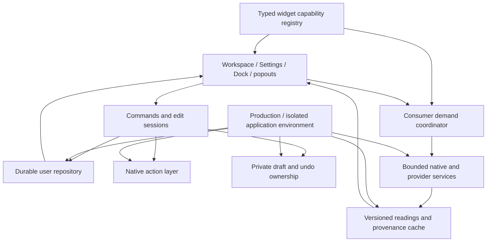

# MyDock — professional product, usability, design and engineering review

**Review date:** 3 October 2026  
**Scope:** the whole current application and its path to a stronger product  
**Disposition:** recommendations only; no application changes implemented

MyDock has the foundation of a distinctive Mac utility: a configurable edge workspace combining applications, files, links, timely information and small tools. Its breadth is ahead of the consistency of its experience. The most valuable next step is to make a few complete daily workflows dependable, understandable and easy to recover, then expand what those workflows can do.

This review goes beyond a defect list. It assesses product purpose, information architecture, first use, sustained editing, native interaction, visual design, all 35 widget families, data trust, engineering structure, privacy, accessibility, distribution and larger product opportunities. It proposes both targeted improvements and substantial investments. It does not recommend discarding the existing application.

## How to read this review

The factual baseline is the [complete application audit](COMPLETE_APPLICATION_AUDIT_2026-10-03.md) and its [76-entry feature coverage matrix](COMPLETE_APPLICATION_COVERAGE_2026-10-03.md), completed on the same date. That audit contains the reproduction conditions, verified source lines, severity, evidence, test ledger and manual acceptance procedures for 43 findings. References such as **MD-A06** identify those findings. They retain their original meaning and confidence.

References **PR-01–PR-20** identify proposed improvement packages in this review; **OP-01–OP-07** identify optional product opportunities. These are proposals, not newly implemented features or additional confirmed defects. The roadmap and traceability tables connect them to the original evidence.

Four distinctions matter throughout:

- **Confirmed issue:** supported by current source, a reproducible isolated execution, a current render or an actual safe UI observation, as specified in the audit.
- **Reviewer judgment:** a reasoned assessment of hierarchy, effort, coherence or likely user confusion. It is not a measured usability-study result.
- **Proposal:** a direction to investigate or implement in future, including its migration and acceptance obligations.
- **Unverified acceptance:** a behavior that still needs real native, live-account, accessibility, hardware or signed-release validation.

The current source and canonical executable were compared with the earlier audit baseline; the captured source fingerprints were unchanged. No new build, test run, account operation or desktop Dock scenario was performed for this document. Relevant current source and existing audit imagery were inspected again, alongside independent product, design and engineering reviews. Apple primary guidance was consulted for the design recommendations. No customer interviews, competitor benchmarking or market-demand research were performed. Audience and opportunity assessments below are hypotheses to validate.

The earlier audit recorded 253 passing default tests with five explicit opt-in skips, a disposable universal Release build, 175 exported PNGs and safe isolated management UI observations. Those results support their specific checked paths; they do not qualify the native replacement experience, desktop compositing or distribution. The audit remains the source for commands, failures, fixture results and limitations.

Navigation: [assessment](#1-reviewer-assessment) · [task chain](#2-make-the-whole-task-chain-coherent) · [screens](#3-screen-by-screen-design-and-usability-direction) · [native interactions](#4-raise-the-quality-of-native-interaction) · [visual/accessibility system](#5-a-disciplined-visual-and-accessibility-system) · [all widgets](#6-review-of-every-widget-family) · [data/services](#7-trustworthy-data-persistence-and-local-services) · [architecture](#8-architecture-investment-that-earns-its-cost) · [privacy/release/support](#9-privacy-lifecycle-release-and-support) · [larger opportunities](#10-larger-product-opportunities) · [roadmap](#11-prioritized-delivery-plan) · [validation](#12-validation-decision-gates-and-missing-evidence) · [finding traceability](#13-traceability-to-every-audit-finding).

## 1. Reviewer assessment

### What is already valuable

The app brings several useful capabilities together without a dependency-heavy stack. Profiles can express different working contexts. A native panel gives the custom Dock a real desktop surface. Widget layouts are distinct from icon treatment, which is the right conceptual separation. Several faces prioritize actual metrics rather than decorative icons. Local tools can reduce the need to open larger applications for a small action.

There are good reliability foundations: revision-aware atomic writing, tested three-way profile draft merging, explicit appearance inheritance, credential-free portable profiles, device-local Keychain storage, provider request coalescing and backoff, bounded automation paths, notification generation guards and Apple Dock preference recovery journals. Normal application Quit and window Close are separate operations. These should survive every redesign and architectural extraction.

The visual language is also worth keeping: quiet light/dark surfaces, modest radii, restrained accent color, recognizable macOS controls and compact metric compositions. MyDock does not need a different brand to become more professional. It needs a more consistent relationship between visual emphasis and what the user is trying to do.

### What currently holds the product back

| Dimension | Current assessment | Consequence |
|---|---|---|
| Product clarity | The app manages native layouts, a custom companion and a replacement Dock, with overlapping vocabulary. | People must understand internal state distinctions before confidently making ordinary choices. |
| Correctness and trust | Confirmed save/reporting, migration, parser, credential replacement and aggregation defects remain. | A useful-looking feature can give a false success or misleading number. |
| Editing | Profile drafts are stronger than several nested utility forms; configuration starts with appearance. | Creating useful content takes more effort than styling it, and unfinished input can disappear. |
| Native Dock quality | Public-API foundations exist, but window identity and default menu availability have defects; much desktop acceptance remains open. | Full replacement is a higher-confidence promise than the evidence currently supports. |
| Design | Calm composition previews coexist with large unused editing space, tall repeated wrappers and compact content clipping. | The app can look settled while common work is still awkward. |
| Widget portfolio | Thirty-five families offer breadth, with uneven setup, action, feedback and persistence conventions. | The catalog’s size can become a discovery and maintenance burden. |
| Performance | Source and synthetic results identify synchronous work and broad invalidation; production frame pacing is unmeasured. | “Smooth” and “lightweight” cannot yet be qualified for actual daily workloads. |
| Release maturity | Local development validation is substantial; signed artifact, supported-OS and native acceptance are incomplete. | A passing local build is insufficient evidence for distribution readiness. |

There is no established Critical/P0 finding in the audit. That does not lower the importance of its P1 problems. Unknown-version protection, honest durable success, safe numeric parsing, stable account identity and dependable native actions are basic product obligations.

### The recommended product promise

**“Keep the apps, tools and information for your current work within reach.”**

This proposed promise makes profiles and useful small actions central. It gives MyDock a coherent purpose beyond collecting widgets and avoids requiring Apple Dock parity as the foundation of every user’s experience.

Treat the existing operating modes as clear capability tracks:

| Track | User purpose | Recommended treatment |
|---|---|---|
| Companion workspace | Add useful tools while keeping the familiar Apple Dock. | The recommended first experience while replacement acceptance remains open. |
| macOS layout management | Save and apply native pinned arrangements. | Explain that Apply changes Apple’s Dock; keep the transaction and recovery visible. |
| Replacement Dock | Use MyDock for daily app/window interactions. | An explicit choice with capability limits, permissions and restoration explained. |
| Desktop-widget presentation | Keep selected information/tools on the desktop. | Present as a surface behavior with focus, layering and click expectations, rather than another competing product concept. |

The three setup modes already exist, and the source default is `.both`, not replacement. The proposal is clearer presentation and acceptance, not a claim that coexistence is missing. Do not silently change an existing user’s mode. See [SetupMode](../../Sources/MyDock/Models/DockModels.swift:3) and [AppSettings defaults](../../Sources/MyDock/Models/DockModels.swift:1106).

### Audiences to test before broadening scope

| Research hypothesis | Useful working-day outcome | What must be excellent |
|---|---|---|
| People switching among work contexts | Move between familiar app/file/link arrangements. | Fast switching, obvious active state, retained unfinished work. |
| Developers and technical workers | See meaningful system/network/AI activity and run shortcuts. | Correct metrics, provenance, bounded work and low idle cost. |
| Creative workers | Reuse project files, snippets, colors and conversions. | Finder/clipboard contracts, repairable references and consistent collection editing. |
| Remote workers | Understand upcoming commitments and colleagues’ local time. | Calendar scope, time zones, next-action clarity and permission recovery. |
| Small-business operators | Check a chosen account’s meaningful financial metric. | Stable account identity, currency, period, completeness and freshness. |

Choose two or three complete workflows for early validation. Trying to demonstrate every family during onboarding would obscure the central benefit.

## 2. Make the whole task chain coherent

The standard for improvement should be **discover → configure → use → change → recover → relaunch**. A feature is not complete because its view exists, its happy-path fixture passes or its face looks convincing.

### A stable mental model

Use consistent user-facing concepts:

1. A **Custom Dock/profile** defines its items and behavior.
2. A **macOS layout** defines saved native pinned content.
3. **Select** chooses what to edit.
4. **Activate** makes a custom Dock visible.
5. **Apply** changes the macOS arrangement.
6. **Saved** means the change is durable.
7. **Appearance** inherits app defaults unless explicitly overridden.
8. **Connections** belong to this Mac/account setup; widgets reference them.
9. **Recovery** states which layout, personal content and drafts it can restore.

Current status logic already distinguishes Active, Applied, hidden and inactive. Preserve it. The improvement is to make the distinction readable beside the selected profile’s title and in the sidebar, rather than asking users to infer it from subtle icons. See [DockProfileStatus](../../Sources/MyDock/Models/DockProfileStatus.swift:6) and [manager status/actions](../../Sources/MyDock/UI/DockManagerView.swift:285).

Avoid a generic status dashboard. At adequate width, a compact line can communicate type, editing context, desktop state and save state. At narrow widths, keep essential type/active/save state visible, express editing context through the title/selection and expand details on demand. Failed saves need a visible recovery action. Inactive custom profiles and applied-but-hidden native layouts need accurate wording. **PR-06/PR-07**.

### First use

Current onboarding has a coherent four-step structure and explains permission boundaries. Its main opportunity is to shorten the distance to a familiar, useful result. Replacement mode omits the current native Dock capture option and starts with starter apps/widgets. That is a source-supported product limitation, not an observed setup crash: [import visibility](../../Sources/MyDock/UI/OnboardingView.swift:120), [finish behavior](../../Sources/MyDock/UI/OnboardingView.swift:269).

Offer “Start with my current pinned apps” for a new custom Dock, as read-only capture into an editable candidate. Explain unsupported/missing items and let users review the result before activation. Capturing pinned targets does not promise restoring open windows or an OS session. Applying a native arrangement must remain a separate action.

A stronger initial journey is: choose a low-risk mode, select a small useful starter, activate it, perform one real operation, then refine placement and appearance. Retain advanced placement and modes for users who want them, but avoid requiring cosmetic choices before the app demonstrates value.

After setup, offer contextual, dismissible help for launching an app, opening a widget, adding an item and returning to the manager. It should act on the actual controls, be keyboard accessible and remain available later. Apple recommends brief optional onboarding, learning through action and postponing nonessential setup. [Apple HIG — Onboarding](https://developer.apple.com/design/human-interface-guidelines/onboarding). **PR-06**.

### Daily use

Launching a pinned target, bringing an app forward, opening a popout and switching a profile should require little explanation. The app needs a documented click contract: what a click does when an application has zero, one, minimized or several windows; what a widget click opens; how right-click differs; how focus returns after dismissal.

The normal macOS Dock is a useful expectation reference for app identity and quit behavior. MyDock may intentionally differ in popout tabs, profile composition and widget actions. Explain those differences instead of making every variation look like a defect. Do not promise perfect Spaces/window parity through public APIs.

In replacement mode, leaving the manager closed must still provide understandable recovery and access to Settings. In companion mode, MyDock should add value without interfering with the Apple Dock. Those desktop scenarios remain native acceptance work. **PR-03/PR-10**.

### Editing and switching contexts

Switching profiles should preserve or explicitly resolve pending changes at every nesting level. The tested profile merge/undo model is a strength; it should be the standard for notes, snippets and links. The current snippet Escape loss and rejected-note acknowledgement are concrete examples of inconsistent contracts, not theoretical worries (MD-A05/A06).

Differentiate three kinds of editing: instant reversible controls, saved-object editing and composing a new object. Each needs a predictable close/Escape behavior. A new incomplete snippet should remain a private recoverable draft or require explicit discard, without being inserted into the saved collection. A slider can save coalesced updates; Restore and explicit Save must give a durable result. **PR-02**.

### Failure and recovery

Feedback should answer: **what happened, what remains safe, what to do next**. For example: “Couldn’t save this Dock. Your changes are still here. Retry Save.” Or: “This file is unavailable. The saved reference is unchanged. Locate…” Technical details can be copyable without turning a user dialog into a stack trace.

Preserve the manager’s existing retry-save pattern. Replace false success reporting and generic shared connection messages with operation-specific results. Keep background refresh failures quiet when last-good data remains useful, but label staleness and make recovery reachable. Avoid an alert for every network request. **PR-02/PR-15/PR-16**.

## 3. Screen-by-screen design and usability direction

These are reviewer assessments based on current source and audit imagery. The images linked below are static previews unless the audit explicitly says otherwise. They do not prove wallpaper compositing, actual desktop animation or VoiceOver acceptance.

### Main workspace and profile sidebar

**What the user sees:** a calm, centered profile title and small Dock composition, generous surrounding space, a subdued active status and an ellipsis menu. Selecting an item opens a limited inspector below the canvas. This works as a presentation of a small profile, but sustained editing gains little from the unused area. [Workspace render](../../.build/visual-qa/full-audit-2026-10-03/bundled-renders/editor-light.png), [screen overview](../../.build/visual-qa/full-audit-2026-10-03/screens-contact.png).

**Improve the hierarchy:** put the selected profile’s title, type, status and primary action into a compact header. Keep Add and the selected item’s Configure/Locate readily visible. Leave export, presets, duplicate and destructive profile operations in menus. Do not put every available operation on the toolbar.

**Make large profiles practical:** add an optional Organize/list view alongside the existing Preview. Rows should show name, type, target/setup status and meaningful layout width. A persistent inspector can use available space for editing. List and preview must share one order, selection identity, draft and undo chain; they must not become two models of the same Dock.

**Sidebar:** group native layouts and custom Docks, or give each a consistent type subtitle/tag. Retain color as an additional cue rather than the only identification. Rename “Explore” to “Presets” or “Starter Docks” while it opens that destination; a broader Explore area is a separate product decision. The current destination is [showingPresets](../../Sources/MyDock/UI/DockManagerView.swift:252).

**Keep:** the recognizable composition preview, restrained sidebar, explicit Activate versus Apply semantics and existing profile merge/undo. **PR-06/PR-07**. Success means editing and repairing a large profile without serially opening small sheets or identifying every entry by icon alone. This benefit needs task testing, not assumed speed claims.

### Add Item and widget library

**What the user sees:** meaningful categories and searchable descriptions, visual previews, small add controls and collection sample counts. The library is already categorized; it does not need basic categories invented again. Example counts can look like saved content (MD-U02). After an instance is added, the ordinary plus becomes disabled; adding another is available in a context menu. [Add Item render](../../.build/visual-qa/full-audit-2026-10-03/bundled-renders/add-library.png), [add/duplicate source](../../Sources/MyDock/UI/AddLibrary.swift:191).

**Better arrangement:** give each entry a concise purpose, honest prerequisite, real-size example and named Add action. Use “Add another” when multiple locations, accounts or collections make sense. Explicitly mark sample content as “Example.” A row/list browsing option can fit more choices while retaining an optional visual preview.

Add capability filters where useful: needs a connection, needs permission, works offline, provides an action, shows live information. Generate these from the registry. Do not cover every row with trivial badges. Extend search synonyms around tasks such as “copy text” or “files for later,” rather than requiring users to know the family name.

**Keep:** native application discovery, current categories, searchable descriptions and semantic previews. **PR-08/PR-17**. Success means people know what click will do, what requires setup and whether shown numbers are examples.

### Widget configuration and daily popouts

**What the user sees:** a common preview/layout/icon stack before useful content or account setup. Roughly 430 logical points of the initial configuration hierarchy can be appearance scaffolding; Save/content controls fall below the first viewport (MD-U01). The common sheet directly embeds the daily-use popout. [Clock configuration](../../.build/visual-qa/full-audit-2026-10-03/bundled-renders/configure-sheet-Clock.png), [tools overview](../../.build/visual-qa/full-audit-2026-10-03/tools-contact.png), [wrapper source](../../Sources/MyDock/UI/WidgetConfigurationSheet.swift:30).

**Better arrangement:** put Content & Behavior first. Collapse appearance to a compact disclosure with the current layout/icon choice and one preview. Complex providers and collection tools may justify two sections/tabs; a Clock can remain a short single surface. Do not require identical layout for all families.

Separate **Use** from **Configure** in the hierarchy. A utility popout should prioritize saved content and its primary action; configuration should prioritize persistent choices. Components can be shared without forcing both surfaces into the same screen structure.

Show when content is saved immediately versus when a form requires Save. Preserve drafts across close, Escape and context switch. Validation belongs beside the input and should focus the invalid field. Long forms need reachable actions and clear scroll ownership.

**Keep:** independent layout/icon selection, coherent styling and content-fitting short sheets. **PR-02/PR-08**. Success means creating a snippet, setting a location or connecting a provider without navigating cosmetic controls first.

### Settings and profile appearance

**What the user sees:** standalone and embedded Settings, plus profile appearance in an inspector. Narrow embedded navigation wraps into several visible rows; categories are reachable, but navigation, a large heading/caption and preview consume significant height (MD-U04). Different spacing ranges are a confirmed inconsistency (MD-U06). [Narrow Appearance render](../../.build/visual-qa/full-audit-2026-10-03/bundled-renders/settings-narrow-appearance.png).

**Better arrangement:** use the same category names, search destinations, value ranges and scope descriptions everywhere. Reduce repeated headings and preview height in small windows. Favor one familiar Settings window with sidebar/search if task testing supports it; embedded Settings can remain if preserving context is useful, but it should share the same content model.

Make scope a first-class control: “Editing: This Dock / App defaults.” Explain inherited values beside the action that creates an override; offer Reset this section to defaults. Do not silently convert existing full appearance overrides to partial inheritance. Per-property overrides are a possible later refinement with real migration cost.

Direct resizing must have the same inheritance rules and allowed size as Settings. A change made in one surface must be representable in another. Preserve normal menu/shortcut access to Settings; Apple’s macOS convention is a separate Settings window reachable from the app menu. [Apple — Adding a settings interface](https://developer.apple.com/documentation/foundation/adding-a-settings-interface-to-your-app). **PR-09**.

### Onboarding

**What the user sees:** a four-step flow with mode, starter selection, placement and review. It is orderly and uses familiar controls. Its highest-commitment mode asks users to rebuild familiar content, and the final summary does not itself teach daily interactions. [Onboarding preview](../../.build/visual-qa/full-audit-2026-10-03/bundled-renders/onboarding-1.png).

**Better arrangement:** emphasize a safe useful result over a broad product tour. Provide read-only custom capture of existing pinned targets, simple task-oriented starters and a visible explanation of what activation changes. The current replacement setup uses starter apps and does not offer copying existing pinned apps into the new custom profile; later manual composition remains available. Keep permission prompts contextual. Starter items must be installed or resolvable; unconnected data must be an honest empty/setup state.

**Keep:** import safety explanation, back navigation and optional permission boundaries. **PR-06**. Validate with newcomers asked to create, activate, modify and switch a profile without coaching, including explaining what happened to Apple’s Dock.

### Connections and integrations

**What the user sees:** stored business account rows labelled “Connected,” management actions and a shared operation message. The label is based on stored metadata, not a current successful health check: [row construction and label](../../Sources/MyDock/UI/ConnectionsCenterView.swift:27).

**Better arrangement:** distinguish Stored, Last tested, Last successful refresh, Authentication required and Offline. Show verified tenant/store identity, environment where meaningful, and the widgets using the connection. Credential replacement and disconnect need their own scoped results. A last-good snapshot should identify the account and its age.

Do not cosmetically change “Connected” to “Healthy” without a real health result. Fix underlying Shopify identity and cross-tenant stale data risks first (MD-P03/P09). AI account discovery, local-log activity and provider-reported limits require different setup explanations; a detected local session is not proof of complete billing access.

**Keep:** local Keychain secrets and credential exclusion from profiles/backups. **PR-04/PR-15**.

### Permissions

**What the user sees:** permissions with status and system recovery links; not-granted/unrequested statuses were observed safely. This is a good base. Actual denial/revocation/regrant behavior across native operations remains open.

**Better arrangement:** explain each permission in terms of the operation that needs it. Accessibility permits particular window actions; Screen Recording is for preview/freeze functions rather than app launching; location can be replaced by manual weather selection; Calendar and Reminders remain distinct. Notifications should be requested only for a user-enabled alarm/reminder behavior.

Show a useful degraded state and a specific recovery step. Do not repeatedly prompt, bundle unrelated requests or require every permission to use basic app/file/link launching. Detect changes when appropriate without claiming a successful operation from permission state alone.

**Keep:** optional features and normal System Settings recovery. **PR-03/PR-11/PR-14**. The permission screen must itself be fully keyboard and screen-reader usable.

### Backup, history, drafts and recovery

**What the user sees:** several mechanisms with different scope and retention. History is deliberately sanitized, yet its option names only Sticky Note when it includes more private content (MD-A08); retained entries beyond ten are inaccessible (MD-A09).

**Better arrangement:** present Current save health, Recoverable layouts, Exported backups and Pending drafts as distinct capabilities. Explain what each preserves: order, appearance, saved personal content, connection references, credentials, running timer state. Preview Restore as New, enumerate omitted content and only claim success after a successful save.

Make all retained history and presets browsable. Keep private-content history opt-in and describe its precise scope and lifetime. Do not solve recovery by putting secrets and every private collection into routine layout history. A local deletion undo should not silently create a permanent private backup.

**Keep:** sanitized defaults, restore-as-new behavior and original recovery files. **PR-01/PR-02/PR-16**.

### Alerts, confirmations and feedback

Use specific titles and affected object names where safe. Confirmation should explain the actual scope: remove a reference versus delete a file; disconnect an account versus remove its widgets; replace a native layout versus activate a custom Dock. Serious persistence failure should remain visible until resolved, with a retry and preservation explanation.

Routine successful copy/open/add operations usually need brief local feedback, not modal alerts. Sensitive error details should not expose tokens, raw account responses or private document contents. Cancel must remain a valid outcome of native quit/close and destructive confirmations. **PR-02/PR-16/PR-20**.

### Menu bar, command palette and keyboard commands

The existing command search and global profile shortcuts are valuable. Make core visible controls available as named commands too, with consistent words and shortcuts. Group commands by action or destination; show which profile/item they affect. Keep Deactivate, Open Settings and Recovery reachable without discovering the active-status popover.

The command palette can later search explicitly saved snippets, links and shelf references, subject to privacy and duplicate-result handling. That is an extension of existing content, not passive clipboard surveillance. Apple recommends exposing toolbar actions through macOS menus and prioritizing frequent toolbar commands. [Apple HIG — Toolbars](https://developer.apple.com/design/human-interface-guidelines/toolbars). **PR-07/PR-11/OP-03**.

### The actual activated Dock

Static bottom/side previews suggest a restrained, useful visual direction. They cannot establish hit testing, stable wallpaper readability, screen-edge reveal or animation quality. [Bottom preview](../../.build/visual-qa/full-audit-2026-10-03/bundled-renders/dock-bottom.png), [side preview](../../.build/visual-qa/full-audit-2026-10-03/bundled-renders/dock-left.png).

The improvement goal is stable reading and predictable action. Running indicators, pinned status, selection, missing targets, overflow and focus should remain distinct. Secondary metrics should justify their width. Hover must not make values difficult to read. Resize must not feel like aiming at a hairline; the current effective pointer band is approximately 9.1 points (MD-U05).

Accept bottom, left and right independently. Side variants need vertically meaningful compositions; simply squeezing a horizontal face is insufficient. Keep the actual panel’s material visually related to the app, but let forms use readable solid surfaces where glass adds little. **PR-03/PR-10/PR-11/PR-12/PR-18**.

## 4. Raise the quality of native interaction

### Application and window identity

Launching, activating, selecting a window, restoring a minimized window, closing a window and quitting an application must share an identity and outcome contract. The current exact-path launch handling is a strength, but bundle-ID grouping elsewhere can associate another installed copy. Untitled windows can also become unresolved because display fallback differs from action identity. Windows/Close Window are hidden under default optional monitoring settings (MD-D01–D03).

Use a native action layer with the selected installed URL, current process identity and revalidated window observation. A window descriptor is a temporary observation, not a durable target. Recheck before acting and classify stale/not supported/permission denied outcomes. For Quit, distinguish request accepted, process exited and still running/pending; report cancellation only where observable. A public API accepting the request does not reveal the outcome of another app’s unsaved-document dialog. Keep window discovery demand-driven without tying menu availability to unrelated preferences.

Preserve normal Quit semantics. Unsaved-document prompts and cancelled quit requests are not failures to be bypassed with force termination. Finder’s lifecycle and third-party AX limitations require dedicated cases. The UI should distinguish Close Window from Quit App by words, target and availability. **PR-03**.

Public APIs establish a boundary, not a promise of Apple Dock parity. NSWorkspace supports launching specified application URLs and returning a running application; AX operations depend on permission and the target’s accessibility implementation. [Apple — NSWorkspace](https://developer.apple.com/documentation/appkit/nsworkspace), [Apple — AXUIElement](https://developer.apple.com/documentation/applicationservices/axuielement_h). Document supported, permission-dependent, best-effort and unavailable interactions per mode.

### Targets, dragging and spatial editing

Internal spatial reorder already exists. External Finder drops append rather than choose an insertion location (MD-D04), which is a reasonable product enhancement rather than a claim that drag/drop is entirely broken. Next-level editing should preview the insertion position, work at separators/empty regions and handle overflow without a sudden target shift. Validate drag cancellation, duplicate targets and the difference between copying a reference and moving content.

Keep in Dock/Remove from Dock, running versus pinned state and outward drag behavior need a consistent contract. Avoid destructive outward gestures whose effect is unclear. Offer keyboard reordering and a named remove command with undo where applicable.

Missing or moved applications/files need an actionable Locate workflow. File Shelf currently disables unavailable rows without repair (MD-D05). Distinguish deleted files from temporarily disconnected volumes; preserve the reference and title when repair fails. Where sandboxing or security-scoped access is applicable, test bookmark renewal and access lifetime explicitly. An unsandboxed bookmark is not proof of sandbox compatibility.

Ordinary filesystem folder targets have a folder-contents popout. Its full enumeration/sort needs bounded loading and cancellation, especially for large directories or slow/disconnected volumes (MD-S02). This is separate from the App Folder widget, which stores a curated list of selected applications.

Groups and separators should improve comprehension, not multiply hidden rules. For large profiles, structured editing can show group boundaries and insertion positions more clearly than a compressed visual Dock. **PR-07/PR-10**.

### Popout focus and dismissal

The single tabbed popout host is an intentional product choice. It can limit clutter, but it needs a predictable focus model: click the same widget to toggle or focus consistently, another widget to select its tab, Escape to close safely, click outside without losing protected drafts, and keyboard return to the launching item.

Do not propose multiple independently floating panels solely because it is technically possible. Consider an optional pin only if a sustained task genuinely benefits, such as a timer or working collection. That would require explicit lifetime, display, accessibility and data-demand ownership.

Accept left/right anchors, screen-edge clipping, multiple displays and profile switches. A popout must not retain an orphaned item after deletion or show one profile’s private form under another. **PR-02/PR-10/PR-14**.

### Apple Dock ownership, displays and lifecycle

Replacement mode should have visible states: inactive, activating, active, restoring and recovery required. The existing preference journals are important foundations. A user should be able to find a recovery command and understand which values MyDock owns.

Define a conflict policy when another utility or the user changes an owned preference while MyDock is active. Do not assume exclusive ownership indefinitely. Keep recovery records when restoration fails, and report the difference between restoring preferences and restoring native pinned content.

Display disconnection needs a stable fallback that does not permanently overwrite the preferred display. Reconnection should follow an explicit policy. Fullscreen, Spaces, Mission Control, Apple Dock coexistence, sleep/wake and desktop-widget layering need real acceptance on the supported OS matrix. These are open verification requirements, not newly observed defects. **PR-03/PR-10/PR-19**.

### Resizing and performance as interaction design

The current resize path retains the hosting view, uses transient resize state and avoids ordinary root updates during the gesture. The audit does not support the claim that the entire root is recreated on each pointer event. It does support a broad settings signature outside resizing and synchronous immediate persistence (MD-E01/E02).

Improve the pointer affordance without making it visually heavy. A subtle visible handle can have a larger invisible hit area. Keep double-click reset and accessibility adjustment. Display the current size when useful, and make inherited versus profile-specific changes clear.

During drag, geometry, icon representation, overflow controls and animation must not fight the pointer. Keep edge anchoring stable; avoid loading a new icon for every fractional size; defer history/persistence to the coherent gesture boundary. Cancellation, interrupted resize, display change and min/max limits need explicit state-machine behavior.

Measure actual event-to-presentation timing, main-thread hitches, CPU/memory and writes on a real Dock. The earlier synthetic loop demonstrates algorithm/writer costs, not FPS. Qualify bottom/left/right on the actual refresh rate with small, normal and large profiles. **PR-09/PR-18**.

## 5. A disciplined visual and accessibility system

### Density and hierarchy

The same visual scaffold should not dominate unrelated tasks. A small calculator, account setup and multi-item collection do not need identical preview heights, padding and cards. Use shared semantic components—editor row, collection row, provider-status row, compact summary and confirmation—while allowing the content to determine composition.

Reduce large empty presentation regions during editing. Reserve large centered empty states for genuinely empty destinations, and pair them with a specific starting action. Avoid decorative gradients, glows or oversized icons as a substitute for hierarchy. The existing app already has design tokens; extend their semantic use rather than introducing a separate styling layer.

Use a stable hierarchy for window title, page title, section and supporting text. Important controls should look interactive and expose focus. Muted text should describe rather than carry the only essential information. State should use text/shape as well as color. **PR-07/PR-08/PR-11**.

### Typography, formatting and localization

Compact Clock can clip an ordinary time, and compact Checklist can truncate a basic count (MD-U03). These are content-fit problems, not reasons to shrink every face. Define concise formats and switch composition before valuable content is lost.

Attach units visually to metrics. Use monospaced digits for changing numeric values where it improves stability. Format currencies, dates and numbers using their actual semantics and locale. Negative values, large magnitudes, long account names and right-to-left text need intentional cases. Do not concatenate a currency symbol and decimal value without considering the currency’s format and minor units.

The converter render presents roughly eleven decimal places for a simple meter-to-foot result. The calculation is not shown to be wrong; the presentation suggests impractical precision and distracts from the useful result. Use meaningful significant digits for the glance, optionally expose full precision on copy/detail, and define rounding behavior by conversion type. [Tools render](../../.build/visual-qa/full-audit-2026-10-03/tools-contact.png).

Treat localization as engineering input, even before full translation: centralized strings, plural rules, longer labels, calendar conventions, DST and accessible spoken units. No claim of current multilingual acceptance is made. **PR-11/PR-17**.

### Glass, opacity and color

Use materials where they convey a floating functional layer: the Dock and anchored popouts. Solid or standard-material forms often give configuration clearer structure. Apple’s guidance distinguishes a navigation/control material layer from content and asks for semantic materials and legible system colors. [Apple HIG — Materials](https://developer.apple.com/design/human-interface-guidelines/materials), [Apple — Adopting Liquid Glass](https://developer.apple.com/documentation/TechnologyOverviews/adopting-liquid-glass).

Qualify Clear and Frosted finishes over real wallpapers, not only checkerboards or bitmap previews. The full opacity range must match its labels; “Opaque” must actually deliver the promised readable backing. Tint and opacity should remain independent. Light, dark, system, increased contrast and Reduce Transparency need the same basic interpretation.

Check actual transparent window backing, rounded masks, edge halos, shadows and material changes while resizing/revealing/switching profiles. The preview should say when it uses sample data or simulated material and preserve real widget dimensions. Older supported OS fallbacks should be intentionally accepted, not only compile-guarded.

Do not make elaborate glass the central product promise. If it weakens readability, a restrained readable surface is the better product result. **PR-09/PR-12/PR-19**.

### Motion

The current animation styles, Off, preview requests and Reduce Motion need acceptance before adding styles. Activation, reveal/dismissal, profile switching and rapid reversal should use a single cancellation/ownership contract. Style changes must not leave transforms or hit regions stale. Resizing and magnification must not accidentally combine into extra motion or layout reflow.

Useful motion explains a state change: an item was inserted, a workspace became active, a reorder settled or an error recovered. Decorative entrance effects and stronger hover glow add little if they destabilize reading. Prefer stable layout with restrained composited transitions where appropriate, while respecting the actual AppKit/SwiftUI hosting model.

Reduce Motion must produce a coherent alternative, including rapid repeated previews and interrupted transitions. A settings toggle is not acceptance evidence. **PR-12/PR-18**.

### Accessibility as a complete operating model

Existing named actions, selected traits, command search and adjustable resizing are useful. They do not establish VoiceOver acceptance. Define a focus contract for opening, validation, dismissal, deletion, reorder and popout switching. Returning focus to a removed item is not valid; choose a sensible surviving neighbor or container.

Users should be able to create a Dock, add/configure/reorder/remove an item, cancel an operation and repair a missing target with the keyboard. Swatches and layout choices need names and selected values, not only a blue outline. Custom buttons need visible focus and adequate hit regions independent of icon size. Hover-only tooltips cannot explain essential actions.

Test larger text, long labels, contrast, Reduce Motion, Reduce Transparency and increased contrast in both appearances. Measure contrast where applicable; materials must also be evaluated over changing content. Apple recommends checking contrast across appearances and reducing automatic/repetitive motion when requested. [Apple HIG — Accessibility](https://developer.apple.com/design/human-interface-guidelines/accessibility).

Run VoiceOver tasks with actual spoken labels/order/value updates, not only accessibility identifiers. Small-window controls must remain reachable by both keyboard and pointer. **PR-11**.

## 6. Review of every widget family

The catalog contains **35 registered families**. Memory/swap/core/thermal information belongs to System Activity; there is no standalone Memory family. The [coverage matrix](COMPLETE_APPLICATION_COVERAGE_2026-10-03.md) records implemented entry points, source, automated evidence, dependencies, stored state and runtime gaps for every family. The table below evaluates their product role and next-level direction. Recommendations in its third column are future work, not current capabilities.

| Family | Useful job at Dock scale | Recommended next-level direction | Constraint or acceptance that matters |
|---|---|---|---|
| Stock | Glance at one selected market instrument. | Keep a compact price/change face; make symbol discovery, covered trading interval and last update clear. | Correct parser bounds, market closures, currency, rate limits and unavailable data. |
| Watchlist | Follow a small chosen set of instruments. | Share Stock setup/data infrastructure; make the selected instrument and navigation obvious without compressing a table into the face. | Partial quotes and stale instruments must be individually identified; preserve ordering. |
| Calendar | Know the next relevant commitment. | Prioritize next event, time until start and an action derived from actual event data; clarify selected calendar scope. | EventKit permission, all-day/ongoing events, time zones, empty calendars and revocation. |
| Reminders | See and act on Apple Reminders. | Clearly distinguish native tasks from local Checklist; show the next useful action and completion feedback. | Native completion is an OS mutation; handle denied access and stale callbacks without duplicating tasks. |
| Now Playing | Identify/control current playback. | Let track/state dominate artwork; expose supported controls and target source clearly. | Automation denial, stopped playback, source change and unsupported players; no invented listening history. |
| Weather | Decide based on chosen location and conditions. | Use temperature with unit, place and a restrained forecast in wider layouts; keep manual location available. | Location freshness/deadline, forecast time zone, units, unavailable data and safe numeric conversion. |
| Focus Timer | Run a deliberate focused session. | Give start/pause/resume/reset clear priority, consistent completion feedback and understandable persistence. | Sleep/clock changes and interrupted sessions; current completion is not a notification-delivery contract. Any proposed completion alert needs opt-in and denial/revocation acceptance. |
| Sticky Note | Keep a small piece of private text visible. | Make direct editing, draft survival, limit feedback and saved state reliable before adding rich text. | Rejected content must remain recoverable; private history/export scope must be explicit. |
| Battery | Understand power state without opening another view. | Prioritize charge/charging status and useful accessory detail only where real data exists. | Missing battery, changing accessories and unknown health/time data; no inferred remaining time. |
| Shortcuts | Execute an existing named macOS Shortcut. | Show the selected action, bounded execution, progress, cancellation and useful failure feedback. | Existing run is unbounded (MD-S01); never imply success before completion or expose raw sensitive output. |
| Stripe | Glance at a precisely defined selected-account metric. | Display source/period/currency/completeness; distinguish calculated recurring run rate from dashboard-equivalent MRR. | Nested pagination, billing intervals, mixed currencies, identity replacement and offline cache. |
| Paddle | Glance at the provider’s meaningful business metric. | Use correct permission setup and consistent account/freshness/status presentation without erasing provider semantics. | Metrics scope instructions, unbounded subscriber/count values, tenant binding, token revocation and sandbox/live distinction where supplied. |
| Shopify | See a selected store’s useful business summary. | Fix same-store credential replacement, clarify metric period and expose partial-result status. | Stable store identity, repeated cursors, pagination progress and record deduplication. |
| Clock | Read local time immediately. | Ensure normal locale time fits; keep date in richer layout. Consider optional concise format preferences only if needed. | Current compact clipping; system time/date/time-zone changes and spoken formatting. |
| World Clock | Compare selected places/time zones. | Clarify primary place, local-day offset and useful wider comparison; reuse Clock formatting. | DST, day boundaries, long place names and saved zone identity. |
| Stopwatch | Measure elapsed duration. | Make run/pause/lap or history proposals explicit; preserve clear current timing and reset semantics. | Do not imply stored laps/history unless implemented; test sleep and clock independence. |
| Countdown | Track a chosen duration to completion. | Prioritize remaining time and state, with clear edit/reset and completion behavior. | Restart/relaunch, past deadline, rapid changes and unavailable notifications. |
| Alarm | Remember a specific future time. | Make next firing, repeat/time-zone policy and enablement explicit; reconcile pending native notifications. | DST, missed alarms, revoked notifications, edits and deletion of scheduled requests. |
| Time Progress | Glance at elapsed/remaining time in a known period. | Explain the period and its boundaries; keep the progress face concise rather than decorative. | Time-zone/year/month boundaries and selected period persistence. |
| Hydration | Log explicit drinks/known volume and optionally receive reminders. | Make the existing logging, history, known-volume totals and removal undo coherent; clarify unknown amounts and reconcile enabled reminder settings on startup. | MD-S04 is a reconciliation inference; retain actual recorded data and unknown-volume semantics, with no medical intake claims or invented consumption totals. |
| System Activity | Understand current CPU and useful memory/system context. | Preserve real bounded CPU history; make units/load/core/thermal context interpretable in detail. | Real samples only, absent-data states, consumer ownership, coherent side variants and low sampling cost. |
| Network Activity | See actual transfer rate/activity. | Distinguish receive/transmit, units and active interface; make reset/sleep changes safe. | MD-P07 reset spike; no invented traffic history/totals and no false 32-bit wrap assumption. |
| AI Limits | Know provider-reported allowance/window information. | State supported provider, quota type, window and freshness; show unavailable as unavailable. | Local token history is not a quota; extreme cached percentages need bounds and semantics. |
| AI Activity | Understand recorded local/provider activity. | Deduplicate logical records, respect configured roots and name sessions/time range precisely. | Recorded activity is not complete billing; missing logs, copied sessions and midnight boundaries matter. |
| AirDrop | Start a supported sharing action. | Make the selected content and native handoff clear; provide outcome/availability guidance without promising delivery. | Finder/native sharing acceptance remains open; do not transfer real files to prove audit coverage. |
| Trash | Reach or inspect native Trash behavior. | Align displayed count/scope with the offered action; use accurate destructive wording and normal confirmation. | Home versus volume Trash scope is an inference requiring safe fixture validation (MD-D06). |
| Disk Space | Understand storage availability. | Keep free/total visible and location/volume clear; show refresh age and disconnected-volume state. | No existing cleanup capability should be implied; avoid a destructive optimizer detour. |
| Calculator | Perform a small calculation. | Improve keyboard entry, invalid-expression feedback and copy; define whether closing retains a session expression/history. | Current expression/history are transient; accuracy and numeric overflow need fixtures, not a richer decorative face. |
| Quick Checklist | Track a small private local task list. | Add consistent editing/removal/undo and clear empty-state start; fix compact count composition. | Distinct from Reminders, private-content recovery and relaunch persistence. |
| File Shelf | Keep explicit file references close for later action. | Add Locate/repair, meaningful unavailable-volume state, local undo and clear copy/share/drag contracts. | References are not copied files; removing a shelf item must not imply deletion of the original. |
| Text Snippets | Reuse explicitly saved text. | Retain unfinished input, improve search/edit/copy/remove feedback and local undo. | Clipboard intake should remain explicit; private-content exports and duplicate/limit rules. |
| Quick Links | Reach a selected set of URLs. | Use consistent drafts/edit/delete/search, clear open/copy actions and actionable invalid URL errors. | Allowed schemes, duplicates, missing titles, offline favicon behavior and private export policy. |
| Unit Converter | Convert common physical quantities quickly. | Improve practical precision, unit grouping, swap and copy; keep physical units separate from live exchange rates. | Temperature offsets, negative values, invalid input, locale decimal entry and rounding. |
| Color Picker | Capture/reuse an explicitly selected color. | Clarify Apply versus Save Color, selected palette state and formats; qualify native sampling cancellation. | Strict HEX/RGB validation, alpha/color-space policy, deduplication, palette limits and clipboard feedback. |
| App Folder | Launch a curated collection of selected apps. | Make existing add/reorder/repair/launch consistent and accessible, with clear selected-copy identity. | Missing applications, duplicate identity, multiple installed copies, stored order, relaunch and actual launch; this is not filesystem folder enumeration. |

### Portfolio coherence without removing useful families

Consolidate internal setup/formatting while preserving distinct jobs:

- **Time tools:** Clock/World Clock and Focus/Stopwatch/Countdown/Alarm/Time Progress can share formatting and consistent completion conventions. Their timing and persistence semantics must remain different.
- **Market:** Stock and Watchlist should share discovery, quote models and provenance. One compact ticker is still a legitimate use case.
- **System:** System Activity, Network and Disk can share a detail-navigation pattern or optional grouped popout, while keeping independently useful faces.
- **AI:** Activity and Limits must remain conceptually separate. A provider that supplies one does not automatically supply the other.
- **Local tasks:** Checklist and Reminders should share interaction quality, not silently synchronize separate stores.
- **Working collections:** Shelf, Snippets and Links need one dependable editing/recovery contract with content-specific validation.
- **Business:** Stripe, Paddle and Shopify should share connection health and provenance presentation, not a fabricated universal revenue definition.

There is no evidence-based reason to delete families merely to reduce the count. Reorganizing a toolbox is not the same as changing persisted family identifiers. Any family/submode consolidation must preserve profiles and content. **PR-08/PR-11/PR-15/PR-17**.

### A widget acceptance contract

Each family should declare its main glance/action, layouts, side representation, permissions, setup, stored/transient state, refresh needs and error behavior. For every advertised layout, check empty/loading/error/offline/denied states, long values, minimum Dock size, light/dark and locale. Wider layouts must add useful information rather than padding.

A useful popout should provide action or explanation beyond enlarging the face. Metrics need source, range, freshness and a meaningful interpretation. Collections need operational rows and recovery. Tools need a focused task and feedback. Decorative icons should not dominate known data, and secondary information should earn its width.

Configuration previews must show real geometry and honest samples. Icon swatches must change only icon treatment. Existing legacy layout/icon mappings should retain fixtures during any redesign. **PR-08/PR-11/PR-17**.

## 7. Trustworthy data, persistence and local services

### Durable success must have one meaning

Restore currently can publish optimistic in-memory state and “Restored” after a rejected or failed save (MD-A02). Other paths use stronger candidate-first results. A user should not need to know which store method an action called to interpret success.

Define outcomes such as rejected, accepted/saving, durable and failed, with retained draft/candidate information. Explicit Save, Restore, important mode changes and clean termination need durable boundaries. Routine editing can remain debounced; turning every keystroke into a synchronous write would create a different problem.

Apply the same contract to nested utility forms, deletion undo and recovery. An undo stack must respect intervening changes and identities, not resurrect removed provider responses or overwrite newer personal content. Native operations need separate outcomes: saving an alarm locally and scheduling its notification are related but not one atomic OS transaction. **PR-02**.

### Compatibility and validation are supported product features

Unknown future schemas should be recognized before decoding version-specific enums. Keep the original data untouched and explain the incompatible version. An unknown widget payload can be preserved as bounded opaque content only if it is lossless and cannot execute unsupported behavior. Do not make decoding permissive enough to accept corruption indiscriminately.

Use explicit migration fixtures for each released schema. Validate identifiers, collection limits, references, finite/domain-bounded values and overflow-safe arithmetic at trust boundaries. Imported cached readings can be discarded/recomputed safely; user-authored content cannot be treated as disposable cache.

The audit’s extreme cached AI percentage and huge market volume trapped in isolated source-slice execution. Those establish unsafe parsing/arithmetic paths, not a claim that a live provider normally sends those values or that the app was crashed in production (MD-A03/A04). **PR-01**.

### Separate user intent, cached readings and interaction state

Widget configurations currently combine user choices and provider snapshots; refreshes flow through ProfileStore. This makes external data updates participate in the same whole-state persistence pipeline as editing. See [WidgetConfiguration](../../Sources/MyDock/Models/DockModels.swift:384), [refresh publication](../../Sources/MyDock/Services/WidgetDataCoordinator.swift:215), [store mutation](../../Sources/MyDock/Persistence/ProfileStore.swift:442).

A stronger architecture has three explicit classes:

| State class | Examples | Recommended storage/ownership |
|---|---|---|
| Durable user intent | Profiles, order, selected locations/accounts, settings, saved notes/collections. | Validated revisioned repository with migrations, drafts and recovery. |
| Cached external readings | Quotes, weather, provider usage, calculated business snapshots and their provenance. | Versioned cache keyed by stable provider/tenant/query identity; last-good retention and invalidation. |
| Interaction state | Resize gesture, selection, form input, open popouts, progress and animation. | Surface/session owner; deliberately persisted drafts only where required. |

Start with business/market snapshots, rather than a conversion of every model at once. Migrate embedded snapshots with their original timestamps and semantic versions. Missing cache should produce loading/offline state, not invalidate the profile. Backups should preserve authored content and clearly state cache policy. **PR-13**.

### Refresh demand should follow consumers

The global Dock-visible gate can pause other visible editor/popout consumers, while provider coordination is primarily active-profile based (MD-S05). Services need demand ownership from actual surfaces: a Dock face, configuration preview, open popout or scheduled behavior.

Demand tokens can specify required detail/freshness. Hidden/absent consumers should release them; scheduled alarms remain a separate category. Keep the existing request limiter, coalescing and backoff. Add cancellation, priority and bounded work without allowing an expensive inactive detail query to monopolize useful refreshes.

Define sleep/wake behavior, stale callback rejection, time-zone changes and refresh after permission/connection replacement. Cancellation must propagate through subprocesses, continuations and permit waits. Shortcuts run, full folder enumeration and location acquisition are specific gaps (MD-S01–S03). Hydration startup reconciliation is an unverified source inference requiring native notification acceptance (MD-S04). **PR-14**.

### Provenance should be part of the data contract

Every metric should carry provider, verified identity, unit/currency, covered interval/time zone, source method, provider effective time, local refresh time, completeness and limitations. The face can stay compact; detail should explain what the number means and excludes. “Unavailable” is more useful than a plausible invented total.

| Integration | What must remain distinct | Corrective/review focus |
|---|---|---|
| Codex activity and limits | Local session records, app-server/account information and reported windows are different evidence. | Deduplicate copied records; define session count; bind readings to the available identity; explicitly unavailable metrics remain unavailable. |
| Claude activity and limits | Status-line/account windows are not equivalent to all local project history. | Honor configured roots consistently; deduplicate logical events; explain coverage limitations. |
| Grok local activity | Recorded local activity is not a complete provider allowance/billing contract. | Make discovered coverage and missing log behavior clear; do not fabricate a limit. |
| GitHub Copilot | Personal billing/usage response reflects its supported account/API contract. | Verify rate/error/token scope behavior and distinguish supported readings from unsupported activity. |
| Cursor, Gemini CLI, Antigravity | Unsupported combinations are not zero usage. | Explain absence and supported setup without implying account-level completeness. |
| Stripe | Calculated subscription run rate differs from dashboard-equivalent accounting metrics. | Nested item pagination, per-unit/interval assumptions, currency and partial-result status. |
| Paddle | Provider metrics have their own definitions and scopes. | Correct `metrics.read` setup guidance, identity, huge numeric values and freshness. |
| Shopify | Store-specific orders/sales have period, completeness and identity boundaries. | Fix same-store replacement; progress/page budgets and deduplication; bounded partial results. |
| Alpha Vantage | Daily compact histories represent bounded trading sessions. | Respect supported range, numeric bounds, market closure, throttling and stale quote indicators. |
| Open-Meteo | Forecast/current readings have requested units and time-zone semantics. | Preserve Unix-time boundaries, location identity, response bounds and unavailable reading behavior. |
| Local native services | CPU/rates/battery/disk/event information has native sampling and permission constraints. | Reset handling, actual timestamps/units and consumer-driven sampling. |

AI Activity’s duplicated records and current “Sessions” aggregation have specific evidence (MD-P01/P02/P10). Local token counts should never become an inferred usage allowance. A metric-definition change needs cache invalidation/recomputation, not just a new label over old data.

Stable tenant/store identity must be separate from a randomly generated local connection ID. Same-tenant replacement should preserve references; changing tenant should be explicit and invalidate old snapshots. When identity cannot be verified, state that limitation rather than inventing an ID. **PR-04/PR-15**.

Provider technical sources used by the audit remain relevant: [Stripe subscription items](https://docs.stripe.com/api/subscription_items/list), [Paddle MRR metrics](https://developer.paddle.com/api-reference/metrics/get-metrics-monthly-recurring-revenue/), [Shopify client credentials](https://shopify.dev/docs/apps/build/authentication-authorization/client-credentials-grant?lang=node), [GitHub billing usage](https://docs.github.com/en/rest/billing/usage?apiVersion=2026-03-10), [Alpha Vantage](https://www.alphavantage.co/documentation/), [Open-Meteo](https://open-meteo.com/en/docs). These contracts do not replace live-account acceptance or establish completeness of undocumented local AI logs.

### Bounded input and work

Apply response limits during streaming, before allocating the entire body. Keep request deadlines and add pagination progress/page budgets, record identity/deduplication and clear partial-result reporting. Response caps applied after allocation are availability hardening opportunities, not proven credential exposure (MD-P08).

Bound subprocess output, execution duration and cancellation. Use structured arguments and avoid shell interpretation of user content. For file scanning, limit work and give progress/cancellation rather than an unbounded full enumeration followed by sorting. Reject imported oversized state before full decode where practical. Test these paths with safe adversarial fixtures. **PR-01/PR-04/PR-14/PR-16**.

## 8. Architecture investment that earns its cost

The source does not justify a wholesale rewrite. It does justify several larger ownership improvements because they make future work testable and reduce repeated correctness mistakes.

### A fully isolated application environment

Temporary ProfileStore alone is not an isolation boundary. Global preview caches and cleanup paths can still touch production resources (MD-Q01). Make environment selection an assembled dependency graph, covering state, defaults, cache paths, credentials, permissions, notifications, native preferences, clock and network transport.

Production, preview and tests should select that environment as a unit. Fake permission state must never grant access to real native mutations. Quit must use the same isolated dependencies as launch. Begin with mutation-capable services, preserving production paths and identities. This is the first architectural investment because it enables safe UI failure/recovery and large-model validation. **PR-05**.

### A typed capability registry

The 35-family inventory spans registry, views, configuration, layout, loading and QA. String-based dispatch can drift; the current adaptive export misses five families (MD-Q02). A compiled typed registry should declare stable IDs, configuration schema, layouts, side treatment, actions, permissions, refresh policy, persistence class and QA cases.

Generate inventory/coverage obligations from that registry. Keep provider implementations explicit. Gradually replace the broad configuration payload with family-specific payloads while maintaining legacy fixtures. This does not require a third-party executable plug-in system, which would add unrelated security and release responsibility. **PR-17**.

### Controller boundaries and presentation invalidation

Extract ownership where it helps tests and measurable behavior: native app/window actions, panel geometry/resize, visibility/reveal, motion cancellation and popout focus. The manager should orchestrate sessions and commands; it should not become the owner of every integration and save convention.

Reduce presentation invalidation to effective display state rather than all AppSettings. Preserve the current hosting-view retention and resize guard. Runtime readings should update their relevant face rather than unnecessarily reconstruct the entire presentation. Measure before claiming the broad signature causes visible hitches. **PR-13/PR-17/PR-18**.

### Proposed ownership map

This is a future design direction, not a description of implemented structure:

Avoid circular ownership: services should not decide which profile is selected; views should not reconstruct provider identities; cache writes should not look like authored edits; presentation components should not choose production persistence paths.

### Engineering governance

For each change, define its command result, state owner, persistence policy, cancellation, privacy and acceptance surface. Maintain architectural decision records only for meaningful tradeoffs. Small refinements should remain small.

Use behavior tests around boundaries rather than tests that restate a switch or dimension. Generate render coverage from capabilities, but retain native acceptance for integration. Inject clock/transport/storage for deterministic failure tests and keep private fixtures out of shared logs. **PR-17/PR-20**.

## 9. Privacy, lifecycle, release and support

### Privacy as an understandable product property

Keychain secrets, private file permissions and sanitized exports are strengths. No unexpected telemetry was identified in inspected source; this review did not perform network-monitoring runtime acceptance. Explain categories separately: saved personal content, provider caches, credentials, drafts, window previews and diagnostics. Each needs a retention, export and deletion policy.

Diagnostic export should be opt-in and show its contents before save. Keep fixed typed error codes rather than private document names, file paths, URLs, window images or raw provider responses. Ensure cleanup follows the selected environment. Window thumbnails can be sensitive even without API keys.

Clipboard access should remain explicit for current tools. Passive clipboard history is a separate privacy-sensitive product decision, not an automatic upgrade to Snippets. Cloud sync, if ever pursued, needs content-category exclusions and a clear encryption/recovery model. **PR-16/PR-20/OP-06**.

Consider an explicit optional privacy presentation for shared screens: mask user-selected sensitive faces and provide a quick Hide private content command. Notes, appointments, account metrics and previews can be sensitive simply because they are visible. This is a product proposal, not a confirmed leak or a promise to detect screen sharing. Its policy must cover faces, tooltips, popouts and accessibility values coherently, with a deliberate reveal action. **PR-16**.

### Threat review priorities

The confirmed imported numeric traps are availability defects; the future-schema path risks state replacement but retains a recovery original. Neither should be exaggerated into credential exfiltration or irretrievable deletion. The audit found no established material secret-leak vulnerability. Hardening still matters at imported state, local logs, URLs/bookmarks, subprocesses, network bodies and temporary artifacts.

Retain strict URL/path handling and credential exclusion. Add streaming caps, bounded work and privacy-safe diagnostics. If an updater is introduced later, its downloaded artifact and signing identity need validation; the current manual release discovery/open-link flow should not be described as an existing insecure automatic installer. **PR-01/PR-14/PR-16/PR-19**.

### Install, login, quit and uninstall are user journeys

Login-at-startup should reflect the actual SMAppService approval state, including user changes in System Settings. Explain when registration failed or needs approval rather than showing only a saved checkbox. Apple’s API launches the main app on subsequent logins subject to approval. [Apple — SMAppService registration](https://developer.apple.com/documentation/servicemanagement/smappservice/register()). Current signed login acceptance remains open.

Quit must retain failed saves/drafts, cancel background work and restore owned system settings coherently. A cancelled document quit request targets the other app; it must not be mistaken for MyDock termination success. Crash/relaunch recovery should explain what was recovered and leave original files/journals available when a step fails.

Provide an understandable removal guide: deactivate/restore owned Dock preferences, disable login launch, disconnect credentials if desired, then remove the app. Do not silently delete personal data merely because the app is removed. A future in-app data deletion flow would require precise scope and separate credential/content choices. **PR-02/PR-03/PR-16/PR-19/PR-20**.

### Distribution quality

The canonical development bundle is universal and validly ad-hoc signed. It lacks App Intents metadata; Focus filter discovery is therefore not qualified (MD-Q03). The release script already has full-Xcode, metadata, Developer ID, notarization, stapling and Gatekeeper gates. CI currently validates an Xcode product but uploads the CLI bundle (MD-Q04).

Promote the same metadata-bearing artifact through acceptance, signing and packaging. Attach a release manifest containing source fingerprint, executable hash, architecture, deployment target, metadata, signing class and qualification results. Distinguish local developer build from qualification candidate and distributable release.

Test the oldest supported OS and Intel separately, including material fallbacks, permissions, login items and Focus. Deployment settings are not runtime acceptance. Reassess the support floor only after measuring cost and user need; dropping macOS 13 to simplify implementation would be a product decision requiring communication and migration support.

Verify quarantine install, identity continuity, preferences restoration, upgrade/downgrade, offline behavior and rollback. No automatic-update promise is required for a credible initial release; a reliable manual update path is preferable to an unqualified updater. **PR-19**.

### Documentation and support

Documentation should describe implemented behavior and its limits, with dated artifact-specific acceptance. Historical widget/test counts should not masquerade as current inventory (MD-Q05). Explain local history versus provider billing, unsupported APIs, private-content backup scope and native permission recovery in user language.

Add help at the point of failure rather than relying only on a README. A support reproduction package can record app/OS/version, permission statuses, operation codes and sanitized configuration shape, with explicit review before export. Avoid automatic upload of diagnostics.

Define bug triage around user impact and recoverability: lost drafts, false success, wrong account data and unusable native actions outrank a decorative mismatch. Tie support notes to release manifests so developers can reproduce the artifact users actually have. **PR-20**.

### Sustainable product scope and commercial decisions

A local utility is judged throughout a working day, including when it is invisible. An unobtrusive, dependable default configuration may create more value than a technically impressive catalog that needs continual tuning. Evaluate features by recurring usefulness, permission/setup burden, failure cost and maintenance obligation—not only whether they can be implemented.

Maintain a deliberate balance: most initial value should be available locally without account setup; connected widgets should add optional specialized value. Each provider carries ongoing API, authentication, semantics and support obligations. A new integration needs an owner and a plan for contract changes, outages and retirement. Retiring a provider should retain its configuration/content safely and explain unavailable readings rather than silently deleting its instances.

Before choosing pricing or paid feature boundaries, test whether users repeatedly use the intended workflows and trust their recovery. No pricing or willingness-to-pay evidence was collected here. Reliability, accessibility, private-content recovery and restoration of owned system preferences should not become confusing capability tiers. If a commercial model is introduced, its entitlement state should be separate from user data and credentials, with clear offline and expiry behavior.

For external distribution, record dependency/resource provenance and the right to ship icons, fonts, artwork and bundled material. Preserve original product identity and avoid presenting MyDock as an Apple product. This is a release process recommendation, not a confirmed license or trademark violation. Do not introduce promotional UI or repeated prompts into the Dock’s daily interaction merely to make a business model visible. **PR-19/PR-20**.

## 10. Larger product opportunities

These are optional hypotheses. They should not delay the trust and native acceptance work. Each opportunity starts with a specific task, uses the existing portfolio where possible and has a condition for declining or stopping the work.

### OP-01 — Explicit project/workspace start

**Use case:** open the handful of apps, project folders and links needed for a particular task, then activate its useful Dock.

**Minimum useful scope:** a named set of existing validated targets; a preview of what will open; an explicit Start workspace action; per-target outcomes; reasonable duplicate-open avoidance; cancel remaining work. Keep Activate separate from opening everything. Do not automatically quit apps, close documents or promise private window/session restoration.

**Required data and permissions:** saved target references and public Workspace launch/open APIs. Basic opening need not acquire broad new permissions. Window placement/restoration would be a separate feasibility and permission project.

**Components/dependencies:** native target identity, missing-target repair, command outcome model, profile draft/undo and launch acceptance (PR-02/03/07/10).

**Effort:** Large for a coherent workflow; smaller proof of concept possible. **Migration:** optional new workspace-start settings, with no action on old profiles until explicitly configured. **Risk:** unwanted repeated launches and ambiguity between activation and starting.

**Success:** representative users start three real contexts with fewer repeated actions, understand what will open and recover cleanly from missing targets/interruption. **Stop condition:** users prefer ordinary launch targets, or duplicate/unwanted opens outweigh the convenience.

### OP-02 — Explainable context switching

**Use case:** choose a workspace for a Focus or a simple context without repeatedly switching manually.

**Minimum useful scope:** first qualify the existing Focus path, then one deterministic rule type with priority, manual override, dwell/debounce, preview/dry-run and a visible explanation of why a switch occurred. Fall back when the display/profile disappears. Automatic native layout mutation should require a separate explicit policy.

**Required data and permissions:** the specific supported trigger. Focus uses App Intents; foreground-app observation and schedules have different contracts. Do not infer or promise arbitrary system Focus monitoring from unrelated access. [Apple — Focus integration](https://developer.apple.com/documentation/appintents/focus).

**Components/dependencies:** exact release metadata and discovery, switching sessions, effective mode/appearance, demand ownership (PR-02/06/09/14/19).

**Effort:** Large if generalized; begin with a constrained Medium investigation. **Migration:** rules opt-in and disabled by default for existing users. **Risk:** surprising oscillation, conflicting automation and lost drafts.

**Success:** users can explain and override every switch, and no unfinished work is lost. **Stop condition:** a general rule builder becomes harder to understand than manual switching. A reliable shortcut is often enough.

### OP-03 — Working collections everywhere

**Use case:** find and use an explicitly saved snippet, link or shelf item without first locating its widget.

**Minimum useful scope:** command-palette search over existing saved collections; clear copy/open/reveal actions; add/edit/remove/undo; missing-reference repair; deterministic handling of duplicate titles. Preserve collection scope and indicate which profile owns a result.

**Required data and permissions:** existing explicitly saved content. Clipboard reads remain user-triggered. No passive clipboard history, message access or background file import is needed.

**Components/dependencies:** common edit contract, target repair, command search and registry metadata (PR-02/07/08/10/16/17).

**Effort:** Medium/Large. **Migration:** indexes can be rebuilt; authored content must remain unchanged. **Risk:** exposing private text on a shared screen, stale search results or confusion between profile-specific and shared content.

**Success:** a user captures, retrieves, copies/opens and repairs content across relaunch and can undo removal. **Stop condition:** search duplicates the current popout without improving a demonstrated task; begin with small palette results rather than a new collection dashboard.

### OP-04 — A dependable next-meeting workflow

**Use case:** know what starts next and reach the actual event’s resources quickly.

**Minimum useful scope:** clear next relevant event, time until start, selected calendar scope, correct zone/day handling and a link/location action only when actual event data supplies one. An optional meeting workspace can use explicitly saved targets.

**Required data and permissions:** Calendar access; existing event URLs/location text. World Clock needs no invented attendees or schedule inference. Launching a URL is not permission to send messages or join on the user’s behalf.

**Components/dependencies:** EventKit recovery, semantic formatting, action validation and existing Calendar/World Clock (PR-03/08/11/14).

**Effort:** Medium for next-event improvement; larger for workspace integration. **Migration:** selected calendars and display preferences, with existing choices retained. **Risk:** all-day/ongoing overlap, ambiguous conference URLs and private calendar information exposed on a visible edge.

**Success:** real fixture events across time zones/DST yield an honest next action, and denied permission leaves unrelated features useful. **Stop condition:** richer meeting orchestration needs unsupported data or becomes a second calendar application.

### OP-05 — Audio output utility

**Use case:** switch between speakers/headphones without opening Settings.

**Minimum useful scope:** current output, available output devices, explicit selection, hotplug/disconnection feedback and unavailable-device handling. Add volume/mute only where the device supports them.

**Required data and permissions:** feasibility investigation using public Core Audio device/property APIs. No recording capability should be introduced merely to select playback output. The existence of a default-output property is a starting point, not proof that every device is writable. [Apple — Default output device property](https://developer.apple.com/documentation/coreaudio/kaudiohardwarepropertydefaultoutputdevice).

**Components/dependencies:** typed registry, native action outcomes, demand/lifecycle and accessible selector (PR-03/11/14/17).

**Effort:** Medium investigation/implementation, subject to device coverage. **Migration:** stable selected-device preference and fallback policy if needed. **Risk:** aggregate/virtual devices, Bluetooth transitions, unsupported volume and confusion between app output versus system default.

**Success:** changing among representative real devices works with explicit error feedback and keyboard/VoiceOver operation. **Stop condition:** public APIs or supported device behavior cannot give a dependable useful minimum. This is the strongest new-widget hypothesis here, not proven customer demand.

### OP-06 — Portable workspace exchange, then optional synchronization

**Use case:** reuse a useful layout on another Mac or share a safe starter with another person.

**Minimum useful scope:** evolve existing exports into a reviewed portable package with content summary, missing-target/connection mapping, version handling and safe import-as-new. Explicitly identify omitted credentials/private content. Templates should contain validated declarative targets, not executable plug-in code.

**Required data and permissions:** existing profile exports and local import. Cloud/account permission is unnecessary for this first stage. Optional sync would be a separate Large project requiring conflict resolution, content-category control, encryption/key recovery, offline edits and deletion semantics.

**Components/dependencies:** migration guard, transactional import, recovery, typed registry and tenant/reference mapping (PR-01/02/13/16/17).

**Effort:** Medium for better portable exchange; Large for sync. **Migration:** versioned package and explicit target reconciliation; never copy device credentials. **Risk:** private content leakage, restoring intentionally deleted data, paths that differ across Macs and account-reference mismatch.

**Success:** a package previews its exact contents, imports without overwriting newer work and explains every unresolved target. **Stop condition:** portable exchange satisfies the need; do not add mandatory cloud infrastructure to a local-first utility.

### OP-07 — An optional unified system detail surface

**Use case:** move from a CPU/network/disk glance to related system context without opening three unrelated popouts.

**Minimum useful scope:** one detail surface using existing actual CPU/memory/network/storage data, with units, freshness and selectable sections. Preserve independent Dock faces. Avoid fabricated totals, per-process attribution or process-killing controls.

**Required data and permissions:** current supported local measurements; additional sensors/process attribution need separate feasibility and permission review.

**Components/dependencies:** shared formatting, runtime snapshot separation, demand ownership and sampling/performance acceptance (PR-11/13/14/17/18).

**Effort:** Medium if reusing accepted services; Large if expanded into a system monitor. **Migration:** mainly optional presentation preferences. **Risk:** extra polling, excessive density and scope drift into a different application.

**Success:** related information answers a demonstrated task without increasing absent-widget idle work. **Stop condition:** compact independent popouts are already sufficient. Do not pursue this merely to create a larger dashboard.

### Deliberate scope choices

Defer more provider dashboards until identity, paging and metric semantics are reliable. Defer decorative animation styles until interruption and accessibility are accepted. Defer an executable plug-in marketplace until the compiled registry is coherent. Avoid automatic cleaners, force-quit tools or broad clipboard surveillance as easy feature-count growth.

Retain companion coexistence as a supported result. Preserve local-first behavior. Use larger investments to make a complete workflow more capable, rather than turning MyDock into a calendar, financial accounting tool, full system monitor and automation platform simultaneously.

## 11. Prioritized delivery plan

Priority means user impact and sequencing, not a precise duration. **Small/Medium/Large** are relative scope. Some packages are deliberately phased. Existing finding severities remain in the audit; a package’s priority does not reclassify every included subtask.

### Immediate corrective work

| Package | User outcome and smallest coherent scope | Priority / effort | Dependencies and migration | Acceptance and regression risk |
|---|---|---|---|---|
| **PR-01 — Compatibility and safe input** | Reject incompatible future schemas and unsafe numbers without replacing authored state or trapping. | P1 / Medium | Isolated fixtures; envelope/version dispatch; explicit old-schema migrations. | Unknown enums/future versions remain untouched; extreme values safely reject; valid old files still import. Risk: overly permissive or overly strict decoder. MD-A01/A03/A04. |
| **PR-02 — Truthful mutations and recoverable edits** | Durable success, retained rejected/unfinished input, consistent save/discard/cancel and local collection undo. | P1 core; P2 extension / Medium–Large | Explicit mutation outcomes; private draft lifecycle; preserve profile merge/revision semantics. | Failed Restore never says success; rejected note remains; snippet/link Escape and relaunch preserve or explicitly discard; undo respects later edits. Risk: synchronous editing or content resurrection. MD-A02/A05–A07. |
| **PR-03 — Native action identity and capability** | Windows/Close are discoverable; the intended app copy/window receives the action; normal quit cancellation is respected. | P1 / Medium–Large | Public-API action layer, permission classification and native fixtures; identity migration only where persisted. | Default settings expose valid window actions; untitled/stale/relaunched/multi-copy/Finder cases; unsaved Close/Quit/Cancel accepted. Risk: action on wrong process or force-quit substitution. MD-D01–D03. |
| **PR-04 — Provider correctness repairs** | Account replacement, aggregation, pagination and rate readings are credible. | P1 core; P2 narrower fixes / Medium | Stable verified tenant identity; parser/progress conventions; invalidate corrected metric caches. | Same-store Shopify replacement succeeds; old tenant readings disappear on switch; repeated records/cursors and nested pages behave correctly; network reset produces no false spike. Risk: changed totals and historical cache semantics. MD-P01–P10 as mapped below. |
| **PR-05 — Safe application environments** | Validation can exercise failures without touching personal state or native preferences. | P1 / Medium–Large | Inject mutation-capable services first; keep production paths unchanged. | Launch/error/Quit in isolated mode cannot access production store/cache/credentials/preferences; no fake permission enables real operations. Risk: partial injection retaining an unsafe singleton. MD-Q01. |

### Next quality and reliability pass

| Package | User outcome and smallest coherent scope | Priority / effort | Dependencies and migration | Acceptance and regression risk |
|---|---|---|---|---|
| **PR-10 — Complete target and spatial interactions** | Repair missing targets and understand drops, pin/remove, overflow and popout focus. | P2 / Medium | PR-02/03/05; bookmark/reference refresh; retain unavailable targets. | Locate recovers moved files; external insertion is explicit; drag cancel, keyboard reorder, overflow, multiple displays and popout dismissal accepted. Trash scope must match action. Risk: unintended file movement/deletion or orphaned popout. MD-D04–D06. |
| **PR-13 — Authored state versus runtime cache** | Refreshes stay fast and offline readings remain honest without complicating recovery. | P2 / Large, phased | PR-01/02/05/15; versioned cache migration from embedded snapshots. | Offline relaunch and failed refresh retain correct last-good data; tenant switch/deletion invalidate; backups keep authored content; provider refresh is not an edit/history event. Risk: lost cache/provenance or stale cross-tenant results. MD-E01/P09. |
| **PR-14 — Demand, deadlines and cancellation** | Visible consumers update; absent widgets cost less; hung work is bounded. | P2 / Medium–Large | PR-05/13; service demand tokens; preserve scheduled timer/alarm semantics. | Dock hidden but popout/editor visible updates; absent widgets release demand; Shortcuts/folder/location work bounded; sleep/wake and cancellation safe; Hydration reconciles. Risk: subscription leaks or disabling useful background behavior. MD-S01–S05. |
| **PR-15 — Provider provenance and connection health** | Users know which account, source, interval and freshness a number belongs to. | P2 / Medium–Large | PR-04; stable identity, metric semantics and freshness contract; cache semantic versions. | Stored versus tested/valid/offline status distinct; partial/estimated readings labelled; no local tokens shown as quota; disconnect impact clear. Risk: invented health claims or generic labels erasing provider differences. MD-P01/P03/P05/P06/P09/P10. |
| **PR-16 — Recovery and privacy clarity** | Restore what is available, undo mistakes and understand retention/export scope. | P2 / Medium | PR-01/02/05; precise private-content preference migration and history policy. | All retained history/presets reachable; scope and lifetime truthful; no secrets/default private content in portable history; streaming caps and diagnostic review. Risk: privacy over-retention or restoring deliberate deletion. MD-A08/A09/P08. |
| **PR-18 — Measured responsiveness** | Launch, reveal, resize and editing remain responsive on real workloads. | P2; gate before performance claims / Medium initially | PR-05; signposts/profiling; PR-13/14 as evidence directs. | Real bottom/side resize, pointer latency, hitches, CPU/memory/writes measured; no per-event durable write; host retention/root updates checked. Risk: optimizing synthetic loops while desktop cost remains. MD-E01/E02/U05. |
| **PR-19 — Exact-artifact release qualification** | The distributed app matches the accepted build and native integrations. | P1 before distribution / Medium tooling, Large acceptance | Full Xcode/signing/notarization environment; PR-01–05; no user-data mutation for routine CI. | Same metadata-bearing artifact packaged/uploaded; supported OS/Intel, Focus, login, quarantine install, recovery and rollback accepted; manifest recorded. Risk: signed identity/permission differences. MD-Q03/Q04. |

### Design and usability improvements

| Package | User outcome and smallest coherent scope | Priority / effort | Dependencies and migration | Acceptance and regression risk |
|---|---|---|---|---|
| **PR-06 — Clear modes and first success** | Users understand Select/Activate/Apply and start with useful familiar content. | P2 / Medium | PR-02/03; preserve existing mode; optional read-only capture into custom profile. | Newcomers explain active versus editing state and Apple Dock effect; create/use/switch without coaching; tutorial dismisses and returns. Risk: renaming that obscures existing users’ expectations. |
| **PR-07 — Sustained workspace editing** | Large profiles can be found, organized and repaired without repeated tiny sheets. | P2 / Medium–Large | PR-02/06; one shared order/selection/draft/undo. | Preview and Organize remain synchronized; long names/missing items clear; named core actions/menu commands reachable; large-profile task study improves. Risk: divergent state or overfilled toolbar. |
| **PR-08 — Task-first setup and discovery** | Add/configure a useful capability before styling it. | P2 / Medium | PR-02; capability metadata from PR-17 can follow; no family identifier changes. | Content/Save reachable at minimum size; examples labelled; repeated instances obvious; use/configure contracts predictable; all 35 families checked. Risk: hidden drafts or oversimplifying provider forms. MD-U01/U02. |
| **PR-09 — One appearance/settings contract** | Values, scope and inheritance mean the same thing in every entry point. | P2 / Medium | Shared ranges/resolver; retain full overrides initially; partial overrides need separate migration. | Inspector, Settings and resize round-trip every valid value; reset and inheritance predictable; small-window navigation usable. Risk: silently altering saved appearance. MD-U04/U06. |
| **PR-11 — Glanceability, formatting and accessibility** | Read and operate the app at small sizes, by keyboard and assistive technology. | P2 / Medium–Large | Shared semantic components and focus contracts; preserve layout/icon migration; PR-08. | Ordinary time/counts fit; units/precision/locale correct; all major tasks with keyboard/VoiceOver; contrast/text/motion variants accepted. Risk: shrinking content instead of adapting it. MD-U03/U05. |
| **PR-12 — Qualified material and motion** | The Dock stays readable and responds coherently through animation changes. | P2 / Medium | Real desktop fixture environment; PR-09/11/18; saved settings remain compatible. | Full opacity/tint range on wallpaper; real corners/halos; Off/Reduce Motion/interruption/reversal/preview accepted; older-OS fallbacks. Risk: previews claiming compositing they cannot show. |

### Maintainability and sustained quality

| Package | User outcome and smallest coherent scope | Priority / effort | Dependencies and migration | Acceptance and regression risk |
|---|---|---|---|---|
| **PR-17 — Typed capabilities and ownership extraction** | New/refined widgets remain consistent and easier to qualify. | P2 / Large, incremental | PR-01/05/13/14; stable family IDs and fixture migrations; extract boundaries when useful. | Registry matches render/config/service inventory; every advertised layout/state covered; missing exports fail validation; family payload migrations preserve content. Risk: framework complexity or a risky all-at-once conversion. MD-Q02/E02. |
| **PR-20 — Evidence, help and quality loop** | Users recover without developer knowledge; release claims reflect acceptance. | P2 / Small–Medium initially | Release manifests, sanitized support format and task-study baseline. | Current counts/claims generated or dated; help explains limitations/privacy; opt-in diagnostics reviewed; owner prioritization based on user impact. Risk: telemetry/privacy scope creep. MD-Q02/Q05. |

### Practical sequencing

1. Fix compatibility/numeric guards, false success and account identity, while building isolation for safe validation.
2. Accept native identity/quit behavior and complete one daily workflow through relaunch and failure.
3. Improve content-first setup, drafts, repair, inheritance and focus; use targeted source changes and task studies.
4. Separate runtime cache/demand and extract registry/controller boundaries as measurement and repeated failure patterns justify them.
5. Qualify a signed exact artifact and supported environments before distribution claims.
6. Pilot one larger opportunity with a real use case; stop if it adds more surprise/configuration than value.

Some design work can proceed in parallel with reliability engineering. It should not imply that an attractive new surface fixes the underlying save/account/native action contract.

## 12. Validation, decision gates and missing evidence

### Validate the product through tasks

Run unassisted task studies with representative users before treating these design directions as proven. Use a fixture/disposable account where native settings or private integrations are involved.

| Task | Observe | Decision it informs |
|---|---|---|
| Create and activate a useful first Dock | Whether the person understands mode, selection and activation; unnecessary choices; recovery from setup failure. | Onboarding, terminology and initial mode presentation. |
| Change a work context with pending input | Whether saved/unsaved/active state is understood and work survives. | Draft/session model and switching feedback. |
| Organize a large profile | Finding, naming, reordering and repairing among many entries; pointer versus keyboard effort. | Whether the structured editor earns its complexity. |
| Add a snippet/link and use it later | Content setup, closing/reopening, retrieval, copy/open feedback and undo. | Task-first configuration and collection conventions. |
| Interpret a stale AI/business/system reading | Whether users can explain account, source, period, unit and limitations. | Provenance/detail and connection status language. |
| Decline then recover a permission | Whether unrelated tasks remain usable and recovery is understandable. | Permission timing, degraded modes and help. |
| Resize and switch on real displays | Pointer stability, perceived lag, hit regions, overflow and disruption. | Geometry/motion/performance priorities. |
| Relaunch after interruption | Recovered drafts, profiles, preference ownership and last-good data. | Trust/readiness and recovery information hierarchy. |

Record completion, mistakes, interpretation accuracy, failed recovery and qualitative reasons. Establish the current baseline before setting numeric task targets. A subjective preference for a prettier screen is not enough evidence to replace a working workflow.

### Measure what can support a claim

| Measurement | Reproducible method | What it can and cannot prove |
|---|---|---|
| Startup/reveal | Signposted launch/command to usable window/Dock, repeated on the same artifact and workload. | Latency under that environment; not universal speed. |
| Resize/hover/motion | Instruments main-thread/animation traces plus actual desktop timing/video and display refresh information. | Production pacing/hitches; bitmap geometry tests cannot substitute. |
| Idle/hidden/visible cost | Defined duration/workload with CPU, RSS, network and write counters; widget absent/visible variants. | Resource differences; one short RSS increase is not a leak. |
| Persistence | Write count/duration/revision traces through drag, editing, explicit Save, failure and termination. | Frequency and ordering; a file existence assertion alone does not show durable correctness. |
| Provider behavior | Contract fixtures and explicitly authorized test accounts with identity/time/partial-result cases. | Contract and selected account scenarios; not undocumented universal billing completeness. |
| Accessibility | Full Keyboard Access, Accessibility Inspector, actual VoiceOver task recordings, contrast tools and system settings variants. | Real operation and spoken semantics; identifiers alone cannot qualify it. |
| Long sessions | Controlled repeat/use/sleep cycles, tasks/observers/network/write tracking and memory instruments. | Leak/recovery evidence under the workload; not inferred from one idle sample. |

Record hardware, OS/build, artifact fingerprint, display scale/refresh rate, profile size, enabled widgets, network condition, workload and duration. Do not claim “smooth,” “lightweight” or “native quality” without the relevant method and evidence. Instrumentation must exclude private content.

### Release quality gates

**Trust gate:** incompatible versions and adversarial numbers safe; durable success honest; pending/rejected drafts retained; provider identity and metric corrections accepted; privacy defaults intact.

**Native gate:** app/window actions accepted with untitled/multiple/stale/minimized/unsaved cases; normal quit cancellation; permission decline/revoke/regrant; Apple Dock apply/restore/interruption; display/Spaces/fullscreen behaviors documented.

**Interaction gate:** bottom/left/right resize, reveal, overflow, popout focus, external drag/drop and motion interruption accepted on desktop; wallpaper material and hit testing qualified.

**Usability/accessibility gate:** content-first setup, small windows, long/locale content, focus restoration and core keyboard/VoiceOver journeys accepted. Every advertised widget layout/state is covered.

**Artifact gate:** same signed/metadata-bearing artifact qualifies supported OS/architectures, quarantine installation, Focus, login items, upgrade/rollback and restoration. Distribution claims refer to that artifact.

### Important decisions to make deliberately

| Decision | Recommended starting position | Evidence needed before a larger change |
|---|---|---|
| Primary product identity | Contextual companion workspace, with distinct native/replacement tracks. | Task studies and accepted replacement behavior. |
| Default/new-user path | Useful coexistence first; preserve existing preferences. | Whether it delivers value without confusing duplicate Dock behavior. |
| Workspace editor | Keep preview, pilot an optional structured editing view. | Large-profile tasks show meaningful benefit and shared-state reliability. |
| Settings location | Shared model; choose embedded versus standalone by task behavior. | Small-window/navigation studies and context-switch cost. |
| Appearance inheritance | Keep current full override semantics initially. | Demonstrated demand for per-property inheritance and safe migration. |
| Widget consolidation | Share infrastructure and toolbox discovery; preserve families. | Evidence that a family/submode restructuring improves comprehension. |
| New integrations | Repair current provider contracts before adding more. | Demonstrated use case, stable API and viable acceptance. |
| Automatic context rules | One explicit predictable trigger after Focus qualification. | Override/conflict behavior and lack of unwanted switches. |
| Cloud sync | Improve safe portable exchange first. | Actual multi-Mac demand and feasible private/conflict semantics. |
| Updater | Qualified manual update path first. | A signed-artifact download/verification/rollback design and release operational capacity. |
| OS support floor | Honor current claim until qualification reveals cost. | Oldest-OS/Intel acceptance and audience requirements. |
| Third-party plug-ins | Compiled registry only. | A genuine ecosystem need and sustainable security/version/support boundary. |

These are product decisions, not questions that must block this review. They should have owners and acceptance evidence when implementation begins.

### Evidence still missing

The same-day audit has substantial current source, test, parser-fixture, build and safe preview evidence. It does not close the following:

- Actual canonical desktop Dock launch/activate/close/quit, unsaved-dialog cancellation, real drag/drop and external app lifecycle scenarios.
- Production bottom/left/right resizing, event-to-presentation latency, animation interruption, magnification interaction, frame pacing and energy.
- Real wallpaper glass opacity/refraction, panel masks/halos, Reduce Transparency/increased contrast and preview parity.
- Multi-display disconnect/reconnect, Spaces/fullscreen/Mission Control, sleep/wake and long-running service cleanup.
- Native Apple Dock preference mutation/recovery and signed identity effects in an isolated authorized environment.
- Live provider credential refresh/replacement/revocation, tenant verification and account-dependent metric completeness.
- Finder/AirDrop sharing delivery, real clipboard/color sampling and sandbox/security-scoped scenarios where applicable.
- VoiceOver, full larger-text/localization acceptance, oldest supported OS and Intel runtime behavior.
- Full-Xcode signed/notarized release execution, Focus discovery, login-item and quarantine/rollback acceptance.
- Customer task studies, market demand, willingness to adopt replacement and the optional opportunities’ actual usefulness.

Reasons include the audit’s explicit prohibition on unapproved native/account/data mutations, unavailable full Xcode/signing environment, lack of other OS/hardware and lack of user-research sessions. Tool/harness failures and their recovery are recorded in the audit ledger; they are not application defects. Safe preview UI inspection succeeded, so the earlier CUA startup blocker should not be repeated as a current blanket blocker.

Use the audit’s [H1–H9 manual procedures](COMPLETE_APPLICATION_AUDIT_2026-10-03.md#h-manual-acceptance-checklist) for concrete remaining native checks. They cover unsaved Close/Quit, resize, wallpaper material, motion, small windows/VoiceOver, Finder/utilities, permissions/restoration, failures and release.

## 13. Traceability to every audit finding

The recommendations cover every supported audit finding without claiming that it has been fixed. Full finding details remain in [section C of the audit](COMPLETE_APPLICATION_AUDIT_2026-10-03.md#c-detailed-findings).

| Finding | Issue carried forward | Proposed package(s) |
|---|---|---|
| MD-A01 | Future-model decoding precedes downgrade protection. | PR-01 |
| MD-A02 | Restore can report success after failed persistence. | PR-02 |
| MD-A03 | Extreme cached AI percentage can trap. | PR-01 |
| MD-A04 | External numeric conversions lack consistent domain bounds. | PR-01, PR-04 |
| MD-A05 | Rejected Sticky Note content can clear its draft. | PR-02, PR-08 |
| MD-A06 | Unfinished snippet input is lost on dismissal. | PR-02, PR-08 |
| MD-A07 | Utility removal lacks local undo. | PR-02, PR-16 |
| MD-A08 | History private-content label/lifetime is inaccurate. | PR-16 |
| MD-A09 | Retained history/presets beyond ten are unreachable. | PR-16 |
| MD-D01 | Default monitoring settings hide Windows/Close Window. | PR-03 |
| MD-D02 | Untitled window display/action identities differ. | PR-03 |
| MD-D03 | Multiple installed app copies are inconsistently grouped. | PR-03 |
| MD-D04 | External Finder drop appends rather than inserts spatially. | PR-10 |
| MD-D05 | Missing File Shelf references lack Locate recovery. | PR-10, PR-16 |
| MD-D06 | Displayed home Trash scope may differ from Finder action scope. | PR-10 |
| MD-S01 | Shortcut execution has no deadline/cancel. | PR-14 |
| MD-S02 | Folder enumeration/sort is unbounded. | PR-14 |
| MD-S03 | Location/Reminders completion paths lack full deadline/cancellation protection. | PR-14 |
| MD-S04 | Hydration startup notification reconciliation needs correction/verification. | PR-14 |
| MD-S05 | Dock visibility gate pauses other consumers. | PR-14, PR-13 |
| MD-P01 | Duplicate local AI records inflate totals. | PR-04, PR-15 |
| MD-P02 | Claude Activity ignores the configured alternate root. | PR-04, PR-15 |
| MD-P03 | Shopify same-store credential replacement rejects identity. | PR-04, PR-15 |
| MD-P04 | Shopify pagination lacks progress/page budget/dedup. | PR-04, PR-14 |
| MD-P05 | Stripe nested items can be incomplete; metric semantics differ. | PR-04, PR-15 |
| MD-P06 | Paddle setup names the wrong metric permissions. | PR-04, PR-15 |
| MD-P07 | Network counter reset becomes a false wrap spike. | PR-04, PR-14 |
| MD-P08 | Response caps apply after allocation, or are missing. | PR-04, PR-16 |
| MD-P09 | Replacement can retain stale readings under another tenant. | PR-04, PR-13, PR-15 |
| MD-P10 | “Sessions” counts session/day pairs across midnight. | PR-04, PR-15 |
| MD-U01 | Appearance scaffolding precedes useful setup/content. | PR-08 |
| MD-U02 | Library sample counts are not visibly identified. | PR-08 |
| MD-U03 | Compact Clock/Checklist content clips. | PR-11 |
| MD-U04 | Narrow Settings hierarchy consumes excessive height. | PR-09 |
| MD-U05 | Effective resize pointer target is narrow. | PR-11, PR-18 |
| MD-U06 | Inspector and Settings accept different spacing ranges. | PR-09 |
| MD-E01 | Immediate persistence synchronously blocks MainActor. | PR-13, PR-18 |
| MD-E02 | Broad settings signature invalidates presentation. | PR-17, PR-18 |
| MD-Q01 | Temporary store/preview flags do not isolate every service. | PR-05 |
| MD-Q02 | Tests/renders leave significant native/state/layout coverage gaps. | PR-17, PR-19, PR-20 |
| MD-Q03 | Canonical bundle lacks metadata to qualify Focus discovery. | PR-19 |
| MD-Q04 | Local build/CI artifact differs from distribution qualification needs. | PR-19 |
| MD-Q05 | Completion language and historical counts outpace evidence. | PR-20 |

## 14. Review completion and recommended direction

This document reviews the application as a product, covers every registered widget, considers the major management and desktop surfaces, and connects usability/design changes to state, services, native capability, privacy, accessibility and release maturity. It includes immediate fixes, architectural investments, optional larger opportunities, migration/regression concerns and acceptance criteria. It supplements the complete technical audit rather than replacing its evidence ledger.

The most coherent route to a higher-level MyDock is to preserve its quiet visual language and local-first foundations, repair the trust failures, make useful configuration and recovery easy, qualify real native behavior, and develop profiles into dependable working contexts. Significant work is justified for isolation, state/cache separation, demand ownership, a typed capability registry and sustained editing. Those investments should be phased around user outcomes, not undertaken as a rewrite for its own sake.

Recommendations remain unimplemented. Runtime, account, accessibility, performance and distribution gaps above remain open. No source/test/build configuration was changed, no canonical bundle was rebuilt or replaced, and no user data, credentials, permissions or owned system preferences were modified for this review.
